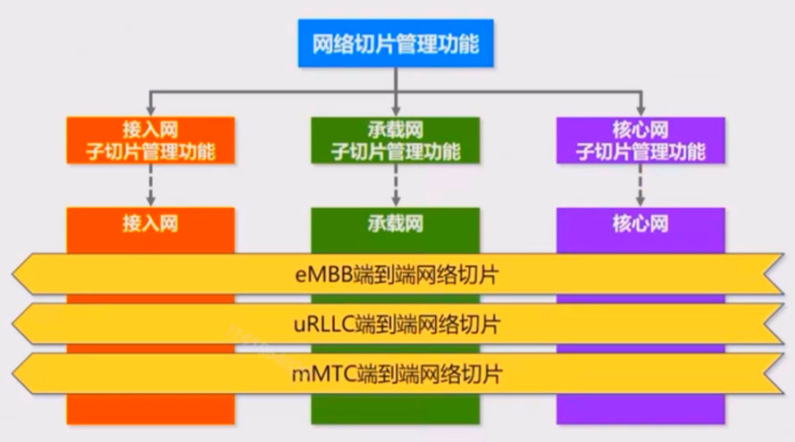

# 一、5G核心网基本概念

## 1. 什么是核心网

-   核心网是移动通信网络的大脑，负责对整个网络进行管理和控制
-   核心网是很多网元设备的统称，并非特指某一种网元设备
-   核心网分为移动核心网和固网核心网。移动通信里面的核心网，是移动核心网

### (1). 接入网

​	我们一般会把传统的通信网络划分为三个部分：接入网、承载网和核心网。接入网位于传统的最底层，它直接面对的是我们的用户、终端，也就是UE（ User Equipment ）。通过接入网可以把终端用户接入到通信网络中来，所以一般可以简单理解接入网就是常见的基站，也就是我们常看到的高塔，以及高塔上绑着的天线（在5G产业概述中有详细描述）。

​	按照接入方式的不同，我们把接入网划分为有线接入和无线接入

### (2). 承载网

​	承载网主要是对接入网以及核心网内不同的网络设备，去把它们连接在一起的。目前说的比较多的就是IP承载网

### (3). 核心网

​	前面说接入网只是把终端接入到网络中来，但是它并不能对业务进行控制，核心网就是**对业务近一步进行控制。**

​	核心网主要是对网络内的用户进行**管理**，以及**业务上的控制**，就类似于人的大脑，是一个非常关键的组成部分。核心网根据业务的不同，也可以分为移动核心网和固网核心网，针对的就是移动网和固网。

## 2. 核心网的功能

-   简单来说：判断用户身份真伪、实现用户业务、管理用户权限、记账和收费.....
-   复杂来说：移动性管理、会话管理、用户平面管理、策略控制、认证管理....

​	核心网想要**判断**一个想要接入网络内的**用户合法性**， 并且会对接入网络中的用户可以使用的**功能权限进行管理**。比方说，你接入网络中来了，你发送了国际漫游，那你有没有开启国际漫游的权限，核心网就要进行相关的核实。并且会对用户在网络中的路由进行相关管理，最后也要对用户进行相关的**计费**等等。

​	这些功能在核心网中都有对应的名称，比如：移动性管理（4G中的MME，5G中集成到AMF）、会话管理（SMF）、策略控制（PCF）等等....

### (1). 核心网的组成部分

-   CS：电路域核心网（Circuit Switch）
-   PS：分组域核心网（Packet Switch）

​	在传统的2G网络中，也就是GSM网络。当我们进入GSM网络时代时，表示我们进入数字移动网络时代，我们采用数字信号，而不是传统的模拟信号，但是GSM网络诞生的时候，只能用于移动网络中的语音业务，是没有数据业务的，也就是说只能打电话，不能上网。如果一定要在GSM电路交换的基础之上实现数据业务，只能提供理论最高值，大概是9.6KB每秒的速率，这种速率只能做简单的传真业务。

​	我们想要使用高速率的网络，怎么办？于是我们在GSM网络的基础上叠加了一个新的网络GPRS（通用分组无线业务），GPRS理论最高速率可以达到172KB每秒。从这个时候核心网分成了上面的两个域：**CS（语音业务）、PS（数据业务）**。

​	之后移动通信发展到3G，3G只是在无线侧发送比较大的改变，提高了上网速率。对核心网内没有什么改变。到了4G，核心网就有了比较大的改变，4G网络是**纯的分组网络**，它把2、3G中的电路域取消了，4G网络**本身只能完成数据业务**，没有直接的语音业务。

​	那4G网络中怎么打电话？不知道你们有没有印象，早期4G手机在打游戏时，都特别害怕收到短信或者接到短话，因为这样会造成数据连接断开或卡顿，4G网络本身并不具备语音功能，早期4G是将业务下沉， 自动切回到2g网络 ，而2g网络打电话是一定会断网的  ，后来这种情况就消失了，因为这时4G借助 IMS 网络实现了 VoLTE 进行通话，同时实现数据传输和通话业务。

### (2). 5G核心网的概念

-   5G核心网，也被称为5GC（5G Core），指5G网络的核心网部分
-   主要依据3GPP协议：TS 23.501（整体上描述5G系统架构），TS 23.502（5G核心网内相关流程）， TS 29.500（5G核心网服务化架构服务化接口）， TS 33.501（5G系统的安全架构和流程）等

## 3. 5G核心网的需求背景

-   eMBB：超高带宽
-   mMTC：低功耗、大连接通信
-   uRLLC：高可靠、低延迟通信

## 4. 5G网络切片

​	把一个物理网络，切割成多个虚拟的端到端的网络，每一个端到端的网络都可以获取逻辑独立的网络资源，并且切片与切片之间是网络隔绝的。

​	所以在这个场景下，当一个网络切片发送故障时，不会影响到其他切片。

​	5G切片就是把5G网络通过切片技术，在移动通用硬件基础之上，虚拟出多个端到端的网络。这里5G内的端到端指的是从 无线-》承载网 -》核心网。这样一个端到端的网络就是一个切片，不同的网络切片提供不同的业务。

## 5. 微服务架构

-   5G核心网采用 SBA （Service Based Architecture，即基于服务的架构）微服务架构，将原来4G中单个网元多个功能，变成多个网元单个功能。
-   微服务架构，源于IT行业，具有业务灵活性的特点

​	4G网络中存在一定的**功能重叠**情况。在4G网络内，会话管理功能，它是用来管理PDN连接的，这个管理功能在MME，SGW，PGW都有这样的功能。**4G网络没有办法做到为某种特定业务类型定制控制功能组合，所有不同的业务会共用同一套逻辑控制功能。** 

​	5G核心网把控制面的功能抽象成不同的网络服务（NF，Network Function）。希望以这种软件化、服务化、模块化的方式来构建网络，达到解耦的效果，最终**实现网络业务灵活定制功能**。

​	在SBA架构下，每个网络服务在功能上会解耦，对外提供统一的服务化接口，可以通过相同的接口向其他调用者提供服务。**把多个耦合的接口转变为单一的服务接口**，从而减少接口数量。

​	通俗的讲：在服务化架构里面，把传统网络中的一个个控制面网元抽象成了多个独立的网络功能（NF），接着把每个NF内拆分成多个服务（NFS：NetworkFunctionSevice），最终通过不同的NFS组合，实现了网络中的功能，例如：注册、会话管理、移动性管理等各种网络信令流程......这样就可以使网络架构灵活的支持5G多业务场景。

​	严格来说，在SBA架构下，5G控制面就没有以前所谓的网元的概念，取而代之的是NF（网络功能）

## 6. 网元功能虚拟化（NFV）

>    	前面说了，可以使用SBA架构满足5G多业务场景的部署，实现SBA架构的基础又是什么？就是我们现在说的NFV。
>
>   ​	简单说NFV就是以IT行业的云计算，虚拟化为基础的，把传统的物理网元，虚拟成一个一个逻辑软件，并且运行在标准通用的服务器上， 实现了软硬件解耦。

-   基于微服务架构，5G核心网引入了NFV（Network Function Virtualiztion，网元功能虚拟化）
-   NFV将网元**软硬件解耦**，实现了系统功能软件化和硬件资源通用化，之后网元软件化，为SBA提供了扎实的基础。
-   厂商传统专有硬件被COTS（商用现成品）通用硬件所取代

​	

## 7. 多接入边缘计算（MEC）

-   为了满足低时延业务、大带宽业务的需求，5G还引入多接入边缘计算（Multi-access Edge Computing）
-   移动边缘计算，就是将部分核心网功能和云计算算力进行"下沉"

M：mulit-access **多接入**，它的前身叫mobile 移动，在之前MEC被称为移动边缘计算，换句话说，在之前只能支持移动业务，但是随着网络架构演进，在5G网络下，用户可以通过不同的接入网络统一接入到5G核心网中。5G网络接入性很强，它可以支持移动网、支持固网接入、支持3GPP接入、支持none-3GPP接入。

E：Edge，让网络更接近用户，有点像小区里面有ATM了，取钱存钱更方便了。非常像互联网中的CDN反向代理。边缘部署的作用是**实现超低时延**

C：Computing，**计算能力下放到边缘**，什么是计算能力，比如视频的编解码处理，深夜的监控设备进行数据回传，但是大部分数据是无用的，所以可以通过MEC的计算能力对视频内容进行分析，把有价值有变化的画面提取出来，进行上传，剩下的大量的没有价值的数据直接存本地，或者定期删除。这样能有效节省传输带宽。

