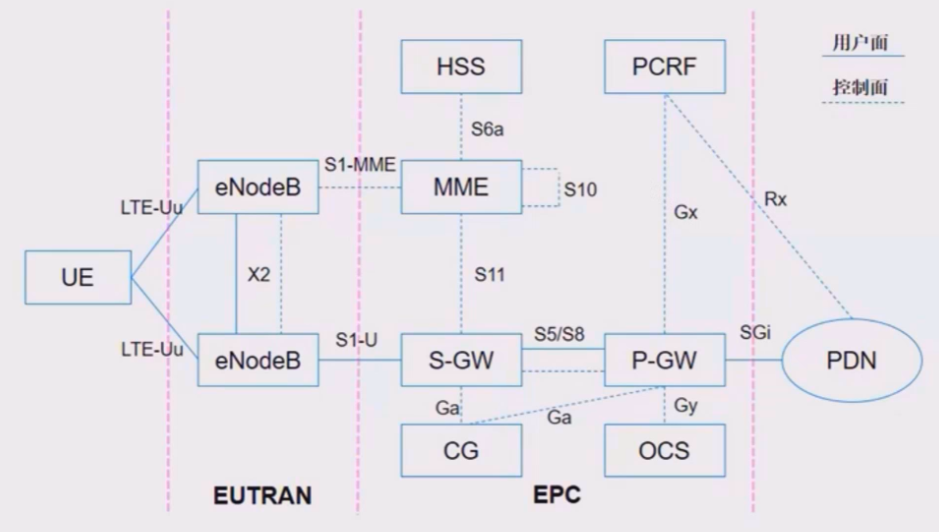
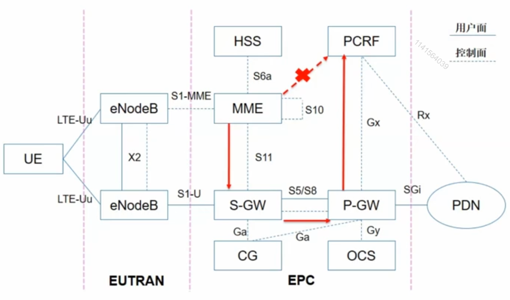
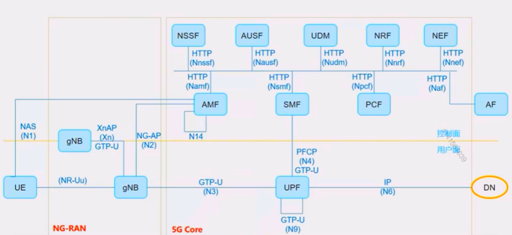
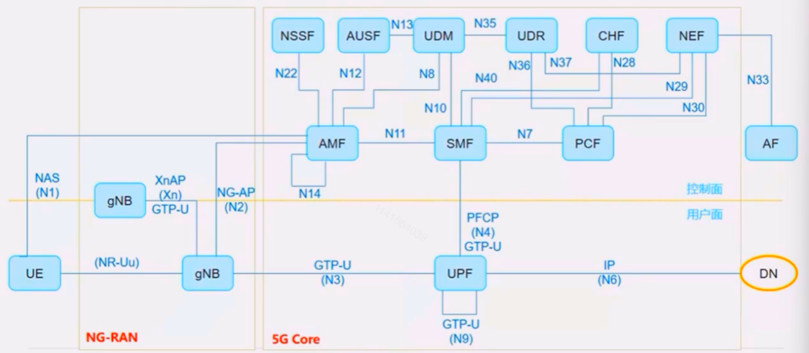

# 二、 5G核心网网络架构

## 1. EPS网络架构

​	首先我们来看一下4G场景的网络架构，它整体上分为三个部分：从最左边的终端到中间的无线，到核心网EPC。

>   -   MME，主要用于移动性管理
>   -   HSS，主要用于签约数据的管理
>   -   S-GW，用于寻呼触发，切换的锚点
>   -   P-GW，提供到外部网络的接口，并且执行业务控制和计费
>   -   PCRF，提供业务控制的策略规则
>   -   CG，离线计费
>   -   OCS，在线计费	
>   -   用户通过4G PDN（Packet Data Network）访问的外部网络。

​	在EPS网络架构图中有两种类型的连接线缆，用户面连接：用户进行数据业务，上网的普通数据包收发的平面。控制面连接：网元与网元之间信令传递的平面

### (1). 控制面和用户面没有完全分离

​	所谓控制面和用户分离是指，这些网元要么只能处理信令，不处理用户数据包；要不然就只能处理用户上网数据包，不处理信令。

​	4G核心网有做到一定的控制面和用户面分离，但是**没有完全分离**。比如说MME是一个纯控制面网元，但是S-GW和P-GW既要处理信令，又要收发用户数据，没有做到控制面和用户面分离。

### (2). 接口一对一

​	接口是位于两个网元之间的，比如eNodeB - 》 MME的接口叫 S1 -MME，这些的接口都是位于两两网元之间，仅仅只用于网元之间的通信，是一种 1 对 1 的形式，这样会使得两两网元之间的交互不那么灵活。

​	比方说：MME有一个用户的位置信息要发送给PCRF，在这个情况下，4G网络架构中，MME不能直接将信息发给PCRF，而是先把数据发给S-GW，由S-GW转发到P-GW，然后再通过P-GW转发到PCRF。

### (3). 网元功能的重叠

​	4G会话管理功能在MME，S-GW，P-GW这三个网元中都有，存在一定的功能重叠情况。

## 2. 5G核心网架构（服务化架构）

​	从整体上看，5G网络和传统的核心网一样，分为三个部分：终端、无线（NG-RAN）、5GC、DN（用户最终想要访问的外部网络）

​	用户在4G网络架构下想要访问的外部网络叫PDN，在5G网络架构下叫DN，为什么？首先PDN（packet Date Network）中的P代表分组。4G网络是一张纯的分组网络，是一张纯的IP网络，换句话说它支持IP协议，在5G时代，外部网络DN不止支持IP协议，还可以支持以太网数据协议这样的非IP协议，到5G以后外部网络所支持的协议更广了，不只是简单的支持分组网络了。

### (1). 用户面和控制面完全分离（CUPS）

​	为什么要做CUPS？它可以给网络带来什么好处？

​	分离后我们可以更好的做到**用户面网关下沉**，现在很多网络中的服务追求网络服务的本地化，对**端到端的时延要求越来越高**，网关下沉可以让用户面更贴近用户，**降低访问时延**。比如：我们访问的网站，服务器在国外的，时延就会很高；如果网站在国内，对比起来时延就会比较低。

​	所以CUPS也可以配合前面说的MEC一起进行部署。可以更好发挥MEC功能。 

​	在实际现网当中，考虑到4G向5G过渡，会4·5G融合部署的场景。也会把传统的4G网络做CUPS。4G网络怎么进行CUPS？

​	4G网络架构没有完全用户面和控制面分离，体现在S-GW和P-GW上，所以可以把S-GW和P-GW的功能拆开成S-GW-C和S-GW-U；然后把P-GW也拆成P-GW-C和P-GW-U。最后再把S-GW-C和P-GW-C融合变成新的控制面网关；S-GW-U和P-GW-U融合变成新的用户面网关。

### (2). 控制面SBA架构

**网络功能解耦**

​	5G核心网采用了SBA架构，把传统的网元抽象成一个个独立的网络服务。

**服务化接口**

​	相较于4G网络中的接口，它抛弃了网络中的接口，抛弃了传统网络中的点对点的通信方式，取而代之的是基于服务化架构的SBI总线协议。

​	因为这些接口底层协议都采用IP协议，传输层都采用HTTP 2.0 协议，它们的传输方式是一样的，这样所有的服务化接口就可以在同一条总线上进行传输，这种通信方式就是总线通信方式。这种通信方式非常像计算机的总线架构下，只要是在总线上，两两计算机都可以任意互通的。对应到5G核心网里面控制面的NF有需要也可以进行**直接互通**。

**网络服务的自发现自管理**

​	在3GPP规范中继续把每个NF进行拆分，划分成不同的NFS，最后我们其实是通过串联不同的NFS，最终实现例如注册、会话管理相关流程。

​	每个NF中都有若干个NFS，要让维护人员手动进行维护显然有点不现实，所以在3GPP中定义了一个新的NF，叫NRF。通过NRF来负责对所有的NFS进行自动化管理。包括自动的注册、发现、状态检测。也就是说每个NFS在上电之后会主动向NRF上报自身的NFS的信息。也会通过NRF来去寻找对端的NFS来发起通信。

## 3. 5G核心网架构（参考点架构）

​	这是5G服务化架构映射到传统架构以后，对应到传统网元的点对点接口之上，主要用它表示NF之间交互的参考模型，它并不是真实的接口，真实的接口仍然是服务化接口。

