# 三、NF功能介绍

## 1. NF功能介绍-AMF

-   AMF（Access and Mobility Management Function）：接入和移动性管理功能**（控制面的入口）**
-   功能：执行注册、连接、可达性和移动性管理功能。并且为UE提供到SMF的传输通道，为用户接入时提供认证鉴权功能，是终端和无线侧的核心网控制面接入点
-   类比EPC网元：

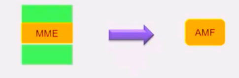

​	AMF是5G核心网控制面的入口，类似4G中的MME，但是相比MME，AMF把漫游控制、承载管理（QoS Flow）包括网关选择都剥离了，只需要进行注册、移动性管理、可达性管理就可以了，相当于一个缩水的MME。

​	同时在前面的架构图中可以看到UE和SMF是没有接口的，如果终端和SMF中间有消息需要传递。也需要AMF进行转发。并且AMF也会参与到终端鉴权中去。

## 2. NF功能介绍-SMF

-   SMF（Session Management Function）：会话管理功能
-   功能：执行会话管理，为UE分配IP地址、UP功能选择、策略实施、计费数据采集、QoS控制等
-   类比ESP网元：

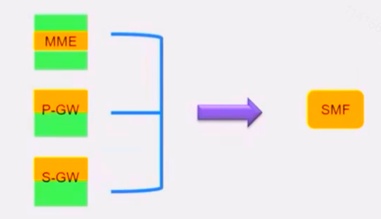

​	

## 3. NF功能介绍-UDM

-   UDM（The Unified Data Management）：统一数据管理功能
-   功能：负责用户标识、签约数据、鉴权数据的管理、用户的服务网元注册管理
-   类比EPC网元：

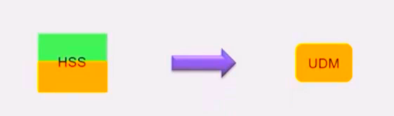

​	什么叫服务网元注册管理？比如终端切换了提供服务的AMF，这是UDM会向旧的AMF发起注销的消息，要求旧的AMF删除相关的用户信息，并且UDM会同时保存当前新的AMF信息。

​	需要注意：UDM在这里只是实现应用逻辑的，只对签约数据进行使用，并不会对用户签约数据进行存储，具体存储是在UDR中完成。

## 4. NF功能介绍-AUSF

-   AUSF（Authentication Server Function）：认证服务器功能
-   功能：实现对3GPP和非3GPP接入用户的认证鉴权
-   类比EPC网元：

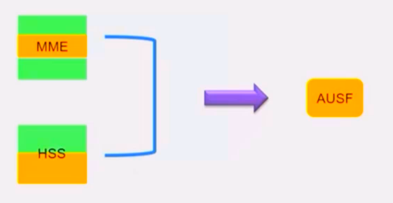

## 5. NF功能介绍-PCF

-   PCF（policy Control Function）：对用户业务、计费相关的策略进行控制
-   功能：统一的策略管理框架，提供策略规则给控制面功能，由其执行
-   类比EPC网元：

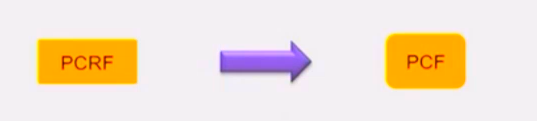

​	提供策略规则去给控制面功能，在5G网络架构中依旧使用PCC（Policy  Charging Control）架构， 即**策略计费控制架构**，对用户的业务、计费进行策略控制。5G中的PCF相当于4G中的PCRF，但是也有一些区别。 

​	4G中的PCRF主要的策略规则是针对与会话管理的，比如控制用户的计费，控制用户使用的QoS。比如说网络中的流量不限量套餐，虽然是不限量但是当一个月流量使用量达到一定限额，就会进行限速处理，这个业务就可以通过PCRF使用。

​	5G中的PCR，它不仅可以对会话管理生成相应的策略规则，还可以给AMF提供接入移动性策略，比如允许终端在那个位置接入，不允许终端在那个位置接入，还可以给终端提供选网和路由策略，辅助终端选择WLAN接入，辅助终端选择PDU会话。

## 6. NF功能介绍-NRF

-   NRF（NF Repository Function）：NF存储功能
-   功能：用于网络功能（NF）的注册、存储和管理

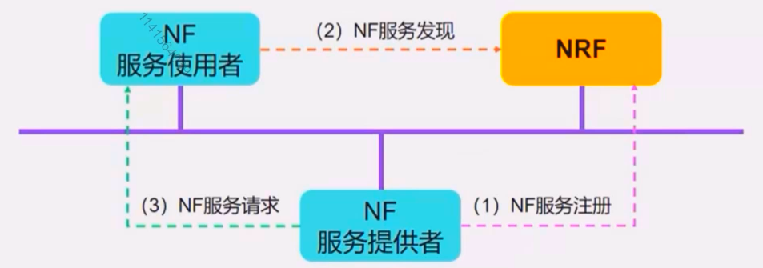

​	我们网络中的每一个NF都必须到NRF中进行注册，并且某个NF要去调用其他的NF，也需要到NRF中进行服务发现，去获取这个NF的数据，之后才能向对应的NF提出服务请求。

​	为什么需要NRF？网络功能被拆分成多个网络功能服务以后，维护工程师由面对传统网络中的几个网元，改变为面对几十个甚至更多的网络服务，如果仍然依靠传统核心网的手动维护的方式，那对维护人员来说：就会大喊一声我太难了。。。

​	所以5G核心网的网络功能服务要做到自动化管理，而NRF就是去完成网络功能自动化管理的网络功能。

​	NRF如何实现网络功能自动化管理的？主要体现在：

1.  **网络服务的自动注册、更新和去注册**：每个网络服务在上电的时候都会向NRF注册本服务的IP地址，域名以及它所支持的能力等等，并且这些信息发送变化后会自动同步到NRF上，最后在下电的时候去想NRF进行去注册。所以NRF需要维护整个网络中的NF的实时信息
2.  **网络服务的自动发现和选择**：5G核心网中都会通过NRF去寻找对端的服务，不再是像传统网络依赖本地的配置这种固化的通讯方式。比方说某个NFS需要另外一个NFS的服务，它会向NRF发送请求，表示自己要请求什么样的NFS，NRF中存储有网络中所有的NFS的信息，它会对请求进行匹配，返回匹配成功的NFS列表，NF再从列表中进行选取。有点类似DNS，我们把域名发送给DNS，DNS返回可能是一组IP地址列表，根据优先级权重等相关信息选择。
3.  **网络服务的状态自动检测**：NRF可以与各个NF之间进行双向的定期的状态检测，如果当某个网络功能异常，NRF探测出来后，NRF会及时的把这个异常的状态通知到当前与这个网络服务相关的其他网络功能服务，告诉他们：你们现在正在对接的这个网络功能服务状态已经异常了，让他们及时做一个更新处理。

## 7. NF功能介绍-NEF

-   NEF（Network Exposure Function）：网络开放功能，提供5G核心网内到外部应用进行信息双向交互的NF
-   功能：提供NF的能力开放

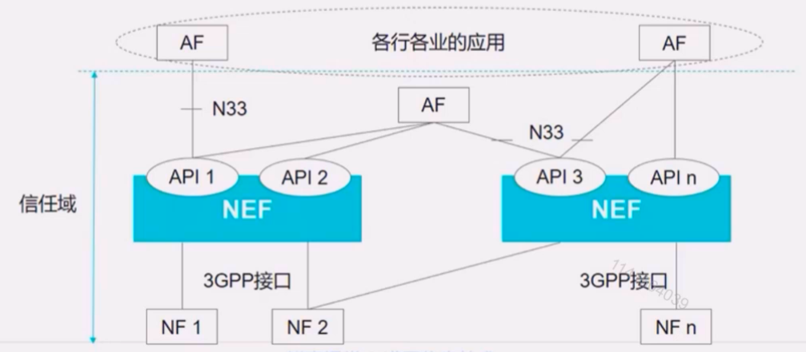

​	比如说：有一个爱奇艺的VIP视频用户要看视频了，视频服务器在外网，对应的AF就会往NEF发一个消息，告诉NEF：有个VIP要看视频了，NEF发送对应的QoS信息到PCF，PCF生成对应的QoS的规则下发到SMF，再由SMF发送到对应的UPF、无线和终端。用来达到相应的QoS的控制，保证VIP用户在观看视频时的带宽体验。

## 8. NF功能介绍-UDR

-   UDR（Unified Data Repository）：统一数据仓库
-   功能：存储和检索UDM的签约数据；存储和检索PCF的策略数据；存储和检索NEF的结构化数据，供网络能力开放；存储和检索NEF的应用数据，供应用检测

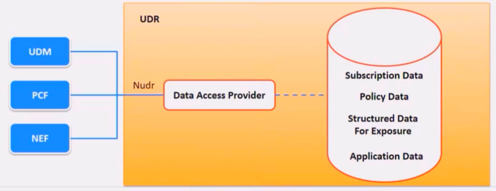

​	3GPP专门定义了数据存储架构，这里涉及了两个NF，一个是UDR，另一个是UDSF。UDR主要存储结构数据，比方说：UDM签约数据就存储在UDR中。UDR还存储PCF的策略数据，还能存NEF的应用数据

## 9. NF功能介绍-UDSF

-   UDSF（Unified Data Storage Function）：非结构化数据存储功能
-   功能：存储和检索任何网元的非结构化数据

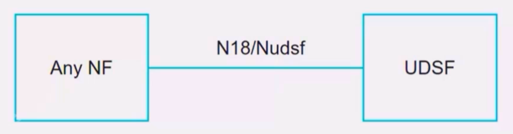

​	什么叫非结构化数据？用户建立会话时的会话ID，终端所建立的上下文等，这些都是非结构化数据。5GC允许每个内部NF都可以在UDSF存储或找回自身的非结构化数据，NF可以共享一个UDSF，也可以独立拥有自己的UDSF。

## 10. NF功能介绍-NSSF

-   NSSF（The Network Slice Selection Funciton）：网络切片选择功能
-   功能：根据UE的切片选择辅助信息、签约信息等确定UE可以接入的切片实例

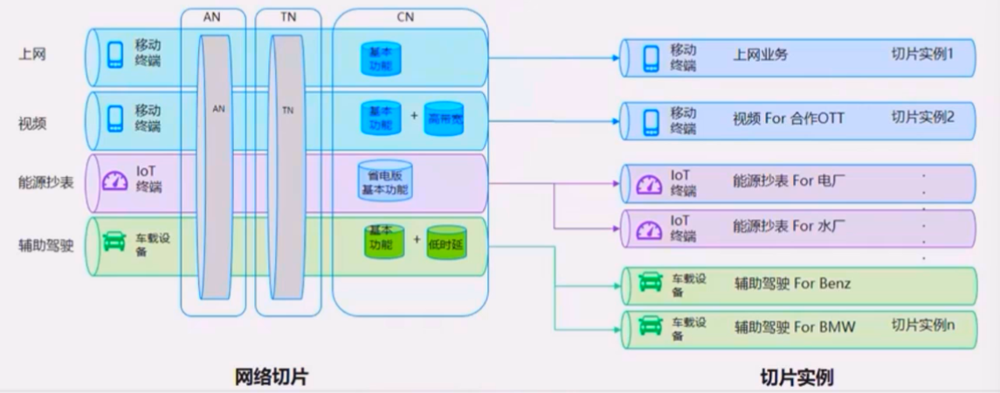

​	一个网络切片可以理解成一组规划好的容器镜像，切片实例就是根据网络切片实例化的容器群，一个切片实例包含多个NF容器。

## 11. NF功能介绍-UPF

-   UPF（User Plane Function）：用户面功能

-   功能：分组路由和转发、策略实施、QoS处理等

-   类比EPC网元：

    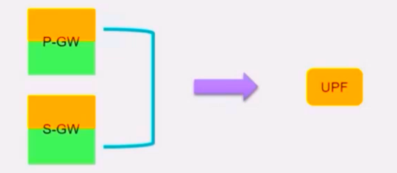

    ​	主要完成数据包的路由转发、流量使用报告、对用户面的QoS处理、包过滤，上下行的限流

# 四、5G漫游架构

## 1. Home Routed：归属地漫游

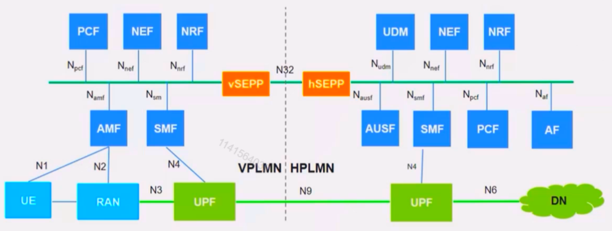

​	在SBA国际漫游架构下，新增了一个网元SEPP（边缘代理网关），通过它可以实现消息过滤以及对不同运营商网络之间控制面网络监管功能，提供跨网络的保障。

​	归属地路由场景，控制面用户会通过拜访地的AMF接入，通过拜访地的SMF转发给归属地的SMF，再由归属地的SMF从归属地的PCF中获取用户的策略信息，进一步对用户的策略控制。

​	对于用户面，拜访地和归属地的UPF之间会通过N9参考点联系起来，拜访地的UPF会把用户数据包转发给归属地的UPF，由归属地的UPF通过N6接口接入到外部网络DN中去。

​	所以Home Routed的思想是：用户发生漫游的时候，拜访地只负责把用户接入到网络中，最终的业务控制和业务出口都是在归属地完成的。

## 2. Local Breakout With in VPLMN 

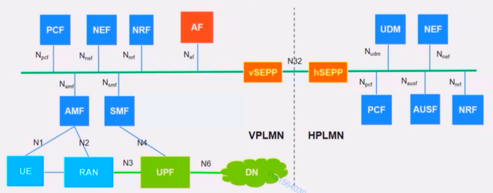

​	Local Breakout相比较Home Routed最大的不同在于用户业务的出口，也就是N6接口。N6接口在这个场景下是由拜访地提供的，**用户在拜访地直接接入到DN中，不会再回到归属地**。

​	AF在拜访地中，业务普通的业务流程和发送在本地的业务流程一致，只不过使用的是拜访地的AMF、SMF和UPF和PCF。这个场景下**AF是位于拜访地**的，之前我们说AF是可以和PCF配合一起生成用户业务的策略规则的，所以拜访地的PCF和AF可以进行交互，然后拜访地的PCF再根据与归属地运用商的漫游协议，根据本地的配置，生成给用户的PCC规则，下发给归属地的SMF去执行。

​	所以**拜访地的PCF不需要与归属地的PCF有交互**，不需要从归属地的PCF获取策略规则，这时策略规则的制定和实施都是在拜访地。

## 2. Local Breakout With in HPLMN

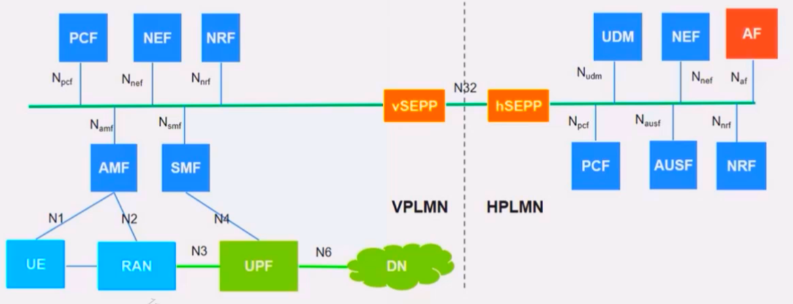

​	与前面的区别是，**AF位于归属地**，所以归属地的PCF会与AF进行交互，然后生成相应的策略规则，之后再去把生成的策略规则发给拜访地的PCF，最终由拜访地的PCF传递给拜访地的SMF，进一步执行策略控制。

​	这个场景下**需要拜访地的PCF和归属地的PCF有交互**。策略规则指定的主体在归属地，策略规则实施的主题在拜访地。这个场景应用不多，策略规则是每个运营商的商业机密，运营商不会把商业机密直接提供给另一个运营商。

