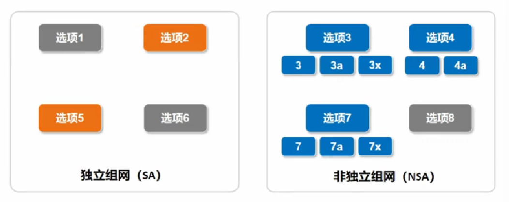
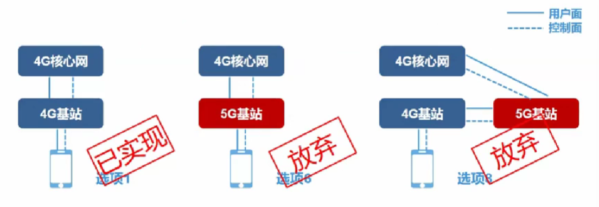
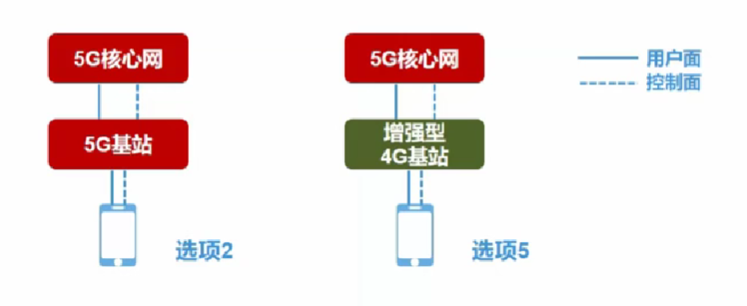
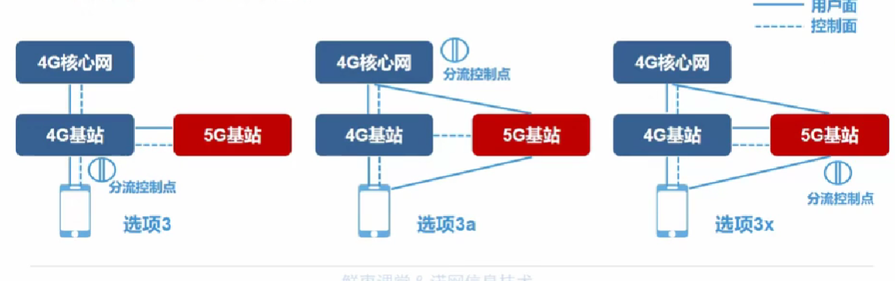
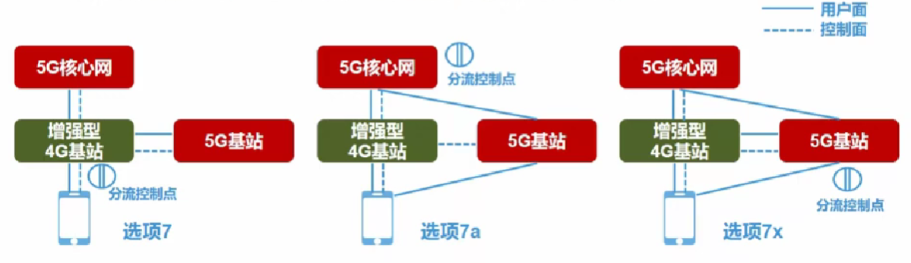
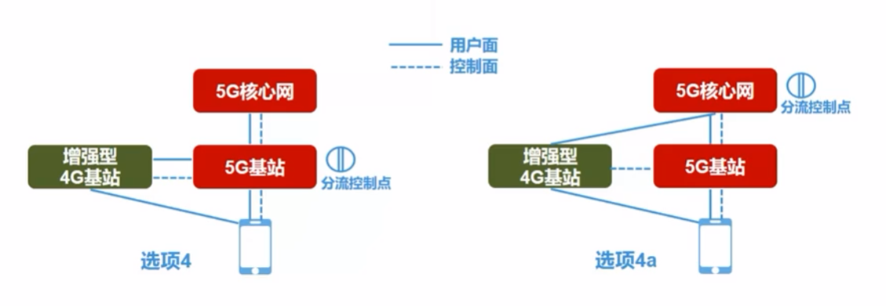
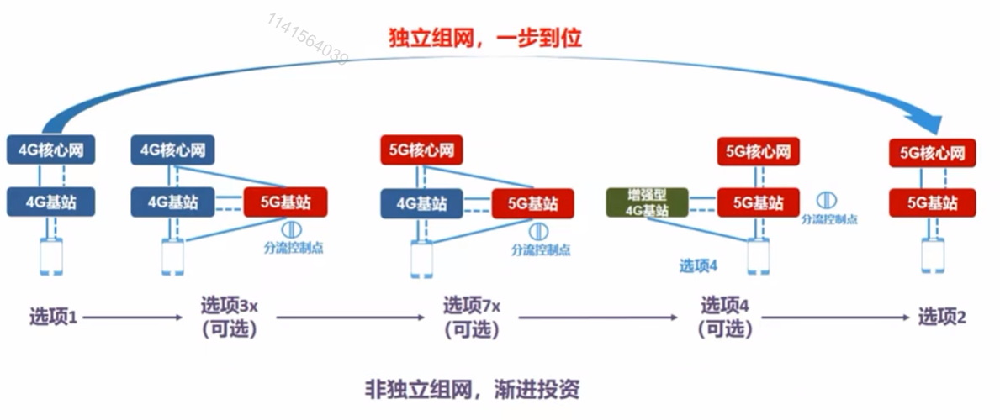

# 四、SA和NSA组网分析

## 1. 5G组网架构

对于5G的网络架构，在3GPP TSG-RAN第72次全体大会上，提出了8个选项，如图所示：

​	在5G之前，所有的网络架构都只定义了一种或者说是唯一的系统架构，但是对5G它却提出了8种不同的可选系统架构，这8种不同的选项被分为了两种不同类型的组网方式，也就是我们常听说的 SA（独立组网）、NSA（非独立组网）。

**什么是独立组网，什么是非独立组网？**

​	所谓独立组网就是指**一张无线接入网对应一张核心网**，非独立组网就是多个无线接入网对同一张核心网。

​	在这8不同的选线架构中，**选项1**早已在4G结构中实现，**选项6和选项8**仅仅是理论存在的部署场景，不具有实际部署价值，所以已经被3GPP抛弃。

**选项6**：使用5G基站连接4G核心网，4G核心网肯定承载不了5G基站所带来的最大负荷，5G基站只能降低能力去迁就4G核心网。但是我们了解运营商网络建设就可以知道：在网络建设过程中核心网和无线接入网比较，肯定是无线接入网建设成本更高。而且这个架构核心网使用的4G网络架构中的，所以对于前面提到的网络切片是无法实现的。

**选项8：**使用4G核心网运用了5G基站去把用户面和控制面的数据传递到4G基站。它对5G基站提出了额外的要求，改造起来比较麻烦，所以也被否决了。

## 2. SA组网

-   选项2：5G基站连接5G核心网，这是5G网络架构的终极形态，可以支持5G的所有应用
-   选项5：其实是把4G基站升级增强之后连到了5G核心网之上，本质上还是4G

## 3. NSA组网

### 术语

-   双连接：是指在接入同一张核心网的两个无线基站共覆盖区内，终端**同时接入两个无线基站**（4G基站和5G基站），并将其中的一个基站作为主节点（Master Node），将另一个基站作为辅节点（Secondary Node）。主节点是用户终端接入网络的锚点，提供用户终端接入网络的信令控制功能并能提供用户面数据转发；辅节点仅为用户终端提供额外的用户面数据转发资源。

>  利用双连接，由4G网络为5G网络提供接入服务，这样既能适配5G NR空口速率，又能实现5G业务的快速部署，满足更高的移动数据业务场景

-   分流控制点：用户的数据需要分到双连接的两条路径上独立传送，在哪里进行分流？是在核心网测分流？还是在基站测分流？如果是在基站测分流，那是在4G基站分流还是5G基站分流？分流的位置就叫分流控制点

### 选项3系列

-   该系列的基站连接的核心网是4G核心网，控制面锚点都在4G
-   适用于5G部署的最初期
-   3系列分为3、3a和3x这三个选项（**分流控制点不同**）

> - 选项3：**数据分流点在4G基站上**，4G基站不仅负责控制管理，还需要负责把核心网下来的数据分为两路，一路发给自己4G基站下面的收集，另一路发给5G基站，让5G基站发送给5G基站下面的手机。因为数据分流在4G基站上，**4G基站要同时处理4G和5G的流量**。
> - 选项3a：**数据分流点在4G核心网上**，4G核心网分别去向4G基站和5G基站分发用户面数据，这样比选项3好一点，但是仍然存在一些问题，在用户面上4G基站和5G基站直接连核心网，两者独立为政，各自单独承载4G和5G业务，没有负荷共享，对某些业务的共享也会有问题。
> - 选项3x：**数据分流点在5G基站上**，是NSA部署方式的首选

### 选项7系列

-   7系列比3系列向5G的演进更近了一步
-   在该系列中，核心网已经切换到了5G核心网，为了和5G核心网连接，4G基站也升级为增强型4G基站
-   7系列同样分为7、7a和7x这3个选项，关键区别在于**数据分流控制点的不同**

### 选项4系列

-   可能会在5G部署的中后期，5G达到连续覆盖了，可以作为5G的补充

## 4. 演进过程

