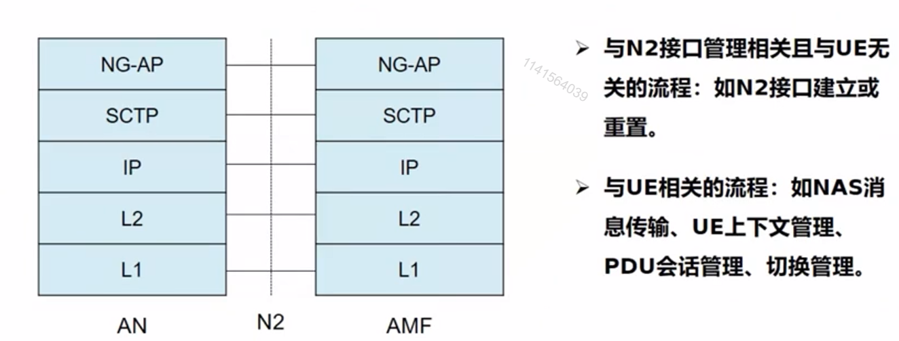

# 一、5G核心网网络接口与协议

​	在介绍5G核心网架构的时候，我们大致了解了一下5G核心网本身有一个参考点架构，通过这个参考点架构可以描述两两NF之间的交互。类似传统网络中的接口。同时这个架构完成了控制面和用户面的分离。所以接下来有关核心网的接口也可以大致分为用户面和控制面。

## 1. 控制面接口：AN --- AMF（N2接口）

​	N2接口是AMF和无线侧的接口，提供终端和AMF的会话管理、移动性管理和安全功能，同时也提供了无线连接功能。还包括寻呼的功能。

​	在N2接口之上存在两种类型的流程：一种是与接口管理相关，但是也业务无关的流程，比如说N2接口建立或重置；另一种是与终端业务相关的流程，比如说PDU会话管理、切换等等。

​	N2应用层协议采用NG-AP协议（无线侧的application应用协议）。NG-AP由多个EP（基本流程）组成。所谓EP就是一次无线侧与AMF的交互。EP包括了一条初始化消息，和一条响应消息。

​	同时在N2接口上定义了两种不同的EP，一种是有响应的消息，可以指示这个EP成功或者失败。另一种是无响应消息，默认成功。比如说NASTransport、Initial UE message，这些都是无响应消息。

​	NG-AP下层采用的依然是传统的SCTP协议（流媒体传输控制协议），用于保证gNB和AMF之间的信令消息的传递。

## 2. 控制面协议：AN -- SMF （N11接口）

​	AN和SMF之间的接口，通过这个接口可以直接透传N2 会话管理信息（N2 SM），N2 SM信息就是N2接口上传递的与会话管理相关的信息，比如说：QFI，Qos Profile，都会在N2 SM信息里携带，N2 SM信息是前面讲的NG-AP消息的一部分，这部分信息是需要交由终端和SMF之间来处理的，但是中间需要AMF进行透传，所以从接入网的角度来看：N2 SM消息是终结于AMF的，因为接入网与SMF是没有接口的。

## 3. 控制面协议：UE -- 5GC （N1接口）

​	N1接口是终端到AMF的接口，采用的是NAS协议，NAS叫非接入层，NAS层主要负责与接入无关，独立与无线接入相关的功能和流程。

​	它是终端和AMF控制面的最高层。一个NAS信令连接用于注册管理（RM）、连接管理（CM）、会话管理（SM）。其中注册管理和连接管理的NAS消息和其他类型的NAS消息时解耦的。也就是AMF负责RM和CM的信令处理。其他的消息就透传给对应的模块进行处理。

​	其他还有哪些相关的协议？NAS协议主要分为NAS-MM（NAS移动性管理）和NAS- SM（NAS会话管理）这两部分组成。上面的 RM 和 CM 就是属于NAS -MM的范围。除此之外，终端和5GC还会有不同的协议，比方说：sm会话管理、SMS短消息、UE Policy终端策略、LCS基于位置的服务。这些协议都是承载在NAS -MM 之上的，通过NAS -MM进行透传的。

​	终端通过不同的接入方式，可能是3GPP，也可能是None-3GPP。总之，它们接入到AMF的时候，每个接入方式各有一条N1的NAS信令连接。所以NAS -MM支持这几个功能：

1.  AMF中接NAS流程：注册管理，连接管理状态，为终端和AMF提供安全的NAS信令连接，以及接入控制功能
2.  不同的NAS消息可以同时和NAS-MM同时传输
3.  3GPP和None-3GPP采用相同的NAS协议
4.  终端和AMF之间的安全上下文会给所有的NAS消息提供安全功能

## 4. 控制面协议 UE -- SM 

​	终端到会话管理功能之间的信令，前面提到过叫NAS - SM信令。支持处理终端和SMF的会话管理，也就是用户面的PDU会话建立、修改、释放。

​	NAS-SM消息是通过AMF传输，并且对AMF是透明的，AMF只透传SMF消息，不对它进行解析处理。

## 5. 控制面协议 5GC -- 5GC

5GCb内部网元之间的接口为SBI接口，采用HTTP服务的形式。

因为5GC采用SBA服务化的架构，所以也需要与它向适应的新一代的接口协议体系。

-   API设计方式：应用程序接口，以RESTful为主
-   IDL（接口描述语言）：OpenAPI 3.0
-   序列化协议：JSON

## 6. 服务化接口的交互模式

​	一个NF使用服务的过程叫服务调用，在服务调用的情况下，使用服务的NF叫Consumer（消费者），提供服务的NF叫Producer（生产者）。一个NF可以同时作为消费者和生产者。

- **请求-响应**：消费者向生产者请求某个特定的网络功能服务，网络功能服务内容可能是提供某个信息、或者操作某个资源。NF_B根据NF_A请求的内容返回对应的响应。
- **订阅-通知**：A向B订阅网络功能服务，B会对所有订阅这个服务的NF发送通知，并返回结果。消费者订阅的信息可以是按时间周期更新的信息，也可以是特定事件触发的通知，比如订阅了用户签约数据发生改变，订阅了用户位置信息发生改变。
- **帮助订阅**：A帮助C向B订阅，A在订阅请求时携带C的地址，这样B的通知信息就直接发送给B。比如NEF可以帮AF在SMF订阅相关通知。

## 7. 用户面协议 一条PDU 会话的用户面协议栈（含N3和N9接口）

​	一整个用户面路劲，从终端到无线，再到UPF。并且图中有两个UPF，这是因为5G PDU会话中可以同时存在多个UPF。

​	用户面协议栈其实就是不同网元在不同的层次对用户的数据包进行封装传输的过程。首先终端侧的Application，这就是用户进行业务的具体**应用数据传输**，可以看到这个层次在整个5GC网络中都是被透传的。5G网络只会帮你把这个数据包传递给外部网络，**不做任何处理**。

​	Application是被封装在下面的PDU层的，这个**PDU层**相当于在PDU 会话上终端和DN之间的PDU搬运工，PDU会话是IPv6是，这里面就相当于IPv6的包；PDU会话类型是以太网时，它就相当于以太网帧。PDU层负责终端与DN之间的PDU会话传输的响应的PDU，这个层次**在中间无线和UPF是透传的**。

​	在核心网的角度来看，再往下就是**GTP协议**了，GTP协议是GPRS隧道协议，在传统2~3G核心网中就已经使用了，在5G核心网中，GTP协议在N3、N9接口之上，**把用户PDU进行封装**来传输。GTP再往下就是传统的UDP和IP了。

​	在无线侧PDU下层有5G AN接入协议层，这里的具体协议，图片没有展示出来。是因为它要取决于具体的接入层。5G可以支持不同接入网类型，不同的接入网就有可能有不同的协议支持。