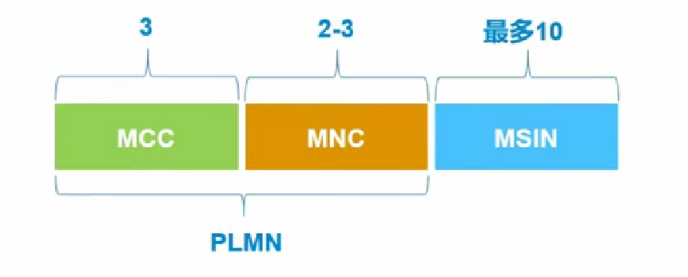
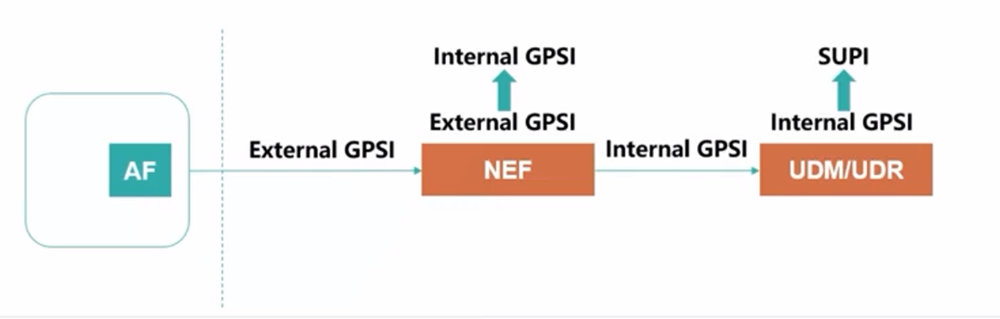
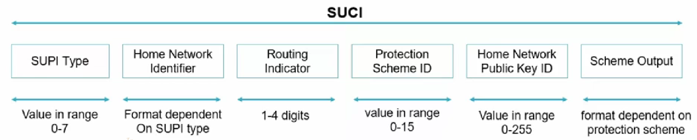
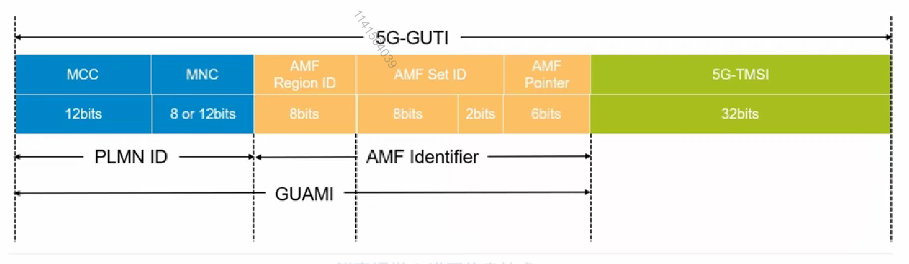
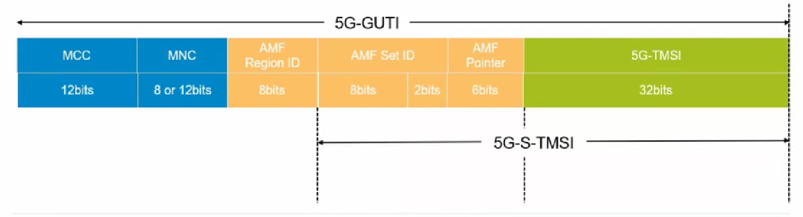
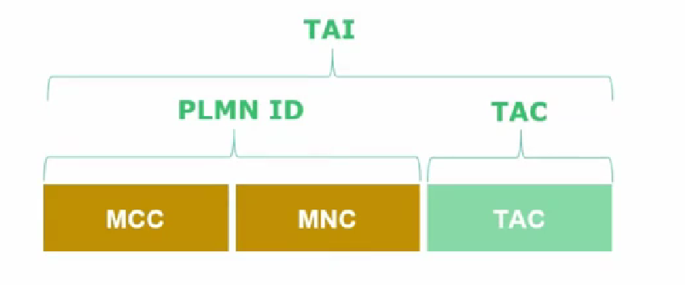
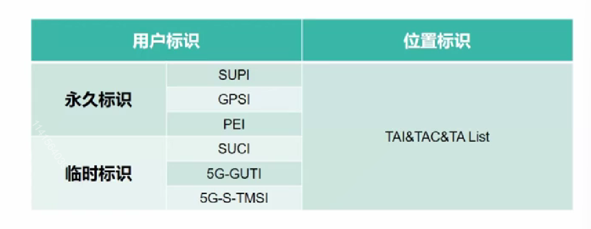

# 一、5G核心网标识

>   5G核心网内有哪些主要标识

## 1. 用户标识

5G 核心网定义的终端用户标识分为永久标识和临时标识两类，如下：

-   永久标识：SUPI、GPSI、PEI
-   临时标识：SUCI、5G-GUTI、5G-S-TMSI

永久性标识是可以**真正**去标识一个终端、一个用户的。临时标识一般是为了保证永久性标识**安全性**而存在的，同时临时标识一般都会比永久标识更短，这是为了**降低传输信令负荷**。

### 1.1 用户永久标识-SUPI

-   SUPI：Subscription Permanent Identifier，永久身份标识
    -   全球唯一，全网都根据此标识来识别一个用户。为了与EPC通用，3GPP接入时使用IMSI，在Non-3GPP接入时使用NAI
    -   SUPI保存在UDM/UDR中它是

它是**手机卡的永久标识**，主要有两种表现形式：1. 3GPP使用的IMSI、2. Non-3GPP使用NAI

>    MCC：移动国家码，中国是460
>
>   MCC：移动网络码，代表具体的运营商比如03
>
>   MSIN：移动用户识别码

### 1.2 用户永久标识-GPSI

-   GPSI：Generic Public Subscription Identifier， 通用公共用户标识符
    -   3GPP系统内外用户与标识用户的公有标识
    -   GPSI作为SUPI的签约数据
    -   GPSI可能是一个MISIDN或外部标识
    -   SUPI和GPSI并不是一一对应的关系

​	它类似传统DN网络提供的网络标识，比方说传统网络的MISIDN，就是手机号，或者其他外部标识可以作为GPSI。GPSI和SUPI有对应关系，但不是一一对应，用户访问不同的DN的数据网络，就可以有多个不同的GPSI标识。在我们的网络内就需要把外部网络GPSI和3GPP本网内的SUPI建立映射关系。

**如何建立映射关系？**

1.  首先外部网络中有一个AF（应用服务器），携带GPSI，范围3GPP网络，这时携带的GPSI我们把它称为`External GPSI`
2.  `External GPSI`会在`NEF`网元中转换位`Internal GPSI`
3.  核心网就会把`Internal GPSI`映射到`SUPI`，但是`NEF`并没有存用户的信息，所以将数据转发给`UDM`
4.  `UDM`会去查询`UDR`，最终映射成`SUPI`

### 1.3 用户永久标识-PEI

-   PEI：Permanent Equipment Identifier， 永久设备标识符
    -   不同场景和不同UE类型可能会有不同的PEI类型
    -   目前3GPP R15只提出IMEI一种

​	前面`SUPI`标识的是手机卡，这里的`PEI`标识的则是终端（手机、pad），它是一个设备的标识。

### 1.4 用户临时标识-SUCI

-   SUCI：Subscription Concealed Identifier, 用户隐藏标识
    -   5G协议针对UE身份安全进行了优化，网络中不再直接传递SUPI，而是使用加密后的SUPI，即SUCI。AMF在安全流程之后可以获取到SUPI。
    -   为用于隐藏SUPI的一种临时标识

​	这是为了弥补传统网络的不足，5G之前的网络通信需要先获得用户的永久性标识，然后才会完成加密的操作，比如，用户想要接入网络，用户先要告诉网络侧我的身份是xxx，我的永久性标识是xxx， 但是这个过程本身是没有加密的，也就是说这个时候用户的永久身份标识是完全暴露在外面的，就很容易被攻击，或者是号码的盗取。很不安全。

​	SUCI就是为了弥补传统网络中的缺陷而产生的，**它是如何产生的？**可以对比HTTP 2.0，引入了公钥和私钥的概念，公钥放在用户侧，私钥放在运营商。这样只有运营商可以解密获取用户的SUPI。

### 1.5 用户临时标识-5G-GUTI

-   5G-GUTI：5G Globally Unique Temporary Identity, 5G全局唯一临时标识
    -   系统下使用5G-GUTI的目的是减少通信中显示使用UE的永久标识，提升安全性
    -   AMF（接入和移动管理功能）分配，AMF可以在任何时候重新为UE分配5G-GUTI
    -   3GPP和Non-3GPP系统通用

**为什么一个临时标识可以说自己是全球唯一的？**

>   GUAMI：全球唯一AMF标识
>
>   PLMN ID：标识全球运营商
>
>   AMF ID：Region ID + Set ID + Pointer， 区域 + 集合 + 集合内具体某一个AMF
>
>   通过GUAMI可以定位：全球某个运营商内，某个区域内的某个集合中的具体某一个AMF
>
>   5G-TMSI：在本AMF内唯一的临时标识

​	一般，AMF会在用户完成了某个网络内的流程后进行分配，比如，初始注册、移动注册更新。

​	同时AMF也可以在任意时刻为UE分配5G-GUTI，比如可以设置一个定时任务，为这个AMF下的所有终端重新分配新的5G-GUTI，但是考虑网络信令负荷，一般不会这么做。

### 1.6 用户临时标识-5G-S-TMSI

-   5G-S-TMSI：简化版的5G-GUTI
    -   5G-S-TMSI是为了使空口信令消息更小，提升空口效率。例如寻呼时，只需要用5G-S-TMSI寻呼终端即可
    -   5G-S-TMSI包含AMF Set ID，AMF Pointer和5G-TMSI

## 2. 位置标识

-   TAI、TAC、TA List
    -   TAI：跟踪区标识
    -   TAC：跟踪区码
    -   TA List：跟踪区列表

# 3. 总结

