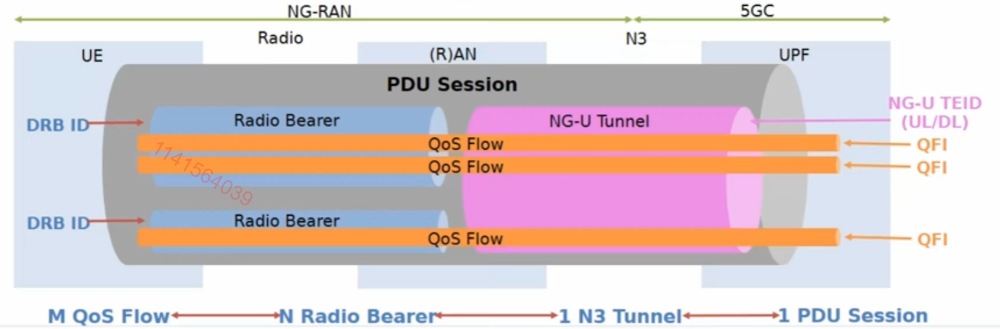
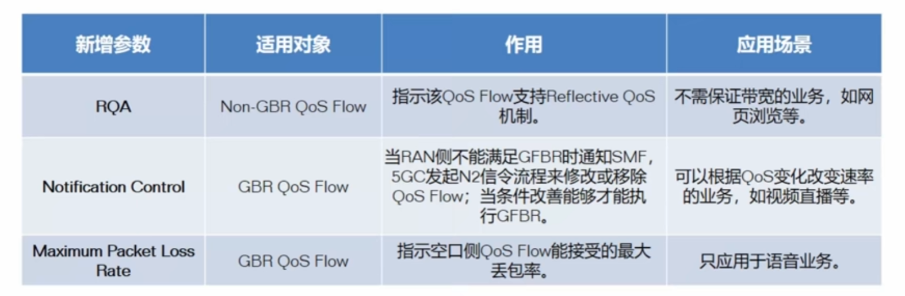

# 三、会话管理

## 1. 概述

​	5GC支持PDU连接业务，PDU（协议数据单元）连接业务就是UE和由DNN标识的数据网络之间交互PDU数据包的业务；PDU连接业务通过UE发起PDU会话的建立来实现。一个PDU会话建立后，也就是**建立了一个UE和DN的数据传输通道**。

-   PDU会话：UE与提供PDU连接业务的数据网络之间的关联
-   PDU会话类型：PDU会话的类型可以分为IPv4，IPv6，IPv4v6，Ethernet（以太网），Unstructured。

**什么是PDU？**

​	协议数据单元，对等层次之间传递数据的一个单位，说人话就是**PDU是用某种协议发送数据单元的一个单位**，每一个协议会有各自的格式，比如说**网络层的PDU就是数据包**，**数据链路层的PDU就是一个数据帧**。

​	PDU连接业务就是终端和DN之间交换PDU的业务，再通俗一点，通过5G进行的业务我们就称为PDU连接业务。需要数据交换就要有传输通道。传输通道我们就叫PDU会话，所以这里给出PDU会话定义：**UE到数据网络DN之间的关联**。

​	因为PDU本身是一个多协议数据传输的一个单位，同时前面也提到过5G的DN网络不仅仅只支持IP协议的业务，还支持其他类型的协议，所以对应着PDU会话的类型也是有多种的：IPv4、IPv6、IPv4v6、Ethernet（以太网）、Unstructured（非结构化）。

​	所以终端与DN之间的PDU类型交换对5G系统来说是**透明**的。

​	**会话管理**功能是**SMF**的基本功能，是用户与外部DN建立连接，进行数据业务的基础，同时会话管理也是通过一些流程对PDU会话进行管理的，主要涉及的流程有PDU会话建立、修改、删除流程。

## 2. DNN

​	DNN：Data Network Name 数据网络名称（**通过它标识不同的DN网络**）

​	5G下的DNN就是4G下的APN，**DNN和APN是等价的**。所以规范对APN的描述和定义与使用就是DNN的描述和定义与使用。

**DNN的作用：**

-   选择PDU会话的SMF和UPF
-   选择PDU会话的N6接口（即对应的UPF到DN的出口）
-   通过DNN确定应用与此PDU会话的策略

一个用户同一时刻是可以**有多个PDU会话**的，比如说上图：UE签约了Internet的DNN，可以通过这个DNN来访问外部网络；同时它还签约了IMS，可以通过这个DNN使用语音业务。

​	不同的DNN对应着不同的PDU会话，一个DNN还可以对应多个PDU会话，假设用户使用Internet这个DNN去访问公网，在公网上也假设有两种协议类型的应用：一个是IPv4类型、另一个是IPv6类型的。所以这个时候用户就需要去申请一个IPv4地址完成v4的业务；同时还需要去申请一个IPv6的地址，完成IPv6的应用。也就是说**每个PDU会话都支持一种PDU会话的类型**。

​	所以当用户同一时刻存在多条PDU会话的时候，我们怎么去判断他到底有多少PDU会话？我们根据什么？我们就根据终端当前所使用的**DNN**，**PDU会话**的类型以及**终端的IP地址**进行判断。只要这**三者中有一个改变**了，这就是一条新的PDU会话。

## 3. 多锚点PDU会话

​	PDU会话有点类型4G中PDN连接的概念。PDN连接也是4G中终端到PDU网络之间的逻辑通道，但是5G中的PDU会话与4G中PDN连接还是有一个比较大的区别。

​	4G的PDN连接与5G的一样，用户同一时刻可以有多条PDN连接，但是一个PDN连接只有一条对外的出口，也就是我们说的**SGI接口**，类似5G的N6接口。但是一个PDU会话是允许有多个对外出口，多个N6接口的，**终端可以通过N6接口上不同的UPF去访问同一个数据网络的DN**。

- 在5G中，一个PDU会话内可以有多个不同的N6接口对应不同的UPF
- 虽然是不同的UPF，但是他们所访问的DN是同一个

### 为什么我访问同一DN需要使用不同的UPF，不同的N6接口？

​	因为这样它可以做到**本地分流**，这个本地分流可以很好的支持前面提到的MEC（多接入边缘计算）业务。

### 上行分类功能

- PDU 会话锚点（PDU Session anchor）：提供到最终外部DN网络的连接，在上行分类功能图中，两个PDU 会话锚点都用N9接口连接到的另外一个UPF，也有一个专门的名字：**UL-CL上行分类器**。
- UL-CL会将用户上行数据包转发到不同的PDU会话锚点中，并且会**把来自不同的PDU会话锚点下行数据做一个合并，发送给终端**。所以UL-CL起到一个类似路由表的功能，对上行业务：UL-CL会执行一定的过滤规则，比如，过滤规则是基于上行数据包的IP、前缀等，来去决定把数据包发往哪一个UPF，决定数据包的路由，发送到不同的PDU会话锚点上，对某些业务可以进行本地的转移。
- 过滤规则不是由UPF提供，而是由SMF提供。假设网络中，部署了普通上网业务，同时还部署了MEC本地业务，SMF会把到MEC本地业务的数据包过滤规则下发给ULCL，当用户发起业务时，ULCL会根据过滤规则，判断符合规则的数据包就发送到本地MEC对应的UPF。

### Multi-home多归属功能

- 功能图和UL-CL功能示意图非常相似，只是中间的ULCL，到右边变成了BP（Branching Point）分叉点，功能是一样的，只不过BP支持的场景是基于IPv6前缀过滤，所以它可以基于业务流的IPv6前缀来进行数据包的识别，然后分流到不同的UPF会话锚点上。

### 小结：

- SMF决定UL-CL和BP（Branching Point）插入、移除；
- UL-CL和BP提供到不同的PDU锚点的上行流量，汇聚到UE的下行；
- UL-CL针对IPv4、IPv6和以太网的PDU会话；仅IPv6类型的PDU会话支持Multi-home特性

## 4.LADN PDU会话

​	LADN：本地数据网络，终端在特定区域才能接入DN

- 网络根据UE的位置信息，为UE指示只有在UE所在特定位置区才能接入的数据网络信息，以供UE接入该DN，使用该DN提供的业务。
- LADN会有专门的LADN 的 DNN 来标识，终端只有处于DN服务区内时，才能进行对应的LADN业务，比如：请求建立这个LADN 对应的PDU会话。
- 这个LADN区就是我们前面讲过的跟踪区TA的集合，当终端离开这个LADN服务区时，他之前所建立的对应的PDU会话，就会被释放。

## 5. QoS Flow

​	相较于4G，5G核心网取消4G承载的概念，取而代之的是QoS Flow。4G中首先终端到外部网络之间有一个PDN连接，类似5G中的PDU会话。在PDN连接内会有多个不同的承载，有默认承载，有专有承载，在承载内再去发送不同的数据流。

​	到5G中，承载概念被取消了，主要是3GPP希望减少网络中承载建立与释放这些信令流程。比方说，4G做语音VoLTE业务时，打视频语音通话时，首先会建立信令默认承载，然后在开始呼叫时，会去建立专门一条语音的专有承载，去承载语音包，同时创建一条视频对应的专有承载，承载视频包，等通话结束后，对应的语音和视频这两条专有承载就会被释放掉。所以网络中专有承载有对应的业务实现的话，那这些专有承载就会不停地建立和释放。所以3GPP就想去减少这样的信令流程，所以取消了承载的概念。

​	在5G PDU会话中，因为没有了承载的概念，所以有了QoS Flow变成了区分QoS 最精细的粒度。在4G业务中QoS 是基于承载的，到了5G QoS 就是基于QoS Flow。一个PDU会话当中，可以包含一个，或者多个QoS Flow，并且每个QoS Flow都会有一个标识叫QoS Flow ID（QFI），PDU会话当中具有相同QFI的业务流就会接收相同的业务转发处理，同时QFI在每个PDU会话中是唯一的，并且在发送用户数据包时，QFI会被封装在N3和N9协议报头中。

​	分析上图，从UE到UPF就是一个PDU会话，一个PDU会话可以存在多个QoS Flow，QoS Flow 的长度跨越了从终端到无线再到UPF，因此从逻辑上我们还可以把QoS Flow对应成两段承载上，一段就是空口的承载Radio Bearer（无线承载），另一段就是无线到UPF之间的N3隧道。

​	从上图看一共有两个Radio Bearer，上面的那个有两条QoS Flow，下面的有一条QoS Flow，所以Radio Bearer和QoS Flow是可以有一对多的关系。而N3隧道为了简化网络路由的管理，5G中一个PDU会话会公用一个NG-U Tunnel（N3隧道）。

​	由此我们可以总结出：一条PDU会话，QoS Flow 、Radio Bearer、NG-U Tunnel三者之间的关系。

​	除了QoS Flow 有它的标识QFI，其它两者也有对应的标识，Radio Bearer是DRB ID，NG-U Tunnel的标识是NG-U TEID（隧道端点标识）

### 小结：

- 5G网络要传输业务数据，首先就要有一条传输通道，QoS Flow 就可以理解为这条传输通道
- QoS Flow 是PDU会话中最精细的QoS 区分粒度。相同的QoS Flow 上所有数据流获得相同的QoS 保障，不同的QoS 保障需要不同的QoS Flow来提供。
- 通过QoS Flow ID（QFI）在5G系统中标识一个QoS Flow

​	

## 6. QoS 映射

​	有一个上行数据包或者下行数据包需要在网络中发送时，这个数据包是如何找到对应的QoS Flow的？怎么进入到入口中进行数据包发送？怎么保证数据包传输是在同一条QoS Flow？

​	我们通过映射解决上面的问题。5G在数据包发送时，首先会把数据包映射到QoS Flow 上，也就是进入通道的入口，这时如何完成的？

​	这里涉及了两个概念，第一个QoS Rule（QoS 规则），另一个PDR（包描述规则）

假设终端要发一个上行数据包：

1. 首先它会根据QoS Rule匹配某一条QoS Flow
2. 之后在空口中完成QoS Flow到Radio Bearer无线承载的映射
3. 在一条PDU会话中只有一个N3隧道，Radio Bearer会统一的将数据包发送到N3隧道上

**QoS Flow 在N3隧道中都是共用一个N3隧道的，在N3隧道内怎么区分不同的QoS Flow?**

​	在终端或UPF分别完成对上下行QoS Flow的映射之后，它们会在数据包的包头上，直接添加QFI（上行）来进行区分。

​	通过这个操作使得用户的数据包可以找到对应的QoS Flow，并且保证在发送过程中，一直是使用同一条QoS Flow。

​	下行会把PDR 规则将数据包映射到不同的QoS Flow上，然后反向一步步映射回给终端。

## 7. Qos Rule

- QoS Rule：对于上行数据，UE根据QoS 规则对数据包进行匹配，数据包从匹配上的QoS Flow以及对应的AN通道（也就是前面说的Radio Bearer无线承载）向上传输。

​	简单说，QoS 规则就是负责把用户所要发送的上行数据包，映射到QoS Flow上，完成了用户对数据包上行映射。

​	一个QoS Rule主要包含了它所关联的QoS Flow的标识(QFI)，Package Filter Set（数据包过滤集合），以及QoS Rule规则的优先级。

​	包过滤器包含了IP五元组和一些其他的IP报头属性相关的信息，通过这个过滤器对上行数据包过滤，匹配到不同的QoS Flow上，同时QoS 规则可以由网络侧直接提供给用户，比如在PDU会话建立或修改流程中，通过信令直接分配给用户；也可以在终端上预配置；再或者终端可以使用反射QoS 机制，将QoS 规则推导出来；

​	通过QoS Rule完成对上行数据包的映射，找到对应的QoS Flow入口。

## 8. PDR

​	如果是一个下行数据包，在UPF这里想要发送给用户，怎么反过来找到对应的QoS Flow?

- PDR：对于下行数据，UPF根据PDR对数据进行匹配，数据包从匹配上的QoS Flow以及其对应的AN通道（Radio Bearer无线承载）向下传输。

​	PDR的功能和QoS Rule是类似的，只不过PDR是用于下行数据包的映射，把用户的下行包映射到不同的QoS Flow上。

​	PDR中的规则也是由SMF来提供，由UPF来完成执行。假设一个数据包没有匹配到任何一个QoS 规则或PDR，这个数据包就会被终端或者UPF给丢弃掉。（入口都找不到，无法完成后续的发送）

## 9. QoS 参数概览

​	在5G中我们通过基于QoS Flow来完成对QoS的控制。在5G中具体有哪些QoS 的参数？

​	这些参数放在一起3GPP给了它一个称呼：QoS Profile（QoS 属性）

​	5G的QoS 参数和4G的一样，首先分成了两种类型，一种是GBR（保证比特率），另一种是Non-GBR（无保证比特率）。

​	这两种类型内都会包含不同的QoS 参数，其中有两种参数是在所有的QoS Flow中都会被包含：5QI、ARP

### ARP

- ARP（Allocation and Retention Priority，分配保留优先级）在资源受限情况下，决定是否接收新的QoS Flow。标识业务获取通路（主要是空口）的能力，也就是用ARP来控制QoS Flow建立、修改的优先级
- ARP参数包含**优先级、抢占能力、可被抢占**等信息；分别标识创建通路的优先级、创建或修改通路时能否抢占其他通路的资源、是否被其他通路抢占资源
- 定义了资源的重要性，在资源受限的情况下，决定一个新的QoS Flow应该接收还是拒绝。**在资源受限情况下**，是否可以抢占现有的QoS Flow的资源。
- ARP优先级的取值范围1~15， 1为最高优先级

> 抢占能力：一个较高优先级的数据流，是否能抢占一个已有的，较低优先的QoS Flow的资源。
>
> 被抢占能力：QoS Flow是否可以**丢失**已经分配给它的资源，用来允许有较高优先级的数据流使用资源。
>
> 抢占能力和被抢占能力都被设置为Yes，ARP的优先级才起效

### 5QI

- 5QI（5G QoS Identifiler，5G QoS标识）类似4G中的QCI，是业务质量的索引，代表了资源类型、优先级、可靠性、丢包率等一组参数的取值方位，应用与所有的通路。
- 定义了索引后，核心网不需要传递全部参数，只传递索引值就可以将一组QoS 信息通知无线侧，减少网元间的参数传递。
- 5QI支持标准化的5QI，同时还支持动态定义的5QI（非标准化），非标准化的5QI在定义后还需要将5QI具体定义信息发送给无线侧，无线侧才可以进行控制

### xBR

- 在业务质量中，带宽是用户最关心，也是最容易被用户观察到的质量参数，分为上行带宽和下行带宽
- 5G的流分为2种类型，保证带宽的GBR类型和非保证带宽的Non-GBR

> - 对于GBR QoSi流，通过如下两个参数来定义：
>   - GFBR:保证流比特率，表示由网络保证在平均时间窗口上向QoS流提供的比特率。
>   - MFBR:最大流比特率，将比特率限制为QoS流所期望的最高比特率，
> - 对于No-GBR QoS流，就不能保证带宽了，取而代之的是AMBR(聚合最大比特率)，AMBR 仅应用于Non-GBR QoS流，不应用与GBR QoS流。AMBR有两种类型，分别是：
>   - Session-AMBR:定义了一个PDU会话的所有non-GBR QoS流的比特率之和的上限，也就是说一个PDU会话的所有non-GBR QoS流的比特速率之和不能大于该PDU的Session-AMBR。
>   - UE-AMBR:定义了一个UE所有的non-GBR QoS流比特率之和的上限，也就是一个UE的所有non-GBR QoS流的比特率之和不能大于UE-AMBR。

​	同一终端有两个IP地址，对应的有两个不同的PDU会话，在PDU会话1中，有三条QoS Flow，第一个为GBR类型，下面两个为Non-GBR类型。第二个PDU会话中有两条QoS Flow，一个为Non-GBR，另一个为GBR。

​	在GBR的QoS Flow中都有各自的GFBR和MFBR，通过这两个参数对GBR类型的QoS Flow速率的控制。

​	对于Session AMBR来说，两条PDU会话对应的就会有两个它们对应的Session AMBR，AMBR是针对Non-GBR，每个Session AMBR只能控制本PDU会话中所有Non-GBR类型的QoS Flow总速率不能超过这个数值，GBR的它控制不了

​	UE-MABR，终端级别的，针对的就是这个终端所有的PDU会话，同时这个参数也是Non-GBR QoS参数，它只能控制当前终端所有的，PDU会话中的Non-GBR类型的QoS Flow的总速率。

### 可选QoS 参数

- 为了更灵活的控制QoS，更好的保障业务质量，5G QoS 还新增了如下可选参数：

## 10. QoS 总结（下行举例）

​	假设网络侧有一个用户下行数据包要发送给用户，有多个不同的数据流，到达UPF这里，UPF根据PDR中的过滤器规则把不同的数据流对应到不同的QoS Flow上，并且会在数据包的包头上，打上对应的QFI的标签。QFI的取值可以等于本条QoS Flow所使用的5QI的取值。

​	UPF用本条PDU会话的N3隧道，将数据包发送到无线侧，无线侧根据数据包不同的QFI的包头，将他们对应的不同的无线侧承载上（RB），完成空口上的映射，最终通过无线承载将用户数据包发送给终端，终端完成数据包接收，并且在整个发送过程中，不同的QoS Flow会根据本条QoS Flow上QoS 属性（Profile）进行数据包控制。

## 总结：

​	

​	