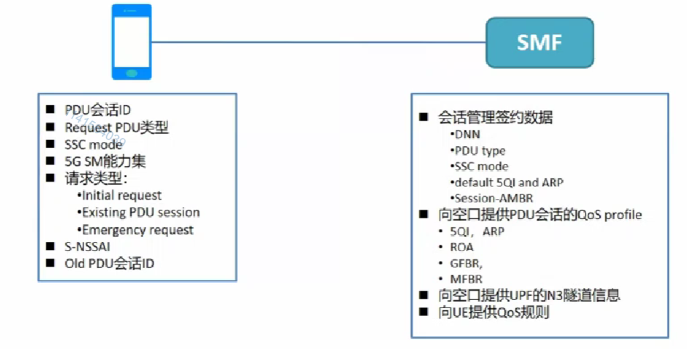

# 三、PDU会话建立流程

## 1. PDU会话建立流程概念

-   PDU会话建立流程用于创建新的PDU会话（4G核心网中的PDN连接）
-   PDU会话创建成功后，网络会**为UE分配IP地址**，并且建立**UE到DN的数据通道**，为**用户分配相应的QoS**，**建立用户的PCC规则**，最终**UE可以使用该IP地址访问位于外部DN上的业务**（IP地址是公网IP地址？如果是这样中国有最少10亿的手机用户，未来有更多难以估计的物联网设备都要给它们分配IP？IP是使用IPv4还是IPv6?）
-   PDU会话建立流程也用于会话的跨系统切换，或者None-3GPP间的会话切换，比如一个用户从4G系统切换到5G系统，也是就等于把用户的PDN连接变成5G中的PDU会话。又或者当前用户是用WiFi接入的，然后从WiFi切换到5G，也需要把WiFi的连接变成5G的PDU会话

### (1). 4G系统和5G系统中会话管理的不同点

​	5G的会话管理与4G会话管理有很大的不同，5G的会话管理和移动性管理是完全分离的，但是在4G的附着流程中会去创建用户的**默认承载**，完成会话的建立。而5G的**初始注册过程**中，**不会建立用户的PDU会话**（对mMTC的支持）。另外5G中取消了承载概念，取而代之的是QoS Flow。5G会话管理中还可以插入多个用户面的功能，比如ULCL上行分类器。这都是5G会话管理和4G会话管理不同的地方。

​	

### (2). PDU会话建立的场景

1.  5G网络正常在网络中发起的PDU会话建立
2.  终端发生了非3GPP和3GPP的切换而创建PDU的会话（WiFi）
3.  终端从4G切换到5G，这种互操作流程创建的PDU会话（EPS =》5GC）

**网络侧会不会发起PDU会话建立？**

​	网络侧不可以发起PDU会话建立请求。

**假如用户注册之后，网络侧有应用业务需要，它需要主动触发给终端时怎么办？**

​	在这种情况下，网络侧会给终端发送一个触发消息，基于这个触发消息，终端再去发起PDU会话建立流程。网络侧触发，但是最后的流程发起者还是终端。

## 2. PDU会话建立流程

### (1). UE给AMF发起会话建立请求

​	虽然AMF不是处理会话管理的网络功能，但是由于终端和SMF之间是没有接口的，所以仍然需要把请求发送给AMF，由AMF转发给SMF。

​	在这个消息中会携带哪些消息，我们来一一看一下：

-   S-NSSAI：确定切片选择信息
-   DNN：标明终端向要接入的外部网络，以及通过它可以完全后续流程的部分选择功能

>   ​	用户有可能不携带这两个消息，终端只携带了DNN，AMF会根据它之前在注册过程中所获取的签约数据，为终端确认一个默认的S-NSSAI。
>
>   ​	终端只携带了 NSSAI，AMF也会根据签约数据，来确定一个默认的DNN，但是终端携带一个它没有签约的DNN，理论上来说AMF就会拒绝这个会话请求，

-   PDU Session ID：如果这是终端创建的一个新的PDU会话，终端就会生成新的PDU会话ID带上来
-   Request Type：
    -   初始请求：这是一个新建的PDU 会话请求，它携带的就是初始会话请求
    -   紧急请求：终端为紧急服务创建PDU会话
    -   已存在PDU会话：从非3GPP网络切换过来，而去创建PDU会话
-   N1 SM容器：里面包含了一个完整的PDU会话建立请求，比如终端请求的PDU类型，终端请求的SSC模式，5G会话管理能力

### (2). AMF选择SMF并想SMF发起请求

​	在第一条消息之后，其实还隐含了一个步骤，就是SMF的选择，AMF会连同NRF和NSSF为用户选择一个SMF。

​	完成SMF选择之后，AMF就会给SMF发起一个请求。请求会话管理建立的上下文。在这个消息中携带了如下的信息：

-   SUPI：用来标识用户
-   DNN、S-NSSAI、PDU Session ID、请求类型、N1 SM容器：AMF转发的信息
-   AMF ID：AMF标识，这个标识就是5G-GUTI的GUAMI，全局唯一的AMF ID
-   用户位置信息、无线接入类型RAT、用户终端的PEI、GPSI手机号码
-   UE所处的LAD服务区：指示UE是处于LAD服务区内还是外

### (3). SMF携带相关信息到UDM中进行注册

​	UDM或者说UDR就会去保存用户的SUPI，SMF ID以及对应的DNN和PDU会话ID

​	注册完成之后，为了处理终端发起的PDU会话建立请求，SMF还需要获取终端的签约信息，包括终端签约的切片、DNN、QoS Profil、SSC 模式等等，所以它会进一步给UDM发一个GET请求，请求获取用户的签约信息

### (4).SMF向AMF返回建立SM上下文的响应消息

​	告诉AMF，SMF是否确认接受创建PDU会话：`PDU session establishment accept (PDU session type IPv4 only allowed)`

### (5).SMF向PCF获取PCC Rule

​	如果需要会话管理的动态PCC规则，这个时候SMF首先启用一个PCF的选择功能，SMF选择PCF可以基于NRF，把之前用户的DNN，AMF告诉它的PCF对应的ID，由NRF来帮SMF来选择PCF。也可以基于SMF的本地配置，可能配置了PCF的本地选择策略，可以根据这个策略自己选择PCF。

​	选择完成之后，就会向PCF获取用户会话管理的PCC规则

### (6). SMF向UPF发起N4会话建立请求

​	如果本次PDU会话为初始请求，SMF就会选择一个UPF发起一个建立N4会话请求。如果之前的请求不是初始建立请求，那么这里发起的就是N4会话修改请求。

​	假设这里是N4会话建立请求，SMF要和UPF之间建立N4会话，因为UPF本身是用户面功能，不属于服务化架构的，所以不能通过NRF进行选择，所以SMF会根据本地的配置策略进行UPF的选择，选择到某个UPF之后，给它发送建立会话的请求，在这个消息中，SMF会提供给UPF相应的有关于用户数据包的，比方说探测、执行、报告等等一系列的规则，让UPF进行执行，比如说：用户的PDR就是在这个时候下发的。

​	同时UPF和SMF之间也会交互各自核心网隧道的信息，来完成N4的隧道搭建。

### (7). SMF向AMF发送N1 N2 Message Transfer

​	这个消息携带的信息包括给无线的N2 SM的信息，这个信息里面包含了对应的QoS Profil以及核心网的隧道信息，也会发送给N1 SM容器，这个容器里面包含了PDU会话建立、接受、包括分配给终端的地址，通知无线侧和终端侧需要建立PDU会话

### (8). AMF将这些消息转发给无线侧

### (9). (R)AN将消息转发给UE

​	无线侧对本次的PDU会话资源进行分配，同时将SMF发送给UE的PDU会话ID，N1 SM容器转发给终端

### (10). 无线侧给AMF返回响应消息

​	同时将自己接入侧的隧道信息告诉AMF，到这步为止，用户的上行隧道就建立起来了，为什么说是上行隧道？首先用户的隧道是分上下行的，上行就是终端到网络，下行就是网络到终端。在之前的流程中通过第七步、第八步，核心网通过SMF把UPF的信息告诉给了无线，所以无线侧知道该把数据包发往那个UPF的，但是UPF还不知道接入侧的信息，所以当前用户的下行信息还不知道往那个基站发。

### (11、12) AMF通过SMF向UPF转发基站隧道信息，建立下行隧道

​	所以通过11步和12步，AMF会把无线侧，也就是接入侧的隧道信息进一步转发给UPF，这样UPF才获取接入侧的隧道信息，也就是基站的隧道信息。至此下行隧道也建立成功。

### (13). SMF向AMF返回PDU会话更新成功的响应，完成本次PDU会话建立

## 3. PDU会话建立流程 -- 总结

### (1). 请求建立SM上下文

​	首先UE会发送建立PDU会话建立请求，请求在网络侧建立会话管理上下文

### (2). 获取PCC规则

​	SMF会与PCF之间进行交互，获取用户会话管理的PCC规则	

### (3). 建立用户面通道

​	最后整个大的部分都是在建立用户面通道，用户面通道分为两个部分：空口隧道，在步骤9 就可以去建立好空口的通道了；无线侧到UPF之间的通道，这部分通道需要双发交互各自的隧道信息，因为它们采用的是GTP协议，它们两者之间需要交互各自的TEID，把核心网的TEID告诉无线，再把无线的TEID告诉核心网。

## 4. PDU会话建立过程的主要信息

### (1). UE携带的信息

-   Request PDUl类型：IPv4、IPv6还是其他类型
-   SSC Mod：会话和服务连续模式（Session and Service Continuity Mode）的简称。 5GS支持有三种不同的SSC mod；一个PDU会话的SSC模式在该PDU会话的整个生命周期内不会改变，也就是说一条PDU连接在起建立时设置为SSC mode-X，那么这条PDU会话的模式是不能修改的，直至其被去激活都是SSC mode-X。

>   [5G系统——SSC模式](https://blog.csdn.net/u010178611/article/details/81705135)

-   5G SM能力信息
-   请求类型：
    -   Initial request：初始请求
    -   Existing PDU session：已存在PDU会话
    -   Emergency request：紧急请求
-   S-NSSAI：用户请求网络切片标识符
-   是否有旧的PDU会话ID

