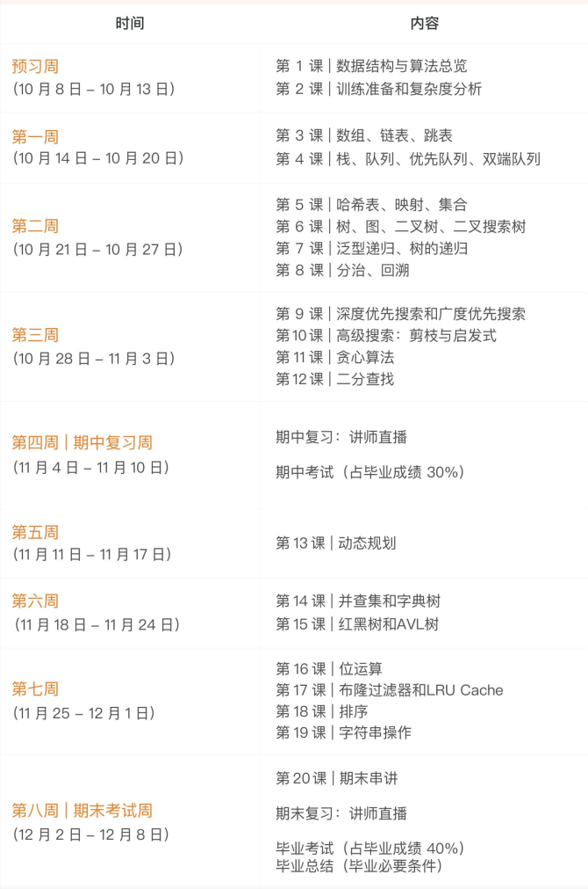

# 刷题计划表

**时间**：2023年6月19日 ~ 2023年8月7日      一共八周

**课程**：极客时间算法训练营第四期

## 一、学习目标

​	**我们希望通过两个月的高强度算法学习，熟练掌握基础算法，一站式解决面试算法问题！**

​	8个星期后我们的LeetCode刷题数**至少达到200道**，也就是说每周刷题量大概是30道左右。

**课表：**

# 第一周：

1.  数据结构与算法总览
2.  五步刷题法
3.  线性表：数组、链表、集合、栈、队列、优先队列、双端队列

作业：

1.  数据结构和算法总览思维导图
2.  参考代码随想录的刷题顺序，**刷完数组、链表、栈与队列的题目，一共有19道题**，完成后可以多自信多刷几道，**严格按照5步刷题法刷题**

参考网站：

1.  [LeetCode题解](https://doocs.gitee.io/leetcode/#/)
2.  [代码随想录](https://programmercarl.com/%E6%95%B0%E7%BB%84%E7%90%86%E8%AE%BA%E5%9F%BA%E7%A1%80.html#%E6%95%B0%E7%BB%84%E7%90%86%E8%AE%BA%E5%9F%BA%E7%A1%80)

