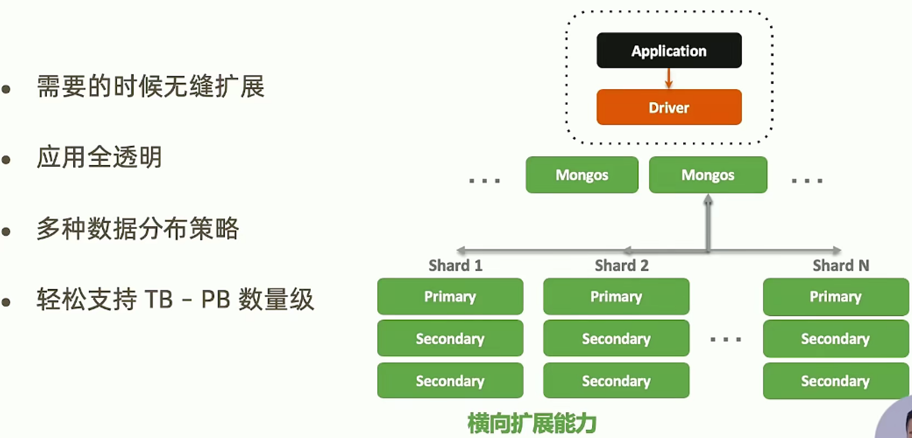
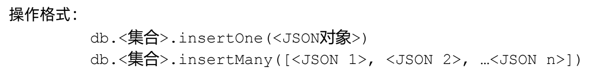

# MongoDB高手

极客时间视频课，因为一些项目需要所以在2022年2月22日开始学习，希望我能学有所成。

**我想要通过学习这门课获得什么？**

1.  通过求职面试
2.  熟练掌握一门半衰期很长的编程语言是一件性价比非常高的事情
3.  将所学过的东西运用起来，更要知其然还要知其所以然


# 第00章 mongoDB综述

## 01 内容综述

第一章 MongoDB再入门：对MongoDB有一个快速的概览

第二章 从熟练到精通的开发之路：文档模型的设计、数据安全和事务性

>   面向开发者，系统在上线之前需要做的事情。

第三章 分片集群与高级运维之道：

>   面向dba和运维，针对系统上线时和上线后需要关注的事情，详细分析影响MongDB性能的因素，出现问题时候的排查手段

第四章 企业架构师的进阶之法：在什么样的情况能够充分利用MongoDB的价值


## 02 认识文档数据库MongoDB

### MongoDB：重新定义OLTP数据库

![[Pasted image 20230407180223.png]]


### MongoDB版本变迁


3.x合并了一家做数据库引擎的公司wiredTiger，性能得到非常大的提高。

4.x支持了事务


### MongoDB VS. 关系型数据库


## 03 `MongoDB`特色及优势

###` MongoDB`优势：面向开发者的易用+高效数据库


> 一目了然的对象模型

### 灵活：快速响应业务变化


> - 多行性：在传统的关系型数据库中，如果一张表中有10个字段，那么它所有的数据都是10个字段。在`Mongo`中不一定要这样，比如客户表现在有10 个字段，第11个客户它要多加一个`QQ账号`字段。
>
> - 动态性：当你的模式需要改变时，比如从10 个字段增加到12个字段，这个动作在传统的数据库中需要下线操作，在`Mongo`中直接在应用层增加属性，把整体的`Json`丢给`Mongo`，它就能帮你存在表内。
> - 数据治理：在一张表中什么都可以放，会不会有很多的垃圾，对`DBA`来说非常难以维护。不是的，`Mongo`有数据治理功能，在表中增加一些限制，让数据必须按照某种规则进来。
> - 对比传统型数据库规则松了一些，同时也更加自由了。

### 快速：最简单快速的开发方式


使用传统的数据库，用于第三范式的设计，一个用户需要分为6张表来进行存储。

#### 物理意义：

​	在`MongoDB`中只要一张表，也就是说数据全在一个区域，这样对物理层有很大的意义，数据都是存储在机械硬盘里的，机械硬盘读写数据花最多的时间是定位，6张表需要定位6次。

#### 代码意义：

​	`SQL`语句，因为`Mongo`只有一张表，所以我们查询的时候只需要写一条查询语句即可。而传统型`SQL`要关联6张表进行查询。


### `MongoDB`优势：原生的高可用和横向扩展能力





## 总结：

这一讲主要介绍`Mongo`相比较于关系型数据库的 优点：

1. `Json`文档模型，对程序员非常友好，类似于`API`的调用，达到快速开发的目的
2. 分布模式，提供高可用，无下线的滚动服务，分片集群和优秀的横向扩展能力，支持TB~PB数量级


# 第01章 `MongoDB`再入门

## 04安装`MongoDB`

### 下载`MongoDB`

[`MongoDB`下载地址](https://www.mongodb.com/try/download/community?jmp=nav)

-   企业版-开发环境免费使用
-   社区版- 所有环境免费使用
-   `TGZ`版本包含server mongos tools和shell

```shell
mkdir -p /data /data/db
cd /data

curl -O MongoDB的下载地址
# 解包
tar -xvf mongdb-linux-x86_64xxxx.tar

# 将mongo加入到可执行文件
export PATH=$PATH:/data/mongdb-linux-x86_64xxxx/bin

mongod --dbpath /data/db --port 27017 --logpath /data/db/mongod.log --fork
```


### 导入样本数据

```
curl -O -k https://raw.githubusercontent.com/tapdata/geektime-mongodb-course/master/aggregation/dump.tar.gz

tar -xvf dump.tar.gz

mongorestore -h localhost:27017
```

在安装的时候可能默认没有安装tools，需要自己手动安装：

[tools下载路径](https://www.mongodb.com/try/download/database-tools)，下载好了后解压缩到`MongoDB`的bin目录下


## 05 `MongoDB`基本操作

学习目标：了解基本的CRUD操作、掌握库和集合的操作

### 使用insert完成插入操作



```sql
// 在当前的数据库中fruit集合中插入一条记录
db.fruit.insertOne({name: "apple"})

// 插入多条记录
db.fruit.insertMany([
    {name: "apple"},
    {name: "pear"},
    {name: "orange"}
])
```


### 使用find查询文档


-   find示例：

```sql
// 在movies集合中查询year为1975的记录
db.movies.find( { "year" : 1975 } ) //单条件查询

// 查询year为1975并且title为Batman的记录
db.movies.find( { "year" : 1989, "title" : "Batman" } ) //多条件and查询

db.movies.find( { $and : [ {"title" : "Batman"}, { "category" : "action" }] } ) // and的另一种形式

db.movies.find( { $or: [{"year" : 1989}, {"title" : "Batman"}] } ) //多条件or查询

// 查询title是B开头的记录
db.movies.find( { "title" : /^B/} ) //按正则表达式查找
```


### 查询条件对照表


### 查询逻辑对照表


### 查询逻辑运算符

```
$lt: 存在并小于
$lte: 存在并小于等于
$gt: 存在并大于
$gte: 存在并大于等于
$ne: 不存在或存在但不等于
$in: 存在并在指定数组中
$nin: 不存在或不在指定数组中
$or: 匹配两个或多个条件中的一个
$and: 匹配全部条件
```


**删除一张表：**

`db.fruit.drop()`:删除fruit表


### 使用 find 搜索子文档

find 支持使用“field.sub_field”的形式查询子文档。假设有一个文档：

```
db.fruit.insertOne({
    name: "apple",
    from: {
        country: "China",
        province: "Guangdon"
    }
})
```


考虑以下查询的意义：

```go
// 查一个文档
db.fruit.find( { "from.country" : "China" } )

// 错误的写法
db.fruit.find( { "from" : {country: "China"} } )
```


### 使用find搜索数组

**find支持对数组中的元素进行搜索。假设有一个文档：**

```go
db.fruit.insert([
    { "name" : "Apple", color: ["red", "green" ] },
    { "name" : "Mango", color: ["yellow", "green"] }
])
```

考虑一下查询的意义：

```go
// 查询color是red的记录
db.fruit.find({color: "red"})

// 可以在数组里面进行查询
db.fruit.find({$or: [{color: "red"}, {color: "yellow"}]} )
```


### 使用find搜索数组中的对像

```go
db.movies.insertOne( {
    "title" : "Raiders of the Lost Ark",
    "filming_locations" : [ 
        { "city" : "Los Angeles", "state" : "CA", "country" : "USA" }, 
        { "city" : "Rome", "state" : "Lazio", "country" : "Italy" },
        { "city" : "Florence", "state" : "SC", "country" : "USA" }
    ] 
})
```

查询城市是**Rome**的记录：

```
db.movies.find({"filming_locations.city":"Rome")
```


在数组中搜索子对象的多个字段时，如果使用 `$elemMatch`，它表示必须是同一个
子对象**同时满足多个条件**。考虑以下两个查询：

```go
db.getCollection('movies').find({
        "filming_locations.city": "Rome",
        "filming_locations.country": "USA"
    })
    db.getCollection('movies').find({
        "filming_locations": {
        	$elemMatch:{"city":"Rome", "country": "USA"}
    }
})
```

`city == Rome and country == USA`


### 使用投影控制find返回字段


```go
// 找到所有的动作片，但是只需要返回title
db.movies.find({"category": "action"},{"_id":0, title:1})
```


### 使用remove删除文档

-   remove 命令需要配合查询条件使用
-   匹配查询条件的文档会被删除
-   指定一个空文档条件会删除所有文档

示例：

```go
db.testcol.remove( { a : 1 } ) // 删除a 等于1的记录

db.testcol.remove( { a : { $lt : 5 } } ) // 删除a 小于5的记录

db.testcol.remove( { } ) // 删除所有记录

db.testcol.remove() //报错
```


### 使用update更新文档

Update 操作执行格式：db.<集合>.update(<查询条件>, <更新字段>)

示例：

```
db.fruit.insertMany([
    {name: "apple"},
    {name: "pear"},
    {name: "orange"}
])

// 查询name为apple的字段，并且给字段添加from。$set更新字段，如果不存在就会创建
db.fruit.updateOne({name: "apple"}, {$set: {from: "China"}})
```

-   使用 updateOne 表示无论条件匹配多少条记录，始终只更新第一条；

-   使用 updateMany 表示条件匹配多少条就更新多少条；

-   updateOne/updateMany 方法要求更新条件部分必须具有以下之一，否则将报错：

    


### 使用drop删除集合

-   使用 db.<集合>.drop() 来删除一个集合
-   集合中全部文档都会被删除
-   集合相关的索引也会被删除

```
// 删除fruit表
db.fruit.drop()
```


### 使用dropDatabase删除数据库

-   使用 db.dropDatabase() 来删除数据库
-   数据库相应文件也会被删除，磁盘空间将来被释放

```
use tempDB
db.dropDatabase()
show collections // No collections
show dbs // The db is gone
```


## 06 使用Python操作MongoDB

这里我们做了一个helloworld实验，通过Python语言连接MongoDB。演示驱动MongoDB的CRUD指令

### 1. 安装Python MongoDB驱动程序

在Python中使用MongoDB之前必须安装用于范问数据库的驱动程序；

```
pip install pymongo
```

检查驱动程序：

```
import pymongo
pymongo.version
```


### 2. 创建连接

**确定MongoDB连接串：**

使用驱动连接到 MongoDB 集群只需要指定 MongoDB 连接字符串即可。其基本格式可以参考文档: [Connection String URI Format](https://docs.mongodb.com/manual/reference/connection-string/) 最简单的形式是：

-   mongodb://数据库服务器主机地址:端口号
-   如mongodb://127.0.0.1:27017

**初始化数据库连接**

```python
from pymongo import MongoClient
url = "mongodb://127.0.0.1:27017"
client = MongoClient(url)
print(client)
```


### 3.数据库操作：插入用户

-   初始化数据库和集合

```
db = client["eshop"]
user_coll = db["users"]
```

-   插入一条新的用户数据

```python
new_user = {"username": "nina", "password": "xxxx", "email": "123456@qq.com "}
result = user_coll.insert_one(new_user)
print(result)
```

注意：我们没有提前创建数据库和表/集合


### 4.更新用户

-   需求变化，要求修改用户属性，增加字段phone

```python
result = user_coll.update_one({ "username": "nina"}, 
	{ "$set": { "phone": "123456789"} }
) 
print(result)
```

