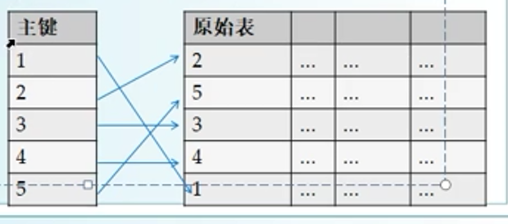

# 第一章 搭建服务器

## 安装mysql

[MySQL官网](https://dev.mysql.com/downloads/mysql/)

[安装博客](https://cloud.tencent.com/developer/article/1636375)

注意安装的时候选择mysql版本，一般mysql5.7版本和8.0版本的比较多。具体的每个mysql的版本比较在后续课程中学习到。


## 安装SQLyog

[SQLyog下载地址](http://www.3h3.com/soft/214163.html#xgbb)


在使用SQLyog连接数据库的时候会出现一些问题，是因为mysql8.0的密码加密问题，在命令行进入mysql然后执行下面的命令，改变密码加密就好了。

```sql
ALTER USER 'root'@'localhost' IDENTIFIED WITH mysql_native_password BY 'root';
```


# 第二章 数据库和表

## 创建数据库

-   打开SQLyog，连接到MySQL服务器
-   创建一个练习用的数据库example
-   删除数据库


## 创建表

-   创建数据库dt_school，用于存储学校内的数据
-   创建表dt_student，用于存储学生信息

学生信息：


## 数据类型

向表添加一列（字段）时，需指定列的数据类型

| 分类     | 典型      | 更多                                       |
| -------- | --------- | ------------------------------------------ |
| 整数     | int       | tinyint，smallint，int，bigint             |
| 字符串   | varchar   | char，varchar                              |
| 浮点数   | double    | double，float                              |
| 日期时间 | datetime  | date，time，datetime，timestamp            |
| 大块数据 | text/blob | tinytext，text，mediumtext，longtext，blob |

整数类型：用于存储整数

tinyint（1字节）、smallint（2字节）、mediumint（3字节）、int（4字节）、bigint（8字节）

注：如果你不确定，就用int，一般够大


浮点类型：用于保存小数

double（8字节）、float（4字节）

注：如果不确定，就用double类型


字符串类型：用于存储短字符串

char：固定长宽字符串

varchar：可变长度字符串

注：

1.  必须指定最大长度
2.  如果你不确定，就用varchar
3.  最大的字符串适合用varchar？10K以下


日期/时间类型

datetime：日期时间

date：日期

time：时间

timestamp：时间戳（自1970-01-01 00:00:00）

year：年份

注：如果你不确定，就用datetime类型


大块数据类型

BLOB(binary large object)，二进制大对象

比如，你想把一个图片文件作为一列存储到数据里（通常这是一个坏主意）

text：存储大段文本数据

blob：存储大段字节数据

其中：

text又分tinytext，text，mediumtext，longtext

text（65K），mediumtext（16M），longtext（4G）


## 列的属性

创建表时，可以设置列的属性

```
列名：列的名称
数据类型：该列存储何种格式的数据
长度：对于varchar/text来说，指最大空间
默认值：添加一行时该列的默认值
非空：是否允许空值
```

**列名Column Name**

原则上，列名可以是中文，但是通常使用英文或拼音

推荐的命名规范：

-   不要使用SQL里的关键词
-   使用有意义的单词或简写
-   第一个单词小写

例如：realName，fileSize


**数据类型 Date Type**

初学者使用：int、bigint、double、varchar、datetime、date就够了


**长度 Length**

对于varchar/text字段，需要设置最大长度

-   不区分中英文，按字符数统计
-   太长的字符串，不适合用varchar存储
-   varchar(512)和varchar(1024)实质没有差别，实际上会按照实际大小存储

对于其他类型，不需要设置长度（意义不大）

例如，int(4)表示最小显示宽度为4，不足时凑空格或0（需勾选ZeroFill属性）


**非空  Not Null**

空值NULL：指这一列的值尚未设置

当一列设置为“非空”时，表示该列不允许空值


**默认值 Default Value**

默认值：值的是当添加一行时，若某列的值未设置，则自动填一个默认值。


## 主键和自增

**主键 Primary Key**

当创建一个表时，可以将某个字段设置为主键，主键，Primary Key，即唯一标识

例如，在student表中，可以将id设为主键，因为id可以唯一标识一行记录。

在订单表中，可以将订单ID设为主键，订单ID可以唯一标识一个订单

**主键设计原则：**

-   可以唯一标识一条记录（不允许重复）
-   通常为由整型或字符串（短字符串）
-   一个表最对只有一个主键
-   主键可以是第一列，也可以是最后一列，数据库中的列顺序是不重要的（顺序无关）
-   建议所有的表都设置主键

扩展内容：联合主键

为什应该用较短的字段作为主键？长字符不行？

因为主键唯一标识一条记录，后面会有查询定位的操作，查询时，长字符查询非常慢。


**主键的作用**

主键唯一标识一行记录

MSQL会把主键单独拿出来，存为一个索引，排序后存储（方便后续的 查找）




**自增 Auto-Increment**

当以整型字段作为主键时，可以同时设置为自增；不是主键就不能勾选自增。

所谓自增，即插入记录时，由mysql来生成ID，保证ID是自增的（每次加1）


自增的起点：

-   新建的表，默认从1开始
-   或表中有数据，从上一个最大值开始
-   过号作废，不重复
-   可以指定起点（高级）


# 第三章 SQL语句

## SQL语句：客户端用来操作数据库的语句

SQL，Structured Query Language


在SQLyog里演示：

```sql
CREATR DATABASE dt_example;
DROP DATABASE dt_example;

作用：创建/删除数据库`dt_example`
```

**SQLyog历史记录**

实际上SQLyog里的每个操作，都是由生成一条SQL语句发送给了服务器


**SQLyog查询编辑器**

-   自动完成
-   语法高亮

建议查询编辑器中练习SQL语句，效率最高（SQL语句并不需要强记！）


## SQL创建数据库

**创建数据库**

```sql
CREATE DATABASE `dt_sample`
```

其中：

-   关键词不区分大小写，CREATE/create均可
-   名称以反引号引起来，但通常可以省略


**删除数据库**

```sql
DROP DATABASE `dt_sample`
```

将删除数据库dt_sample里的所有数据


**切换数据库**

一台MySQL服务器里，通常有多个数据库。所以，如果切换数据库，应该用：

```
USE dt_example;
USE dt_sample;
```


**SQL的命名规则**

在给数据库命名的时候，遵循以下规则：

1.  不要用关键词作为数据库名称
2.  一般应该用英文或拼音，不要用空格等特殊字符
3.  当名称满足上述两条规则时，可以省略反引号

推荐的命名规则：全小写，下划线连接各个单词。

```
`company_project`
```


## SQL创建表

**创建表**

```sql
CREATE TABLE `student`( 
    `id` INT(11) NOT NULL, 
    `name` VARCHAR(64) NOT NULL,
    PRIMARY KEY (`id`) 
); 
```

一般我们都不自己写这么长的SQL语句，可以借助SQLyog帮我们生成，然后查看历史记录，找到对应的SQL语句。

也可以导出备份表作为SQL转储。


**删除表**

```
DROP TABLE命令可以删除表

DROP TABLE `student`;    #删除student表，如果表不存在会报错

DROP TABLE IF EXISTS `student`;   #如果存在就删除student表
```


**修改表**

```
ALTER TABLE .... // 比较复杂，不常用
```

注：在工作中，常用的要能看得懂就行，不要求能写出来（用工具生成SQL即可）


## SQL插入数据 INSERT

**插入数据**:INSERT INTO 命令可以插入数据

```SQL
INSERT INTO `数据库名`.`表名`
(列1，列2，....，列N)
VALUES
(值1，值2，...，值N)

例如：
简化写法：数据全部插入并且顺序按照表的顺序
INSERT INTO student
VALUES
	('202201','段锦涛','15386045944','1999-06-10')
缩减版
INSERT INTO student
	(id,`name`,phone,birthday)
VALUES
	('202201','段锦涛','15386045944','1999-06-10')

完整版
INSERT INTO `dt_school`.`student`
	(`id`,`name`,`phone`,`birthday`)
VALUES
	('202201','段锦涛','15386045944','1999-06-10')
```

规则说明：

-   数据名、表名、列名都加反引号
-   值都加单引号
-   列名和值一一对应
-   简化写法：见缩减版
-   一次插入多行数据

```sql
INSERT INTO `dt_school`.`student`
	(`id`,`name`,`phone`,`birthday`)
VALUES
	('202201','段锦涛','15386045944','1999-06-10'),
	('202202','书架','1530000001','2022-01-01');
```


## SQL查询数据SELECT

**导入演示数据**

-   使用SQLyog，将对应的sql文件拖进SQLyog执行


**查询数据**：使用select命令来过滤查询

```sql
select *from 表名 where 过滤条件

select *from student where id == '202201'
```

**指定过滤条件**

使用where字句可以指定过滤条件

例如：

```sql
where id = '202201'
where id <> '202201';   /*不等于*/
where phone IS NULL;    /*手机号为空*/
where birthday >= 2000-1-1; /*00后*/

```

多个条件可以用AND OR

例如：

```sql
where id > '202201' and id < '201801'
where id > '202201' or id < '201801'
```

还可以小括号联立多个条件

```
xxx and yyy and (zzz or www)
```


**指定列**

在查询时，可以只返回部分列，例如：

```sql
返回不全部列
select * from student;

返回姓名，生日
select `name`,birthday from student where id > 2022001;
```

注：select是最常用、最重要的SQL指令。


## SQL更新数据 UPDATE

**更新数据**

使用update命令可以更新数据

```sql
update 表名 set 列名 = 'value' where 过滤条件

示例：
解释：在student表中将符合条件的行电话设置为对应的value
update student set phone = '153000000' where id = '2022001'

解释：将student表中符合条件的行电话设置为空
update student set phone=NULL where id >= '2022001' and id < '2022010';

解释：将article表中符合条件的行的numView加上8
update article set numView=numView+8 where id='1000'
```


## SQL删除数据 DELETE

**删除所有数据**

删除一个表里的所有数据（清空/截断）

示例：

```
truncate table article;
```

注：自增基数也被重置


**删除指定的行**

用delete命令可以删除指定的行

```sql
delete from 表名 where 过滤条件

delete from student where id='2022001';
```

注意：如果不加where限制，则会删除所有行


## 总结：

增：insert

删：delete

改：update

查：select

```
简称：CRUD
增加(Create)   读取查询(Retrieve)   更新(Update)   删除(Delete)
```


# 第4章 高级查询

## 结果集 ResultSet

**查询结果**

查询结果集，ResultSet

使用select语句查询时，MySQL返回多行，称为结果集


**返回指定列**

```
返回所有列
select * from student

返回部分列
select id,name from student
```


**更改列标签**

列标签Column Label（或称列名）

可以手工指定==结果集==的列名

```sql
select id as `学号`,`name` as `姓名` from student；
```


**排序**

使用==order by==子句，可以让MySQL对结果排序

```sql
select * 
from student 
where sex='1' 
order by id asc,birthday desc;

查询student表中sex='1'的行，并且结果集以id升序排列，如果id相同则按照birthday降序排列
```

其中，ASC表示升序（ascending），DESC表示降序（descending）


## 高级查询 in/like/is NULL

**范围查询**

使用IN可以指定一个查询范围

示例：

```sql
select * from student where id IN('2022001','2022003','2022005');
```

用IN指定一个列表，凡在此列表中的则符合条件

注：NOT IN表示不在列表


**空值查询**

示例：

```SQL
where phone IS NULL
where phone IS NOT NULL

返回手机号为空的字段
select * from student where phone IS NULL;
```


**相似查询**

对于字符串字段，可以使用精确查询或相似查询

精确查询：where name='张良'

相似查询:

```
where name LIKE '%良%'
where name LIKE '张%'      #张某
where name LIKE '张%良'    #张某良
```

注：百分号作为通配符只在MySQL中起效，oracle，SQLserver通配符可能不是百分号


**使用函数**

```sql
//00后
select * from student where YEAR(birthday)>=2000 and YEAR(birthday)<2010;
```

其中YEAR(birthday)，就是MySQL内嵌的函数，可以求日期字段的年份


MySQL有几十个小函数，可以用于对字段或结果集进行简单处理。百度：MySQL 函数

比如：`select max(id) from student`

取得结果集里的最大的ID

注：oracle，MySQL，SQLserver各自支持的函数是不一样的，不通用。


# 第五章 数据库设计

## 表的设计

**规范的命名**

数据库名：全小写，用下划线连接

​	推荐为company_project

表名：全小写，用下划线连接

​	例如user_role  student_exam

列名：第一个单词小写，后面首字母大写

​	displayName, numView


**表的规模**

一个数据库中，通常还有很多表，但每张表的特点是不一样的。（规模、访问频率）

表的规模：该表的最终的存储规模

有些表只存储几百条记录，有得达到几百万条记录


结论：只有存储规模较大的表才值得精打细算


**表的访问**

每个表的访问频率也是不一样的，有的表很少被访问，有的表访问频繁

例如：

​	商品表，可能会被经常用与查询

​	系统日志记录系统事件，很少被访问

结论：当一个表经常被访问时，要精打细算


**合适的数据类型**

比如，对于整型来说有tinyint，smallint，int，bigint

tinyint比int可能有哪些好处？

-   节省存储空间（如果表的规模很小，则忽略）
-   加快传输效率（如果MySQL同机部署，则忽略）
-   加快数据备份的速度（如果数据备份不常发生，则忽略）


## 主键与索引 index

**主键：Primary Key**

主键的作用：快速定位，保证唯一性


设计时要注意两点：

1.  每个表都应设立主键
2.  主键字段一般用整数或短字符串(方便查找)


**索引 Index**

要查找1982年出生的...只能从前往后遍历

如果经常摇查找生日，这种效率是非常低的。

为了加快按日期查询的速度，可以简历`生日`的索引


为某一列建立索引之后，以该列为基础的查询速度会有很大提升


**如何建立索引**

在SQLyog里索引页面添加索引，也可以用SQL语句添加索引


**索引的类型**

在建立索引时，可以额外指定类型：

-   普通索引：默认的索引类型
-   唯一索引 Unique：索引里的值不允许重复
-   主索引 Primary：主键本质上也是一种索引
-   全文索引 FullText：为长文本建立的索引

**注意：**

​	在执行增删改操作时，除了要修改主表，还要同步修改索引。因此，索引不应无节制的添加


## 表的关联

已经有一张表student，存储学生信息

现在添加一张表，表示每个学生所考试成绩


添加exam表，表示每个学生的成绩


显然，在exam表中不需要重复再加name、sex、phone这些字段了...

在逻辑上，表exam和student有关联性

exam.id和student.id一一对应

所以，在exam表中不需要再存储name等字段


**关联查询**

表student和exam存在关联性

关联查询：

```sql
select exam.`name`, student.`chinese`,student.`english`,student.`math` 
from exam,student
where exam.`id` = student.`id`;
```

表的别名：关联查询时，通常指定表的别名（Alias）

```
select a.`name`, b.`chinese`,b.`english`,b.`math` 
from exam a,student b
where exam.`id` = student.`id`;
```


## 内连接 inner join

**多表关联查询**

在多表关联查询时，有以下几种方式：

-   内连接 inner join
-   外连接
    -   左外连接 left outer join
    -   右外连接 right outer join
-   全连接、交叉连接....


**内连接 inner join**

示例：

```sql
select *
from student a inner join exam b
on a.id=b.id
where a.sex=0

其中，on表示连接条件
```


内连接等效与前面关联查询的where查询：

```
select *
from student a, exam b
where a.id=b.id and a.sex=0

其中，where中包含了表示连接条件
```


**性能问题**

1.  谁join谁对内连接没有影响，MySQL内部会进行优化，也就是先从那张表开始查才会最快的问题。
2.  连接查询比单表查询慢


## 外连接 left outer join


示例：

```sql
select *
from student a left outer join exam b
on a.id=b.id
where a.sex=0

其中，left outer join左外连接(a左b右)，以a表为基准表，将b表拼在了右边，如果右边缺项则会被填为NULL
```


**注意**

1.  通常简写为left join或者right join
2.  左表为基准表

```
a left join b  (a是左表)
a right join b (b是左表)
```


​    

## 外键 foreign key


外键foreign key是一种约束，用来保证多表联合时的逻辑完整性(不让用户乱删、错改)

例如：

​	有个student表示学生信息

​	有exam表示学生成绩，以学号进行关联

现在，在学生表里删除一条学生记录，可以吗？


**设置外键**

在SQLyog中改变表第三个栏目`外键`进行设置


**级联删除**

在外键约束时，设置删除选项（Cascade）

这样你在student表中删除一条记录后，exam中依赖于这条记录的数据也会被删除。


# 第六章 MySQL配置与管理


## 用户与授权 GRANT

**系统表mysql.user**里，记录了用户名和密码的信息


注：不要随便修改系统数据库

mysql、information_schema、performance_schema


观察user表的结构

Host：允许从哪台主机登录（客户端IP限制）

User：用户名

Password：密码

权限：select，insert，create，.....

注：这个表用了联合主键Host+User


设置用户授权：`grant`命令

修改密码

允许root远程访问


## 允许远程访问

指从另一台电脑登录范问MySQL服务器

**服务器配置**

1.  在MySQL里，允许'root'@'%'访问

注意：先不要设为'root'@'192.168.1.%'

2.  关闭防火墙

注意：MySQL的端口为3306，但为了简单起见，先统一关闭防火墙


**客户端操作**

打开SQLyog，按一下输入：

Host：192.168.1.109（MySQL所在主机的地址）

User：root

Password：自己设置的密码

连接


**可能的问题**

1.  网络不通：你的电脑和服务器电脑在网络上不连通的（ping 192.168.1.211试试）
2.  服务器防火墙没关
3.  服务器MySQL没启动
4.  服务器没有允许'root'@'%'
5.  服务器没有Fulsh Privileges


注：在真正部署时，MySQL服务器一般与其他服务器在同一机房里，一般都是只允许从某个内网段访问'root'@'机房内网网段'


## 服务器配置

修改my.ini里的配置项，重启MySQL生效


## 备份与还原

设想一下：如果有一天，MySQL主机发生物理损坏

灾容：定期导出数据（每天备份一次或者每天备份两次）


MySQL自带两个工具：

​	mysqldump.exe（用于备份）

​	mysql.exe （用于还原）

**导出：**

-   使用SQLyog备份数据库转储SQL

-   使用mysqldump

```
1. 切换到mysql的安装目录

2. 用mysqldump.exe导出数据库
mysqldump.exe -hlocalhost -uroot -proot --database dt_school >d:\backup.sql

其中，主机localhost，用户名root，密码root，数据库dt_school，导出到d:\backup.sql

3. 导入SQL
mysql.exe -hlocalhost -uroot -proot <d:\backup.sql
```


# 第七章 SQL转义


## SQL转义

问题：使用SQL插入一行，如果字符串中含有单引号，该怎么加到数据库？


在SQL中，如果值里有特殊字符，需要转义

例如：

​	单引号 \'

​	反斜杆 \\

 

## SQL注入

SQL注入，一种利用程序漏洞恶意破坏的手段

用户输入：

```java
String username = "a' or '1' = 1";
String password = "b' or '1'='1";
```

生成的SQL为

```
select * 
from admin 
where username='a'or'1'='1' and password='a'or'1'='1'
```

注：系统之所以能被攻击，是因为程序写得不完善，存在漏洞（并不是MySQL自身的问题）


SQL注入（预防）

可见，当SQL语句拼写不规范时，可能收到攻击，

所以：

1.  总是给值字段加上单引号
2.  总是对值进行转义

即，使用规范的SQL的写法，不会受到SQL注入的攻击


# 第八章 事务

**事务， Transaction**

一个业务单元：需要一次性的执行多个SQL操作，修改多个有关系的表


事务的一般使用模式：

```java
beginTransaction()   //开始事务
try{
	SQL1
	SQL2
	SQL....
	commit()     //提交，确认所有修改
}catch(e){
	rollback()   //回滚，撤销所有修改
}
```


事务的最基本的特性：原子性

"全部成功，才是成功；任何一步出错，都回滚"

例如：

-   SQL执行出错
-   网络中断
-   未提交、或提交出错


# 第九章 数据库的更多技术

## 获取表的结构

**information_schema**

在information_schema中描述了数据库、表、列的信息

数据库：schema

表：tables

列：columns


## MariaDB

MySQL：曾经是免费开源软件，GPL授权

但是大概在5.5版本时被oracle收购


MariaDB:由MySQL的创始人发起，继续开源

[MariaDB网站](https://mariadb.org)


特点：

1.  用法与MySQL基本一致
2.  免费
3.  有windows/Linux版本


## 其他数据库

RDS，Relational Database Server

关系数据库

常见的有MySQL/MariaDB，oracle，SQLserver


按照容量：

```
< 1W: xml/json/SQLite
< 1亿：MySQL/MariaDB
< 100亿：oracle
T级别：大数据(海量数据)，用RDS无法支撑
```


按照类型：

```
RDS:MySQL/MariaDB，oracle，SQLserver
NoSQL:Redis/MongoDB/HBase

其中，Redis是key-Value型，MongoDB是文档型，HBase是大数据型
```

