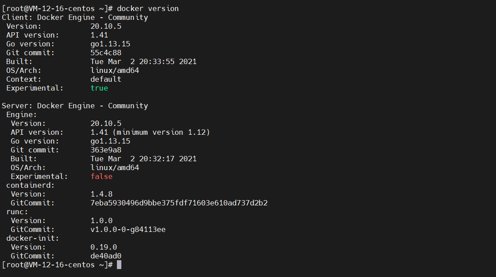
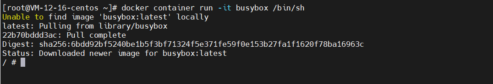
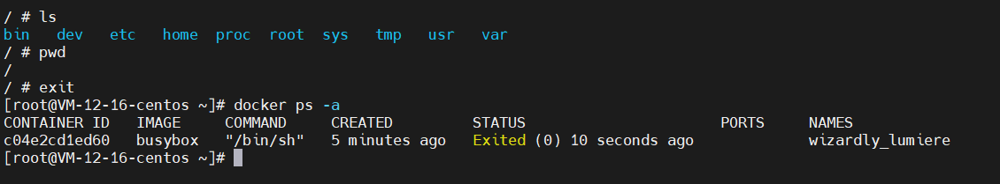
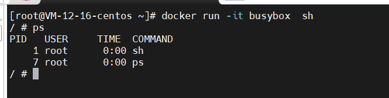
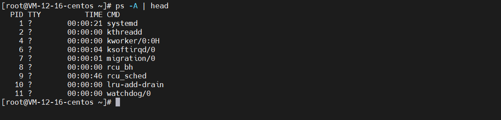
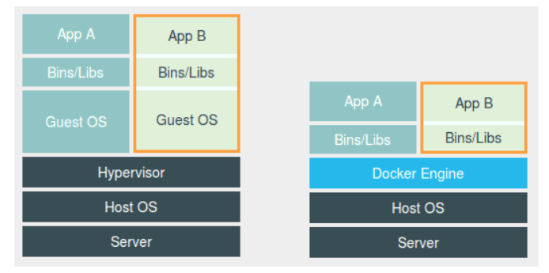
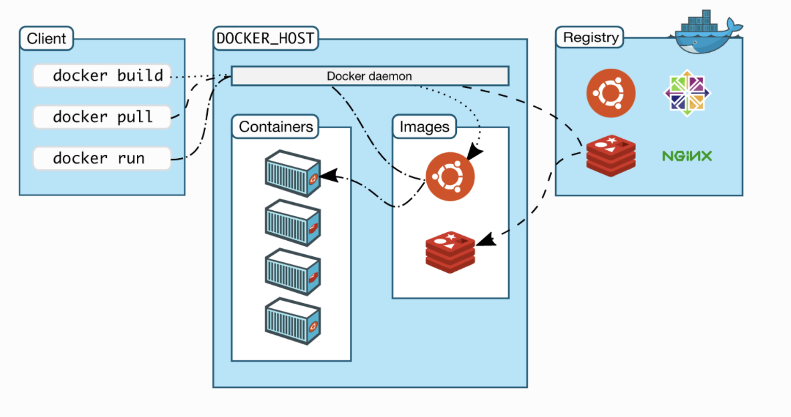
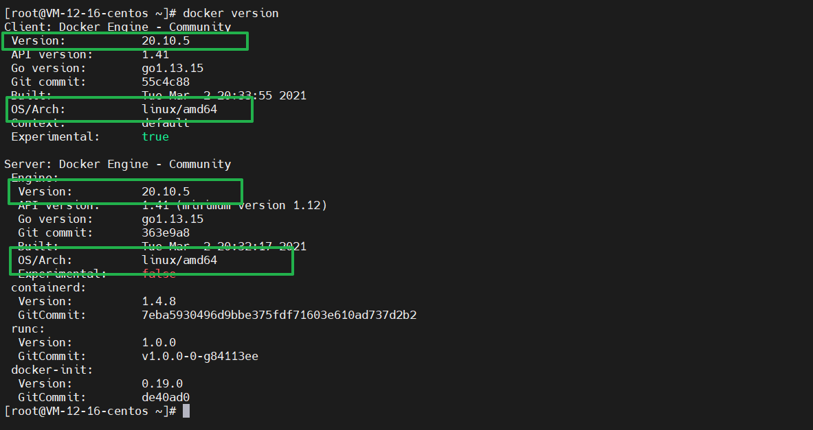

# 第一章：Docker的安装和介绍

## 1-1 什么是容器

​	容器其实是一种沙盒技术。顾名思义，沙盒就是能够给像集装箱一样，把你的应用 “装“ 起来的技术。这样，应用与应用之间，就因为有了边界而不至于相互干扰；而被装进集装箱的应用，也可以很方便的被搬来搬去。

​	这个能力说起来简单，但是要用技术手段实现它们，不是很容易。


## 1-2 “边界” 的实现手段

​	假设你有一个计算加法小程序，这个程序的输入来自一个文件，计算完成后需要把结果写进另一个文件。由于计算机只认识0和1，所以无论你用那种语言编写这段程序，最后都需要通过某种方式翻译成为计算机能读懂的二进制文件，才能在计算机操作系统中运行起来。

​	为了能让这些代码运行起来，我们往往还要给它们提供数据，比如我们加法程序所需要的输入文件，这些数据加上代码本身的二进制文件，放在磁盘上，就是我们所说的一个 “程序”， 也叫代码的可执行镜像。

​	然后，我们就可以在计算机上运行这个 “程序”了。

​	首先，操作系统从“程序”中发现输入数据保存在一个文件中，所以这些数据就被会加载到内存中待命。同时，操作系统又读取到了计算加法的指令，这时，它就需要指示 CPU 完成加法操作。而 CPU 与内存协作进行加法计算，又会使用寄存器存放数值、内存堆栈保存执行的命令和变量。同时，计算机里还有被打开的文件，以及各种各样的 I/O 设备在不断地调用中修改自己的状态。

​	就这样，一旦“程序”被执行起来，它就从磁盘上的二进制文件，变成了计算机内存中的数据、寄存器里的值、堆栈中的指令、被打开的文件，以及各种设备的状态信息的一个集合。**像这样一个程序运起来后的计算机执行环境的总和，就是我们今天的主角：进程。**

​	所以，对于进程来说，它的静态表现就是程序，平常都安安静静地待在磁盘上；而一旦运行起来，它就变成了计算机里的数据和状态的总和，这就是它的动态表现。

​	而**容器技术的核心功能，就是通过约束和修改进程的动态表现，从而为其创造出一个“边界”。**


## 1-3 docker容器的技术原理

​	对于Docker来说，Cgroups技术是用来**制造约束**的主要手段，而Namespace技术则是用来**修改进程视图**的主要方法。

​	可能你会觉得Cgroups和Namespace这两个概念很抽象，接下来动手实践一下，现在docker能支持大部分操作系统，但是我还是推荐使用Linux来进行搭建。具体搭建方式见 [安装docker](# 1-5 安装docker)。



```sh
# 首先创建一个容器
docker run -it busybox /bin/sh

# 上面命令的详细形式
docker container run -it busybox /bin/sh

# 上面命令的简化形式
docker run -it busybox sh

# 获取所有容器id
docker ps -aq

# 删除所有容器
docker rm -f $(docker ps -qa)
```

​	这个命令是Docker最重要的一个操作`docker run`，`-it`参数是告诉Docker项目在启动容器后，需要给我们分配一个文本输入 / 输出环境，也就是 TTY，跟容器的标准输入相关联，这样我们就可以和这个 Docker 容器进行交互了。而 /bin/sh 就是我们要在 Docker 容器里运行的程序。

​	说人话就是：请帮我启动一个busybox容器，在容器中执行/bin/sh，并且给我分配一个命令行终端与这个容器交互。



### (1). docker run -it busybox sh背后发送了什么？

1.  在本地查找是否有busybox这个image镜像
2.  如果没有找到，就去远程的image registry查找busybox镜像（默认的registry是Docker Hub）下载最新版本的busybox镜像（busybox:latest 默认)
3.  基于busybox镜像来创建一个新的容器，并且准备运行
4.  启动容器，运行指定的命令（这里是启动一个shell）

>   需要注意：容器中如果没有一个进程在执行，就会自动退出



​	我只是退出这个shell程序，容器因为没有其他程序在运行了，就会自动退出


### (2). Namespace技术

​	接下来我们继续交互式进入到busybox容器中，然后执行ps



​	 可以看到，我们在 Docker 里最开始执行的 sh，就是这个容器内部的第 1 号进程（PID=1），而这个容器里一共只有两个进程在运行。这就意味着，前面执行的 /bin/sh，以及我们刚刚执行的 ps，已经被 Docker 隔离在了一个跟宿主机完全不同的世界当中。 

​	这究竟是怎么做到的？

​	 本来，每当我们在宿主机上运行了一个 sh 程序，操作系统都会给它分配一个进程编号，比如 PID=100。这个编号是进程的唯一标识，就像员工的工牌一样。所以 PID=100，可以粗略地理解为这个 sh 是我们公司里的第 100 号员工，而第 1 号员工就自然是比尔 · 盖茨这样统领全局的人物。 



​	而现在，我们要通过 Docker 把这个 /bin/sh 程序运行在一个容器当中。这时候，Docker 就会在这个第 100 号员工入职时给他施一个“障眼法”，让他永远看不到前面的其他 99 个员工，更看不到比尔 · 盖茨。这样，他就会错误地以为自己就是公司里的第 1 号员工。

​	这种机制，其实就是对被隔离应用的进程空间做了手脚，使得这些进程只能看到重新计算过的进程编号，比如 PID=1。可实际上，他们在宿主机的操作系统里，还是原来的第 100 号进程。

​	**这种技术，就是 Linux 里面的 Namespace 机制**。而 Namespace 的使用方式也非常有意思：它其实只是 Linux 创建新进程的一个可选参数。我们知道，在 Linux 系统中创建线程的系统调用是 clone()，比如： 

```c
int pid = clone(main_function, stack_size, SIGCHLD, NULL); 
```

 	而当我们用 clone() 系统调用创建一个新进程时，就可以在参数中指定 CLONE_NEWPID 参数，比如： 

```c
int pid = clone(main_function, stack_size, CLONE_NEWPID | SIGCHLD, NULL);
```

​	这时，新创建的这个进程将会“看到”一个全新的进程空间，在这个进程空间里，它的 PID 是 1。之所以说“看到”，是因为这只是一个“障眼法”，在宿主机真实的进程空间里，这个进程的 PID 还是真实的数值，比如 100。

​	当然，我们还可以多次执行上面的 clone() 调用，这样就会创建多个 PID Namespace，而每个 Namespace 里的应用进程，都会认为自己是当前容器里的第 1 号进程，它们既看不到宿主机里真正的进程空间，也看不到其他 PID Namespace 里的具体情况。

​	除了上述的PID Namespace，Linux还提供了很多其他的手段用来实现对各种不同的进程上下文进行“障眼法”操作。

​	**这，就是Linux容器最基本的实现原理**。

​	所以docker容器这个听起来很玄的概念，实际上是在创建容器进程时，指定这个进程所需要启动的一组Namespace参数。这样容器就只能 “看” 到当前Namespace所限定的资源、文件、设备、状态或配置。对于宿主机以及其他不相关的程序，它就完全看不到。

​	**所以说，容器，其实是一种特殊的进程而已。**


## 1-4 容器 VS 虚拟机

谈到为 “进程划分一个独立空间” 的思想，你应该会联想到虚拟机。而且应该还看过下面这幅对比图。



​	这幅图的左边，画出了虚拟机的工作原理。其中，名为 **Hypervisor 的软件是虚拟机最主要的部分**。它通过硬件虚拟化功能，模拟出了运行一个操作系统需要的各种硬件，比如 CPU、内存、I/O 设备等等。然后，它在这些虚拟的硬件上安装了一个新的操作系统，即 Guest OS。 

​	 这样，用户的应用进程就可以运行在这个虚拟的机器中，它能看到的自然也只有 Guest OS 的文件和目录，以及这个机器里的虚拟设备。这就是为什么虚拟机也能起到将不同的应用进程相互隔离的作用。 

​	 而这幅图的右边，则用一个名为 Docker Engine 的软件替换了 Hypervisor。这也是为什么，很多人会把 Docker 项目称为“轻量级”虚拟化技术的原因，实际上就是把虚拟机的概念套在了容器上。 

​	**但是！这样的说法，并不严谨。**

​	在理解Namespace的工作方式后，你就会明白，跟真实存在的虚拟机不同，在使用docker的时候，并没有一个真实的 “Docker容器” 运行在宿主机里面，Docker项目帮助用户启动的，还是原来的应用进程 ，只不过在创建这些进程时，Docker 为它们加上了各种各样的 Namespace 参数。 

​	 这时，这些进程就会觉得自己是各自 PID Namespace 里的第 1 号进程，只能看到各自 Mount Namespace 里挂载的目录和文件，只能访问到各自 Network Namespace 里的网络设备，就仿佛运行在一个个“容器”里面，与世隔绝。 


## 1-5 安装docker

>   因为 Linux 是 Docker 的原生支持平台，所以推荐你在 Linux 上使用 Docker。由于生产环境中我们使用 CentOS 较多，下面主要针对在 CentOS 平台下安装和使用 Docker 展开介绍。



​	docker分为三个部分：

-   docker Client：客户端，用于输入docker的命令，可以与server在同一台宿主机也可以不在同一台宿主机上；
-   docker Server：服务端，里面存有容器和镜像，里面有一个Docker daemon守护进程，在docker启动的时候守护进程也会一起启动，用来监听Client的指令；
-   Registry：远端仓库，我们通过某个镜像启动一个container的时候，如果本地image仓库没有，它就会去远端Registry上去拉取对应的image到本地，默认是docker hub，当然也可以自己搭建私有的registry


### 卸载Docker

>   如果你之前有安装过旧版的docker，可以执行下面的命令卸载

```sh
$ sudo yum remove docker \
                  docker-client \
                  docker-client-latest \
                  docker-common \
                  docker-latest \
                  docker-latest-logrotate \
                  docker-logrotate \
                  docker-engine
```


### 安装Docker

我们通常所说的docker是指 docker Client + docker Server。安装网上有非常多的版本，但是我这里只说其中最简单的安装方式：

**脚本安装：**

```sh
# 从get.docker.com 下载get-docker.sh脚本
curl -fsSL get.docker.com -o get-docker.sh

# 使用阿里云的服务器拉取docker (不是必要的，直接运行也挺快的)
sh get-docker.sh --mirror Aliyun

# 安装完后使用docker version查看是否安装成功
docker version
```



>   如果你没有docker server信息，请尝试启动docker：systemctl start docker


**yum源安装**

```sh
# 添加 Docker 安装源
$ sudo yum-config-manager \
    --add-repo \
    https://download.docker.com/linux/centos/docker-ce.repo
    
# 安装最新版docker
$ sudo yum install docker-ce docker-ce-cli containerd.io

# 安装指定版本docker
# 1. 列举出docker版本号
$ sudo yum list docker-ce --showduplicates | sort -r
# 2. 选择指定版本安装
$ sudo yum install docker-ce-<VERSION_STRING> docker-ce-cli-<VERSION_STRING> containerd.io

# 启动docker
sudo systemctl start docker 
```


**HelloWorld**

```sh
$ sudo docker run hello-world
```


### 配置docker中国加速器配置（非必须）

```sh
vim /etc/docker/daemon.json

{
        "registry-mirrors": [
                "http://registry.docker-cn.com"
        ]
}

systemctl restart docker
```


# 1-6 小结

这一章我们了解到Docker 是利用 Linux 的 Namespace 、Cgroups 和联合文件系统三大机制来保证实现的， 所以它的原理是使用 Namespace 做主机名、网络、PID 等资源的隔离，使用 Cgroups 对进程或者进程组做资源（例如：CPU、内存等）的限制，联合文件系统用于镜像构建和容器运行环境。


## Namespace

Namespace 是 Linux 内核的一项功能，该功能对内核资源进行隔离，使得容器中的进程都可以在单独的命名空间中行，并且只可以访问当前容器命名空间的资源。Namespace 可以隔离进程 ID、主机名、用户 ID、文件名、网络访问和进程间通信等相关资源。
Docker 主要用到以下五种命名空间。

-   pid namespace：用于隔离进程 ID。

-   net namespace：隔离网络接口，在虚拟的 net namespace 内用户可以拥有自己独立的 IP、路由、端口等。

-   mnt namespace：文件系统挂载点隔离。

-   ipc namespace：信号量,消息队列和共享内存的隔离。

-   uts namespace：主机名和域名的隔离。


## Cgroups

Cgroups 是一种 Linux 内核功能，可以限制和隔离进程的资源使用情况（CPU、内存、磁盘 I/O、网络等）。在容器的实现中，Cgroups 通常用来限制容器的 CPU 和内存等资源的使用。


## 联合文件系统

联合文件系统，又叫 UnionFS，是一种通过创建文件层进程操作的文件系统，因此，联合文件系统非常轻快。Docker 使用联合文件系统为容器提供构建层，使得容器可以实现写时复制以及镜像的分层构建和存储。常用的联合文件系统有 AUFS、Overlay 和 Devicemapper 等。

