# 第二章：容器的隔离与限制

## 2-1 容器的 “隔离”

​	前面我们讲清楚了Linux容器中用来实现 “隔离” 的技术手段：Namespace。Namespace技术实际上修改了应用进程看待整个计算机 “视图” ，即它的 “视线” 被操作系统做了限制，只能 “看到” 某些指定的内容。但对宿主机来说，这些被 “隔离” 了的进程和其他进程没有太大区别。这也是 **容器与虚拟机本质的区别**。

​	 在之前虚拟机与容器技术的对比图里，不应该把 Docker Engine 或者任何容器管理工具放在跟 Hypervisor 相同的位置，因为它们并不像 Hypervisor 那样对应用进程的隔离环境负责，也不会创建任何实体的“容器”，真正对隔离环境负责的是宿主机操作系统本身： 

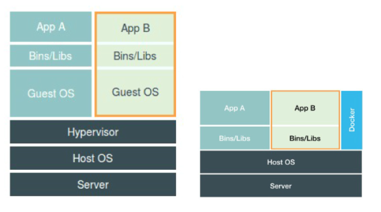

​	 所以，在这个对比图里，我们应该把 Docker 画在跟应用同级别并且靠边的位置。这意味着，用户运行在容器里的应用进程，跟宿主机上的其他进程一样，都由宿主机操作系统统一管理，只不过这些被隔离的进程拥有额外设置过的 Namespace 参数。而 Docker 项目在这里扮演的角色，更多的是旁路式的辅助和管理工作。

​	 不过，有利就有弊，基于 Linux Namespace 的隔离机制相比于虚拟化技术也有很多不足之处，其中最主要的问题就是：**隔离得不彻底。** （容器进程实际使用的还是宿主机操作系统内核）

​	 首先，既然容器只是运行在宿主机上的一种特殊的进程，那么多个容器之间使用的就还是**同一个宿主机的操作系统内核。** 

​	尽管你可以在容器里通过Mount Namespace 单独挂载其他不同版本的操作系统文件，比如CentOS或者Ubuntu，但是这并不能改变共享宿主机内核的事实。 这也是为什么，如果你要在 Windows 宿主机上运行 docker（Linux 容器），或者在低版本的 Linux 宿主机上运行高版本的 Linux 容器，都是行不通的。 

​	 而相比之下，拥有硬件虚拟化技术和独立 Guest OS 的虚拟机就要方便得多了。最极端的例子是，Microsoft 的云计算平台 Azure，实际上就是运行在 Windows 服务器集群上的，但这并不妨碍你在它上面创建各种 Linux 虚拟机出来。 

​	其次，在 Linux 内核中，**有很多资源和对象是不能被 Namespace 化**的，最典型的例子就是：时间。

​	这就意味着，如果你的容器中的程序使用 settimeofday(2) 系统调用修改了时间，整个宿主机的时间都会被随之修改，这显然不符合用户的预期。相比于在虚拟机里面可以随便折腾的自由度，在容器里部署应用的时候，“什么能做，什么不能做”，就是用户必须考虑的一个问题。

​	 此外，由于上述问题，尤其是共享宿主机内核的事实，容器给应用暴露出来的攻击面是相当大的，应用“越狱”的难度自然也比虚拟机低得多。 

​	 更为棘手的是，尽管在实践中我们确实可以使用 某些技术，对容器内部发起的所有系统调用进行过滤和甄别来进行安全加固，但这种方法因为多了一层对系统调用的过滤，一定会拖累容器的性能。何况，**默认情况下，谁也不知道到底该开启哪些系统调用，禁止哪些系统调用**。

​	 所以，在生产环境中，没有人敢把运行在物理机上的 Linux 容器直接暴露到公网上。


## 2-2 容器的 “限制”

​	我们不是已经通过 Linux Namespace 创建了一个 “容器”，为什么还需要对容器做 “限制” ？

​	前面我们提到容器内的第1号进程在 “障眼法” 的干扰下只能看到容器里的情况，但是宿主机上，它作为第100号进程与其他进程之间依然是平等的竞争关系。这就意味着， 虽然第 100 号进程表面上被隔离了起来，但是它所能够使用到的资源（比如 CPU、内存），却是可以**随时被宿主机上的其他进程（或者其他容器）占用的**。当然，这个 100 号进程自己也可能把所有资源吃光。这些情况，显然都不是一个“沙盒”应该表现出来的合理行为。 

​	 而**Linux Cgroups 就是 Linux 内核中用来为进程设置资源限制的一个重要功能**。

​	 **Linux Cgroups 的全称是 Linux Control Group。它最主要的作用，就是限制一个进程组能够使用的资源上限，包括 CPU、内存、磁盘、网络带宽等等。** 这并不是一个新技术，最早由Google发起，后在2008年合并到Linux kernel。

​	 在 Linux 中，Cgroups 给用户暴露出来的操作接口是文件系统，即它以文件和目录的方式组织在操作系统的 /sys/fs/cgroup 路径下。 我们可以用`mount`命令把它们展示出来，这条命令是： 

```sh
mount -t cgroup
```

​	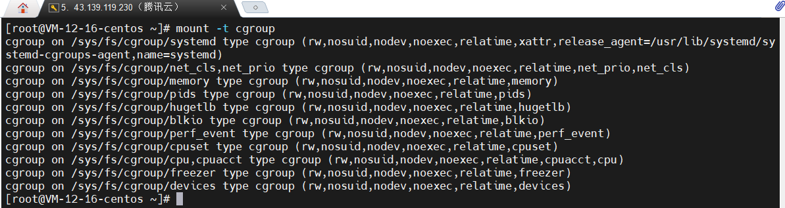

​	它的输出结果，是一系列文件系统目录。可以看到，在 /sys/fs/cgroup 下面有很多诸如 cpuset、cpu、 memory 这样的子目录，也叫子系统。这些都是我这台机器当前可以被 Cgroups 进行限制的资源种类。而在子系统对应的资源种类下，你就可以看到该类资源具体可以被限制的方法。比如，对 CPU 子系统来说，我们就可以看到如下几个配置文件，这个指令是： 

```sh
ls /sys/fs/cgroup/cpu
```

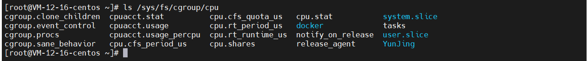

​	在它的输出里有 cfs_period 和 cfs_quota 这样的关键词。这两个参数需要组合使用，可以用来限制进程在长度为 cfs_period 的一段时间内，只能被分配到总量为 cfs_quota 的 CPU 时间。

​	而这样的配置文件又如何使用呢？你需要在对应的子系统下面创建一个目录，比如，我们现在进入 /sys/fs/cgroup/cpu 目录下：

```sh
[root@VM-12-16-centos /sys/fs/cgroup/cpu]# mkdir container
[root@VM-12-16-centos /sys/fs/cgroup/cpu]#ls container/
cgroup.clone_children  cpuacct.stat          cpu.cfs_period_us  cpu.rt_runtime_us  notify_on_release
cgroup.event_control   cpuacct.usage         cpu.cfs_quota_us   cpu.shares         tasks
cgroup.procs           cpuacct.usage_percpu  cpu.rt_period_us   cpu.stat
```

​	这个目录就称为一个“控制组”。操作系统会在你新创建的container目录下，自动生成该子系统对应的资源限制文件。


**吃掉CPU全部资源**：后台执行这样一条脚本

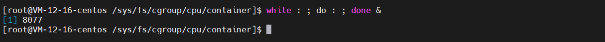

​	脚本执行了一个死循环，它可以把计算机CPU资源吃到100%，根据它的输出，可以看到这个脚本在后台执行的**PID**是**8077**。

​	我们用top指令验证一下：

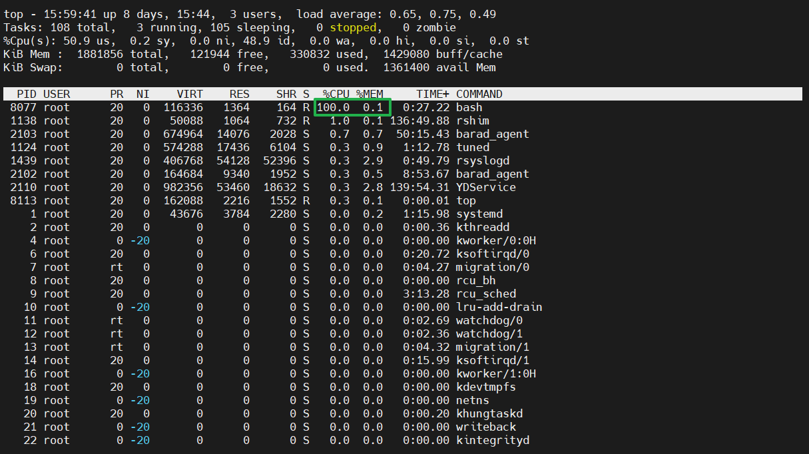

​	从输出中可以看到，CPU的使用率已经100%了

​	可以通过查看container目录下的文件，看到container控制组的CPU quota还没有任何限制（即：-1） ，CPU period 则是默认的 100 ms（100000 us）： 

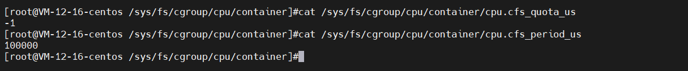

​	我们可以通过修改这些文件内容来设置限制

​	 向 container 组里的 cfs_quota 文件写入 20 ms（20000 us）： 


```sh
echo 20000 > /sys/fs/cgroup/cpu/container/cpu.cfs_quota_us
```

​	这个操作意味着：每100ms的时间里，被该控制组限制的进程只能够使用20ms的CPU时间。 也就是说这个进程只能使用到 20% 的 CPU 带宽。 

​	规则设定了，接下来我们把被限制的进程PID写入container组里的task文件，上面的设置就会对该进程生效：

```sh
echo 8077 > /sys/fs/cgroup/cpu/container/tasks 
```

​	接下来我们用top指令查看：

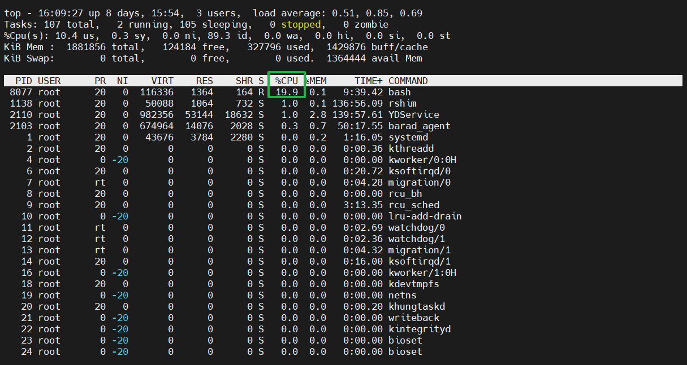

​	可以看到，计算机的 CPU 使用率立刻降到了 20%（%Cpu0 : 20.3 us）。 

​	除此CPU子系统外，Cgroups的每项子系统都有其独有的资源控制能力，docker也是利用了Cgroups技术实现对宿主机的资源访问限制。

​	简单理解：Linux Cgroups的设计就是一个子系统目录加上一组资源限制文件的组合。对于Docker等Linux容器项目来说，它们只需要在每个子系统下面，为每个容器创建一个控制组（即创建一个新目录）。然后在启动容器进程之后，把这个进程对应的 PID 填写到对应控制组的 tasks 文件中。

​	 而至于在这些控制组下面的资源文件里填上什么值，就靠用户执行 docker run 时的参数指定了，比如这样一条命令： 

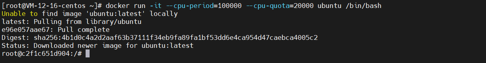

```sh
docker run -it --cpu-period=100000 --cpu-quota=20000 ubuntu /bin/bash
```

​	可以我现在机器上运行了一个Ubuntu容器，容器id为：c2f1c651d904 

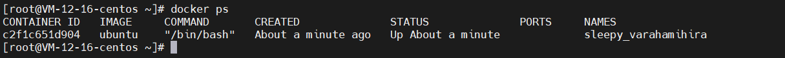

​	 在启动这个容器后，我们可以通过查看 Cgroups 文件系统下，CPU 子系统中，“docker”这个控制组里的资源限制文件的内容来确认： 

```sh
ls /sys/fs/cgroup/cpu/docker/
```

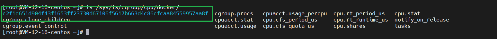

​	这里的容器 id 是完整版的，比我们用`docker ps`看到的要全。进入文件内部查看资源限制文件：

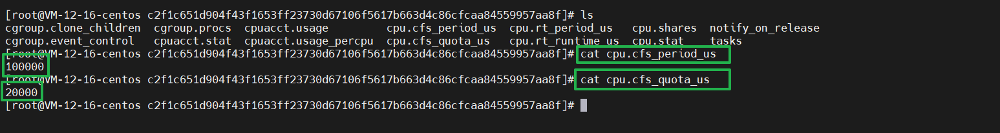

​	 这就意味着这个 Docker 容器，只能使用到 20% 的 CPU 带宽。 


## 2-3 小结

​	这篇文档基本是 Docker 的技术核心原理，或者说不止Docker，所有Linux容器项目的技术核心都是 Namespace 和 Cgroups （其实还有 Mount Namespace，在下篇文章中体现）。

​	Docker使用 Linux Namespace 作为隔离手段有其优势：控制容器就像控制进程一样简单，并且消耗的资源比虚拟机少非常多。但是也有其劣势：隔离不彻底。两个维度，一是容器归根结底使用的是宿主机的内核；二是很多资源和对象是不能被 Namespace 化的。其实也可以把这两个合成一个（因为一般不能Namespace 化的资源都是内核资源）。

​	介绍了容器隔离后，Docker又通过 Linux Cgroups 实现资源的限制，并且我通过了一系列简单的实验，模拟了Docker项目创建容器限制的过程。

​	所以，现在你应该对前面文章中提到的：容器其实就是应用进程有了更深的理解。 **一个正在运行的 Docker 容器，其实就是一个启用了多个 Linux Namespace 的应用进程，而这个进程能够使用的资源量，则受 Cgroups 配置的限制。** 

​	这也是容器技术中一个非常重要的概念，即：**容器是一个“单进程”模型。**

​	由于一个容器的本质就是一个进程，用户的应用进程实际上就是容器里 PID=1 的进程，也是其他后续创建的所有进程的父进程。这就意味着，在一个容器中，你没办法同时运行两个不同的应用，除非你能事先找到一个公共的 PID=1 的程序来充当两个不同应用的父进程，这也是为什么很多人都会用 systemd 或者 supervisord 这样的软件来代替应用本身作为容器的启动进程。

​	 这是因为容器本身的设计，就是希望容器和应用能够**同生命周期**，这个概念对后续的容器编排非常重要。否则，一旦出现类似于“容器是正常运行的，但是里面的应用早已经挂了”的情况，编排系统处理起来就非常麻烦了。 


>   tips：早期Docker中的top指令bug（资源视图隔离）