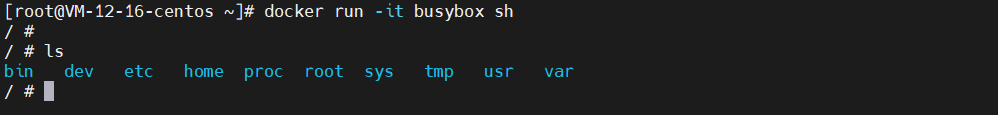
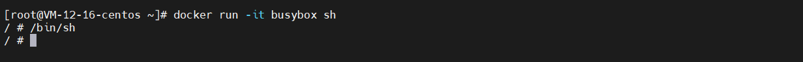
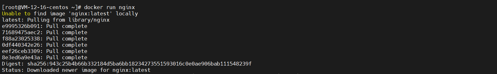
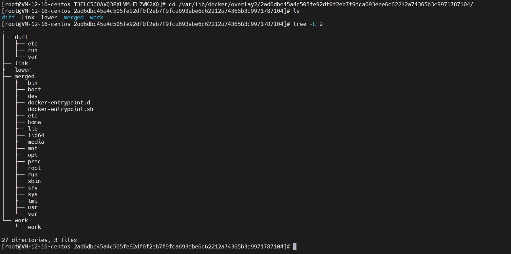
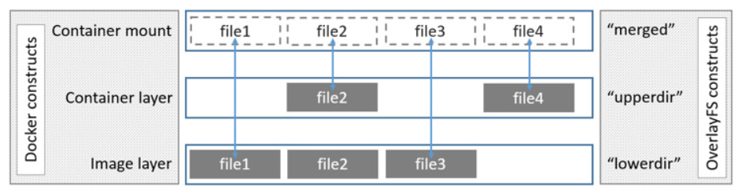

# 第三章：容器的文件系统

## 3-1Mount Namespace

​	从前面两章中可以了解到：Linux容器最基础的两种技术： Namespace 和 Cgroups 。并且探索出了一个结论：  **“容器的本质是一种特殊的进程”** 

​	Namespace 的作用是“隔离”，它让应用进程只能看到该 Namespace 内的“世界”；而 Cgroups 的作用是“限制”，它给这个“世界”围上了一圈看不见的墙。 进程现在真的被 “装” 进了一个隔绝的房间里，这些房间就是 “沙盒”。

​	但是你有没有想过： 这个房间四周虽然有了墙，但是如果容器进程低头一看地面（`ls、pwd`），又是怎样一副景象呢？ 换句话说，容器内的进程看到的文件系统又是什么样子？

​	验证过程比较繁琐，感兴趣的可以看大佬的文档：[DOCKER基础技术](https://coolshell.cn/articles/17010.html)，我直接上结论：通过Mount  Namespace 修改容器进程对文件系统“挂载点”的认知.。它可以在自己的容器目录（比如 /tmp）下进行操作，而**完全不会受宿主机以及其他容器的影响。** 

​	另外， 在 Linux 操作系统里，有一个名为 **chroot** 的命令，它的作用就是帮你“ change root file system”， 即**改变进程的根目录到你指定的位置。** 


## 3-2 chroot

通俗地说 ，chroot 就是可以改变某进程的根目录，使这个程序不能访问目录之外的其他目录，这个跟我们在一个容器中是很相似的。下面我们通过一个实例来演示下 chroot。

1.  在当前目录下创建一个目录

```sh
mkdir rootfs
```

2.  这里为了方便演示，我使用现成的 busybox 镜像来创建一个系统，可以j简单把下面的操作命令理解成在 rootfs 下创建了一些目录和放置了一些二进制文件。

```sh
cd rootfs 
docker export $(docker create busybox) -o busybox.tar
tar -xf busybox.tar
```

3.  执行完上面的命令后，在 rootfs 目录下，我们会得到一些目录和文件。下面我们使用 ls 命令查看一下 rootfs 目录下的内容

```sh
ls 
bin  busybox.tar  dev  etc  home  proc  root  sys  tmp  usr  var
```

4.  使用chroot启动一个 sh 进程，并且把 /home/centos/rootfs 作为 sh 进程的根目录。

```sh
chroot /root/rootfs /bin/sh
```

5.  此时，我们的命令行窗口已经处于上述命令启动的 sh 进程中。在当前 sh 命令行窗口下，我们使用 ls 命令查看一下当前进程，看是否真的与主机上的其他目录隔离开了

```sh
/bin/ls
bin  busybox.tar  dev  etc  home  proc  root  sys  tmp  usr  var

/bin/pwd
/
```

6.  可以看到当前进程的根目录已经变成了主机上的 /home/centos/rootfs 目录。这样就实现了当前进程与主机的隔离。到此为止，一个目录隔离的容器就完成了，但是它只是目录级别隔离，

```sh
/bin/ip route
default via 10.0.12.1 dev eth0
10.0.12.0/22 dev eth0 scope link  src 10.0.12.16
169.254.0.0/16 dev eth0 scope link  metric 1002
172.17.0.0/16 dev docker0 scope link  src 172.17.0.1
172.18.0.0/16 dev br-0ba9b230294f scope link  src 172.18.0.1
```

​	执行 ip route 命令后，你可以看到网络信息并没有隔离，实际上进程等信息此时也并未隔离。要想实现一个完整的容器，我们还需要 Linux 的其他三项技术： Namespace、Cgroups 和联合文件系统。

​	Docker 是利用 Linux 的 Namespace 、Cgroups 和联合文件系统三大机制来保证实现的， 所以它的原理是使用 Namespace 做主机名、网络、PID 等资源的隔离，使用 Cgroups 对进程或者进程组做资源（例如：CPU、内存等）的限制，联合文件系统用于镜像构建和容器运行环境。


## 3-2 roofs

​	 为了能够让容器的这个根目录看起来更“真实”，我们一般会在这个容器的根目录下**挂载一个完整操作系统的文件系统**，比如 Ubuntu16.04 的 ISO。这样，在容器启动之后，我们在容器里通过执行 `ls /` 查看根目录下的内容，就是 Ubuntu 16.04 的所有目录和文件。 

​	 **而这个挂载在容器根目录上、用来为容器进程提供隔离后执行环境的文件系统，就是所谓的“容器镜像”。它还有一个更为专业的名字，叫作：rootfs（根文件系统）。** 

​	 所以，一个最常见的 rootfs，或者说容器镜像，会包括如下所示的一些目录和文件，比如 /bin，/etc，/proc 等等： 



​	而你进入容器之后执行的 /bin/sh，就是 /bin 目录下的可执行文件，与宿主机的 /bin/sh 完全不同。



​	所以，对 Docker 项目来说，它最核心的原理实际上就是为待创建的用户进程：

1.  启用 Linux Namespace 配置；
2.  设置指定的 Cgroups 参数；
3.  切换进程的根目录（Change Root）。


​	**需要明确的是，rootfs 只是一个操作系统所包含的文件、配置和目录，并不包括操作系统内核。在 Linux 操作系统中，这两部分是分开存放的，操作系统只有在开机启动时才会加载指定版本的内核镜像。** 

​	所以说，rootfs 只包括了操作系统的“躯壳”，并没有包括操作系统的“灵魂”（内核）。实际上同一台机器上的所有容器，都共享宿主机操作系统的内核。

​	这就意味着，如果你的应用程序需要配置内核参数、加载额外的内核模块，以及跟内核进行直接的交互，你就需要注意了：这些操作和依赖的对象，都是宿主机操作系统的内核，它对于该机器上的所有容器来说是一个“全局变量”，牵一发而动全身。 （**这也是目前网关组DPDK上云的困难所在**）

​	这也是容器相比于虚拟机的主要缺陷之一：毕竟后者不仅有模拟出来的硬件机器充当沙盒，而且每个沙盒里还运行着一个完整的 Guest OS 给应用随便折腾。


## 3-3 一致性

​	**正是由于 rootfs 的存在，容器才有了一个被反复宣传至今的重要特性：一致性。**

​	什么是一致性？云端和本地服务器环境不同，在容器出现之前，应用打包过程一直是一个头疼的问题。但是有了容器（即rootfs）之后，这个问题被完全的解决了。

​	 **由于 rootfs 里打包的不只是应用，而是整个操作系统的文件和目录，也就意味着，应用以及它运行所需要的所有依赖，都被封装在了一起。** 

​	实际上我们对于大多数研发来说，应用依赖一直都停留在语言层面，比如 Golang 的 go.mod描述的第三方库。 但是实际上： **对一个应用来说，操作系统本身才是它运行所需要的最完整的“依赖库”。** 

​	有了容器镜像“打包操作系统”的能力，这个最基础的依赖环境也终于变成了应用沙盒的一部分。这就赋予了容器所谓的一致性：无论在本地、云端，还是在一台任何地方的机器上，用户只需要解压打包好的容器镜像，那么这个应用运行所需要的完整的执行环境就被重现出来了。 


## 3-4 增量rootfs

​	这时也出现了一个比较麻烦的问题：难道我每开发一个应用，或者每升级现有的应用，都要重新制作一次rootfs吗？当然不是，目录标题你就知道，我们使用了增量rootfs解决了这个问题。

​	Docker 在镜像的设计中，引入了层（layer）的概念。也就是说，用户制作镜像的每一步操作，都会生成一个层，也就是一个增量 rootfs。 

​	这里Docker参考了一种叫联合文件系统 （Union File System） 的能力。Union File System 也叫 UnionFS，最主要的功能是将多个不同位置的目录联合挂载（union mount）到同一个目录下。 比如，我现在有两个目录 A 和 B，它们分别有两个文件： 

```sh
$ tree
.
├── A
│  ├── a
│  └── x
└── B
  ├── b
  └── x
```

​	使用联合挂载的方式，将两个目录挂载到一个公共的目录C上：

```sh
$ mkdir C
$ mount -t aufs -o dirs=./A:./B none ./C
```

​	 这时，我再查看目录 C 的内容，就能看到目录 A 和 B 下的文件被合并到了一起： 

```sh
$ tree ./C
./C
├── a
├── b
└── x
```


### 1. Layers分析

我们先启动一个容器，比如：

```sh
docker run -d ubuntu:latest sleep 3600
```

这时，Docker会从Docker Hub上拉取一个nginx镜像到本地。这个所谓的 “镜像” 实际上就是一个Ubuntu操作系统的rootfs，它的内容是Ubuntu操作系统的所有文件和目录。不过，与之前我们讲述的 rootfs 稍微不同的是，Docker 镜像使用的 rootfs，往往由多个“层”组成： 

```sh
$ docker image inspect ubuntu:latest
...
     "RootFS": {
      "Type": "layers",
      "Layers": [
        "sha256:74ddd0ec08fa43d09f32636ba91a..."
      ]
    }
```

​	由于Ubuntu是基础镜像，所以它只有一层layer，我们来看一个另外一个镜像

```sh
docker run -it nginx:latest
```

​	此时docker会拉下一个最新版的Nginx镜像并运行



```sh
$ docker image inspect nginx:latest
...
     "RootFS": {
      "Type": "layers",
      "Layers": [
                "sha256:a12586ed027fafddcddcc63b31671f406c...",
                "sha256:e74d0d8d2defd5fff2f34af104d18e2512...",
                "sha256:2280b348f4d6af723032eec5a0c05f0722...",
                "sha256:9e7119c28877f445e5893da11829e0aaa4...",
                "sha256:4091cd312f19d65a309dd0962d374daf40...",
                "sha256:a2e59a79fae0d350555b7143026eb0a6a5..."
      ]
    }
```

​	可以看到，这个 nginx 镜像，实际上由六个层组成。这六个层就是六个增量 rootfs，每一层都是 Ubuntu 操作系统文件与目录的一部分；而在使用镜像时，Docker 会把这些增量联合挂载在一个统一的挂载点上（等价于前面例子里的“/C”目录）。 

​	这个挂载点就是`/var/lib/docker/overlay2`



​	 前面提到的六个镜像层，又是如何被联合挂载成这样一个完整的 Nginx容器的文件系统的呢？ 

​	推荐博客：[docker镜像分层原理-overlay2](https://blog.csdn.net/m0_45406092/article/details/103599874)



​	在overlayFS，中底层目录叫lowerdir，顶层目录叫upperdir，对外统一提供服务的是merged，当修改下层文件时，会触发写时复制 

​	联合文件系统有比较多，比如： aufs，device mapper, btrfs, overlay, overlay2。 实现虽然有很多，但是原理其实差不多。容器的rootfs可以分成三部分组成：

**第一部分：只读层**（镜像层）

​	它是这个容器的rootfs最下面的，对应着基础镜像。它们的挂载方式都是只读的（ro + wh，即readonly + whiteout）

**第二部分：可读写层**（容器层）

​	这是容器rootfs最上面的一层，它的挂载方式为：rw。（在我们build Dockerfile的时候发生的拷贝等操作，文件都是存在这一层的）在没写入文件之前，这个目录时空的。而一旦在容器里做了写操作，你修改产生的内容就会以增量的方式出现在这个层中。

​	如果是删除只读层里的一个文件呢？为了实现这样的删除操作，docker会在可读写层创建一个whiteout文件，把只读层里的文件 **“遮挡”** 起来。（ whiteout,这就是每次想把之前不需要的东西删了，但是镜像也没变小的原因）

​	所以，最上面这个可读写层的作用，就是专门用来存放你修改 rootfs 后产生的增量，无论是增、删、改，都发生在这里。而当我们使用完了这个被修改过的容器之后，还可以使用 docker commit 和 push 指令，保存这个被修改过的可读写层，并上传到 Docker Hub 上，供其他人使用；而与此同时，原先的只读层里的内容则不会有任何变化。这，就是增量 rootfs 的好处。

**第三层：Init层**

​	 它是一个以“-init”结尾的层，夹在只读层和读写层之间。Init 层是 Docker 项目单独生成的一个内部层，专门用来存放 /etc/hosts、/etc/resolv.conf 等信息。

​	需要这样一层的原因是，这些文件本来属于只读的镜像的一部分，但是用户往往需要在启动容器时写入一些指定的值比如 hostname，所以就需要在可读写层对它们进行修改。

​	可是，这些修改往往只对当前的容器有效，我们并不希望执行 docker commit 时，把这些信息连同可读写层一起提交掉。

​	所以，Docker 做法是，在修改了这些文件之后，以一个单独的层挂载了出来。而用户执行 docker commit 只会提交可读写层，所以是不包含这些内容的。


## 3-5 总结

​	这篇文章介绍了Linux容器文件系统的实现方式。正是我们经常提到的**容器镜像**，也叫作：rootfs。它只是一个操作系统的所有文件和目录，并**不包含内核**，最多也就几百兆。而相比之下，传统虚拟机的镜像大多是一个磁盘的“快照”，磁盘有多大，镜像就至少有多大。 

​	 通过结合使用 Mount Namespace 和 rootfs，容器就能够为进程构建出一个完善的文件系统隔离环境。而在 rootfs 的基础上，Docker 公司创新性地提出了使用**多个增量 rootfs 联合挂载一个完整 rootfs 的方案**，这就是容器镜像中“层”的概念。 

