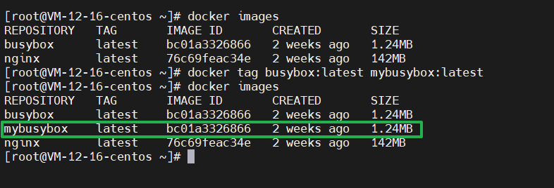
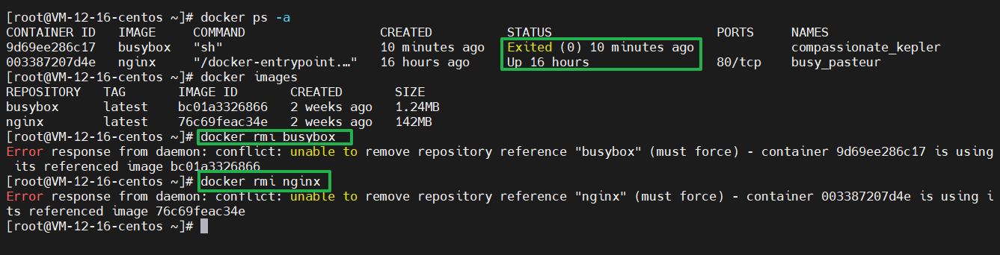

# 第四章：镜像使用

​	前面三章都在试图和你讲清楚原理，在我看来容器使用是再简单不过了，有Linux命令行基础的看一看命令，操作两下就能学会，但是这会学得非常浅，遇到问题就歇菜了，无法快速精准定位问题，耽误时间。

## 4-1 Docker CLI命令行介绍

`docker version`：打印出docker的version系统

`docker info`：打印一些docker环境的信息

### docker命令行的基本使用

docker + 管理的对象（比如容器，镜像） + 具体操作（比如创建，启动，停止，删除）

例如

-   `docker image ls`：列举出docker的image列表
-   `docker image pull nginx` 拉取一个叫nginx的docker image镜像
-   `docker container stop web` 停止一个叫web的docker container容器
-   `docker container --help`  打印container的帮助

| 操作                       | 命令(全)                           | 命令(简)                           |
| -------------------------- | ---------------------------------- | ---------------------------------- |
| 容器的创建                 | docker container run <image name>  | docker run <image name>            |
| 容器的列出(up正在运行的)   | docker container ls                | docker ps                          |
| 容器的列出(up和exit退出的) | docker container ls -a             | docker ps -a                       |
| 容器的停止                 | docker container stop <name or ID> | docker stop <container name or ID> |
| 容器的删除                 | docker container rm <name or ID>   | docker rm <container name or ID>   |

## 4-2 Docker核心概念

### 镜像

​	镜像是什么？看过上一章的同学应该都很清楚，它是一个只读文件和文件夹组合。它包含了容器运行时所需要的所有基础文件和配置信息，是容器启动的基础。所以你想启动一个容器，那首先必须要有一个镜像。镜像是 Docker 容器启动的先决条件。

​	你想使用一个镜像，有两种方式：

1.  自己构建，一个镜像是基于一个基础镜像构建的，你可以在基础镜像上添加一些用户自定义的内容。例如你可以基于centos镜像制作你自己的业务镜像，首先安装nginx服务，然后部署你的应用程序，最后做一些自定义配置，这样一个业务镜像就做好了。
2.  从仓库上拉取一个别人已经制作好了的镜像。例如nginx、ubuntu、centos、mysql等，你可以到 [Docker Hub](https://hub.docker.com/) 搜索并下载它们。


### 容器

​	容器是什么？容器是镜像的运行实体。镜像是静态的只读文件，而容器带有运行时需要的可写文件层，并且容器中的进程属于运行状态。即**容器运行着真正的应用进程。容器有初建、运行、停止、暂停和删除五种状态**。

​	虽然容器的本质是主机上运行的一个进程，但是容器有自己独立的命名空间隔离和资源限制。也就是说，在容器内部，无法看到主机上的进程、环境变量、网络等信息，这是容器与直接运行在主机上进程的本质区别。


### 仓库

​	Docker 的镜像仓库类似于代码仓库，用来存储和分发 Docker 镜像。镜像仓库分为公共镜像仓库和私有镜像仓库。

​	目前， [Docker Hub](https://hub.docker.com/) 是 Docker 官方的公开镜像仓库，它不仅有很多应用或者操作系统的官方镜像，还有很多组织或者个人开发的镜像供我们免费存放、下载、研究和使用。除了公开镜像仓库，你也可以构建自己的私有镜像仓库。


​	从图 中可以看到，镜像是容器的基石，构建镜像的方式有三种：Dockerfile构建、从仓库上pull、从容器commit。容器是由镜像创建的。一个镜像可以通过`run`创建多个容器，容器是镜像运行的实体。仓库就非常好理解了，就是用来存放和分发镜像的。


## 4-3 Docker架构

​	Docker 整体架构采用 C/S（客户端 / 服务器）模式，主要由客户端和服务端两大部分组成。客户端负责发送操作指令，服务端负责接收和处理指令。客户端和服务端通信有多种方式，既可以在同一台机器上通过UNIX套接字通信，也可以通过网络连接远程通信。

### Docker 客户端

​	Docker 客户端其实是一种泛称。其中 docker 命令是 Docker 用户与 Docker 服务端交互的主要方式。除了使用 docker 命令的方式，还可以使用直接请求 REST API 的方式与 Docker 服务端交互，甚至还可以使用各种语言的 SDK 与 Docker 服务端交互。目前社区维护着 Go、Java、Python、PHP 等数十种语言的 SDK，足以满足你的日常需求。


### Docker服务端

​	Docker 服务端是 Docker 所有后台服务的统称。其中 dockerd 是一个非常重要的后台管理进程，它负责响应和处理来自 Docker 客户端的请求，然后将客户端的请求转化为 Docker 的具体操作。例如镜像、容器、网络和挂载卷等具体对象的操作和管理。


### Docker重要组件

runC和containerd

-   runC是 Docker 官方按照 OCI 容器运行时标准的一个实现。通俗地讲，runC 是一个用来运行容器的轻量级工具，是真正用来运行容器的。

-   containerd是 Docker 服务端的一个核心组件，它是从dockerd中剥离出来的 ，它的诞生完全遵循 OCI 标准，是容器标准化后的产物。containerd通过 containerd-shim 启动并管理 runC，可以说containerd真正管理了容器的生命周期。


​	dockerd通过 gRPC 与containerd通信，由于dockerd与真正的容器运行时，runC中间有了containerd这一 OCI 标准层，使得dockerd可以确保接口向下兼容。


### Docker各组件之间的关系

首先通过以下命令来启动一个 busybox 容器：

```sh
docker run -d busybox sleep 3600
```

容器启动后，通过以下命令查看一下 dockerd 的 PID：

```sh
ps aux |grep containerd
root     32226  0.0  0.3 712700  6496 ?        Sl   20:21   0:00 /usr/bin/containerd-shim-r...
```

通过上面的输出结果可以得知 dockerd 的 PID 为 32226。为了验证 Docker 各组件之间的调用关系，下面使用 pstree 命令查看一下进程父子关系：

```sh
pstree -l -a -A 32226
systemd,1 --switched-root --system --deserialize 22
  └─containerd-shim,32226 -namespace moby -id 18948874d0c0b1d54...
      ├─sleep,32247 3600
```

事实上，dockerd 启动的时候， containerd 就随之启动了，dockerd 与 containerd 一直存在。当执行 docker run 命令（通过 busybox 镜像创建并启动容器）时，containerd 会创建 containerd-shim 充当 “垫片”进程，然后启动容器的真正进程 sleep 3600 。


## 4-4 镜像操作

​	镜像是一个只读的 Docker 容器模板，包含启动容器所需要的所有文件系统结构和内容。简单来讲，镜像是一个特殊的文件系统，它提供了容器运行时所需的程序、软件库、资源、配置等静态数据。即**镜像不包含任何动态数据，镜像内容在构建后不会被改变。**


从图中可知，镜像的操作可分为：

-   拉取镜像，使用`docker pull`命令拉取远程仓库的镜像到本地 ；

-   重命名镜像，使用`docker tag`命令“重命名”镜像 ；

-   查看镜像，使用`docker image ls`或`docker images`命令查看本地已经存在的镜像 ；

-   删除镜像，使用`docker rmi`命令删除无用镜像 ；

-   构建镜像，构建镜像有两种方式。第一种方式是使用`docker build`命令基于 Dockerfile 构建镜像（业界最常用的方式）；第二种方式是使用`docker commit`命令基于已经运行的容器提交为镜像。 

### 拉取镜像

Docker 镜像的拉取使用`docker pull`命令， 命令格式一般为 `docker pull [Registry]/[Repository]/[Image]:[Tag]`。

-   Registry 为注册服务器，Docker 默认会从 docker.io 拉取镜像，如果你有自己的镜像仓库，可以把 Registry 替换为自己的注册服务器。

-   Repository 为镜像仓库，通常把一组相关联的镜像归为一个镜像仓库，library为 Docker 默认的镜像仓库。

-   Image 为镜像名称。

-   Tag 为镜像的标签，如果你不指定拉取镜像的标签，默认为latest。

例如，我们需要获取一个 busybox 镜像，可以执行以下命令：

>   busybox 是一个集成了数百个 Linux 命令（例如 curl、grep、mount、telnet 等）的精简工具箱，只有几兆大小，被誉为 Linux 系统的瑞士军刀。我经常会使用 busybox 做调试来查找生产环境中遇到的问题。

```sh
docker pull busybox
```

实际上执行docker pull busybox命令，都是先从本地搜索，如果本地搜索不到busybox镜像则从 Docker Hub 下载镜像。


### 查看镜像

​	Docker 镜像查看使用`docker images`或者`docker image ls`命令。

```sh
# docker images
REPOSITORY     TAG       IMAGE ID       CREATED         SIZE
busybox        latest    bc01a3326866   4 months ago    1.24MB
nginx          latest    76c69feac34e   4 months ago    142MB
hello-world    latest    feb5d9fea6a5   17 months ago   13.3kB
centos         latest    5d0da3dc9764   17 months ago   231MB
ffdfgdfg/nps   latest    52ebfd4ed926   23 months ago   15.1MB
```


### “重命名”镜像

​	一般这个操作出现在需要发布的时候，我们需要规范镜像命名。可以使用`docker tag`命令将镜像重命名。docker tag的命令格式为 `docker tag [SOURCE_IMAGE][:TAG] [TARGET_IMAGE][:TAG]`。

**示例：**

```sh
# 将busybox改名为mybusybox
docker tag busybox:latest mybusybox:latest
```



​	可以看到，镜像列表中多了一个mybusybox的镜像。但细心的同学可能已经发现，busybox和mybusybox这两个镜像的 IMAGE ID 是完全一样的。为什么呢？实际上它们指向了同一个镜像文件，只是别名不同而已。


### 删除镜像

你可以使用docker rmi或者docker image rm命令删除镜像。

**举例：**你可以使用以下命令删除mybusybox镜像

```sh
docker rmi mybusybox
```


​	需要注意的是：如果这个镜像正在被容器使用，不管这个容器是正在运行的还是停止的都不能删除它。



​	如果想强制删除，可以加上 `-f`参数

```sh
docker rmi -f <image id or name>
```


### 构建镜像

构建镜像主要有两种方式：

1.  使用docker commit命令从运行中的容器提交为镜像；

2.  使用docker build命令从 Dockerfile 构建镜像。


#### commit构建镜像

首先介绍下如何**从运行中的容器**提交为镜像。我们都知道容器只是一个运行时的概念，是由底层的只读层加上最上层的可读写层构成的，你在容器中做的所有操作，一旦容器销毁（不考虑挂载）后操作都会不存在。所以就有了**commit**构建镜像的方式。

我依旧使用 busybox 镜像举例，使用以下命令创建一个名为 busybox 的容器并进入 busybox 容器。

```sh
# docker run --rm --name=busybox -it busybox sh
/ #
```

>   `–rm`：指得是容器退出后会被自动销毁
>
>   `-it`：是说需要可视化进入容器，在这里与`sh`配合，表示需要进入这个容器里运行`sh`

​	执行完上面的命令后，当前窗口会启动一个 busybox 容器并且进入容器中。在容器中，执行以下命令创建一个文件并写入内容：

```sh
/ # touch hello.txt && echo "Hello Docker. " > hello.txt
/ #
```

​	

​	此时在容器的根目录下，已经创建了一个 hello.txt 文件，并写入了 "Hello Docker. "。下面，我们新打开另一个命令行窗口，运行以下命令提交镜像：

```
# docker commit busybox busybox:hello
sha256:e5db425558b58eb30075446e2e9f486b5c52058be54744dacfff551e9917852a
```


此时我们可以看到主机上新生成了 busybox:hello 这个镜像。


#### Dockerfile构建镜像

第二种方式是最重要也是**最常用**的镜像构建方式：Dockerfile。Dockerfile 是一个包含了用户所有构建命令的文本。通过`docker build`命令可以从 Dockerfile 生成镜像。

使用 Dockerfile 构建镜像具有以下特性：

-   Dockerfile 的**每一行命令都会生成一个独立的镜像层**，并且拥有唯一的 ID；

-   Dockerfile 的命令是完全透明的，通过查看 Dockerfile 的内容，就可以知道镜像是如何一步步构建的；

-   Dockerfile 是纯文本的，方便跟随代码一起存放在代码仓库并做版本管理。

但是使用Dockerfile需要熟悉比较多的指令。

**Dockerfile常用指令：**


​	指令比较多，接下来我写一个小实例来熟悉，这是一个Dockerfile:

```dockerfile
FROM centos:7
COPY nginx.repo /etc/yum.repos.d/nginx.repo
RUN yum install -y nginx
EXPOSE 80
ENV HOST=mynginx
CMD ["nginx","-g","daemon off;"]
```

​	接下来，我们来逐行分析它：

-   第一行表示我要基于 centos:7 这个镜像来构建自定义镜像。这里需要注意，每个 Dockerfile 的第一行除了注释都必须以 FROM 开头。
-   第二行表示拷贝本地文件 nginx.repo 文件到容器内的 /etc/yum.repos.d 目录下。这里拷贝 nginx.repo 文件是为了添加 nginx 的安装源。
-   第三行表示在容器内运行yum install -y nginx命令，安装 nginx 服务到容器内，执行完第三行命令，容器内的 nginx 已经安装完成。
-   第四行声明容器内业务（nginx）使用 80 端口对外提供服务。
-   第五行定义容器启动时的环境变量 HOST=mynginx，容器启动后可以获取到环境变量 HOST 的值为 mynginx。
-   第六行定义容器的启动命令，命令格式为 json 数组。这里设置了容器的启动命令为 nginx ，并且添加了 nginx 的启动参数 -g 'daemon off;' ，使得 nginx 以前台的方式启动。


**构建镜像**

```sh
docker build -f dockerfile -t nginx_demo .
```

-   **-f :**指定要使用的Dockerfile路径，如果Dockerfile名称就叫Dockerfile，而且在当前路径可以省略
-   **--tag, -t:** 镜像的名字及标签，通常 name:tag 或者 name 格式

例如：

```sh
docker build -t runoob/ubuntu:v1 . 

docker build -f /path/to/a/Dockerfile .
```

**创建容器**

```sh
docker run --name nginx_1 -p 8082:80 --rm -d nginx_demo
```

-   **--name：**指定容器名称
-   **-p：**暴露端口，8082:80 的意思是将宿主机8082端口映射到容器80端口
-   **--rm：**容器停止后立即销毁
-   **-d：**后台运行

**测试结果**

```sh
curl http://ip:8082
```


## 4-5 镜像的实现原理

​	前面我们知道Docker镜像是由一系列镜像层（layer）组成的，每一层代表了镜像构建过程中的一次提交。下面以一个镜像构建的 Dockerfile 来说明镜像是如何分层的。

```sh
FROM busybox
COPY test /tmp/test
RUN mkdir /tmp/testdir
```

上面的 Dockerfile 由三步组成：

-   第一行基于 busybox 创建一个镜像层；
-   第二行拷贝本机 test 文件到镜像内；
-   第三行在 /tmp 文件夹下创建一个目录 testdir。

为了验证镜像的存储结构，我们使用docker build命令在上面 Dockerfile 所在目录构建一个镜像：

```sh
docker build -t mybusybox .
```


这里我的 Docker 使用的是 overlay2 文件驱动，进入到/var/lib/docker/overlay2目录下使用tree .命令查看产生的镜像文件：

```sh
$ tree .
# 以下为 tree . 命令输出内容
|-- bc01a3326866........
|   |-- diff  # 这一层为基础层，对应上述 Dockerfile 第一行，包含 busybox 镜像所有文件内容，例如 /etc,/bin,/var 等目录
... 此次省略部分原始镜像文件内容
|   `-- link 
|-- 0cfec1de0144.........
|   |-- diff   # 这一层对应上述 Dockerfile 第二行，拷贝 test 文件到 /tmp 文件夹下，因此 diff 文件夹下有了 /tmp/test 文件
|   |   `-- tmp
|   |       `-- test
|   |-- link
|   |-- lower
|   `-- work
|-- backingFsBlockDev
|-- c041c6f1d97e..........
|   |-- diff  # 这一层对应上述 Dockerfile 第三行，在 /tmp 文件夹下创建 testdir 文件夹，因此 diff 文件夹下有了 /tmp/testdir 文件夹
|   |   `-- tmp
|   |       `-- testdir
|   |-- link
|   |-- lower
|   `-- work
...
```

​	通过上面的目录结构可以看到，Dockerfile 的每一行命令，都生成了一个镜像层，每一层的 diff 夹下只存放了增量数据，


​	分层的结构使得 Docker 镜像非常轻量，每一层根据镜像的内容都有一个唯一的 ID 值，当不同的镜像之间有相同的镜像层时，便可以实现不同的镜像之间共享镜像层的效果。

​	总结一下， Docker 镜像是静态的分层管理的文件组合，镜像底层的实现依赖于联合文件系统（UnionFS）。充分掌握镜像的原理，可以帮助我们在生产实践中构建出最优的镜像，同时也可以帮助我们更好地理解容器和镜像的关系。

## 4-6 demo：验证容器是特殊的进程

在进行实验之前需要安装**pstree**，在shell中运行` yum install -y psmisc `进行安装

```sh
[root@today docker]# docker container ls
CONTAINER ID   IMAGE     COMMAND                  CREATED          STATUS          PORTS     NAMES
8bce0a683311   nginx     "/docker-entrypoint.…"   17 minutes ago   Up 17 minutes   80/tcp    inspiring_hermann
[root@today docker]# docker container top 8bc
UID                 PID                 PPID                C                   STIME               TTY                 TIME                CMD
root                59675               59657               0                   14:03               ?                   00:00:00            nginx: master process nginx -g daemon off;
101                 59724               59675               0                   14:03               ?                   00:00:00            nginx: worker process
# 查看59675这个进程的进程树
[root@today docker]# pstree -halps 59675
systemd,1 --system --deserialize 16
  └─containerd-shim,59657 -namespace moby -id 8bce0a683311e786e0541f87650b4f144dd6c0e621b5d3a10f8a6a3f230aadb7 -address /run/containerd/containerd.sock
      └─nginx,59675
          └─nginx,59724
```

上面是在容器外面的宿主机上查看进程ID，但是如果你进入到容器内部，你会发现进程ID会不一样


## 4-7 demo：docker container run 背后发生了什么？

```shell
docker container run -d --publish 80:80 --name webhost nginx  #--name起一个名字，如果不给docker会随机生成一个名字
```

1.  在本地查找是否有nginx这个image镜像，但是没有发现
2.  去远程的image registry查找nginx镜像（默认的registry是Docker Hub)
3.  下载最新版本的nginx镜像 （nginx:latest 默认)
4.  基于nginx镜像来创建一个新的容器，并且准备运行
5.  docker engine分配给这个容器一个虚拟IP地址
6.  在宿主机上打开80端口并把容器的80端口转发到宿主机上
7.  启动容器，运行指定的命令（这里是一个shell脚本去启动nginx）


```powershell
列出镜像
docker image ls 
docker images 

查看镜像历史
docekr history <image name or id>

显示镜像详细信息
docker inspect <image name or id>

从镜像仓库里搜索镜像
docker search centos:7

从镜像仓库拉取镜像
docker pull centos:7

推送一个镜像到镜像仓库，需要先登录镜像仓库
docker push xxxx

移除未使用的镜像。没有被标记或被任何容器引用的
docker image prune -a

重命名镜像: 在提交镜像仓库之前需要规范命名
docker image tag SOURCE_IMAGE[:TAG] TARGET_IMAGE[:TAG]

移除一个或多个镜像
docker image rm <image id or name>
docker rmi <image id or name>
```


### 通过容器保存镜像

```powershell
将一个容器导出成一个归档文件
docker export <容器ID或者name> > export.tar

从一个归档文件导出成一个容器
docker import - <新容器名称> < export.tar
```


### 通过镜像保存镜像

```powershell
保存一个或多个镜像到一个tar归档文件
docker save <image ID> > images.tar
docker save -o images.tar postgres:9.6 mongo:3.4

载入镜像
docker load < images.tar
```


### 两种导出方案的区别

1. **文件大小不同**
   - export导出的镜像文件小于save保存的镜像
2. **是否可以对镜像重命名**
   - docker import 支持为镜像重命名
   - docker load 不支持
3. **是否可以同时将多个镜像打包到一个文件中**
   - docker export 不支持
   - docker save 支持
4. **是否包含镜像历史**
   - **export** 导出（**import** 导入）是根据容器拿到的镜像，再导入时会丢失镜像所有的历史记录和元数据信息（即仅保存容器当时的快照状态），所以无法进行回滚操作。
   - 而 **save** 保存（**load** 加载）的镜像，没有丢失镜像的历史，可以回滚到之前的层（**layer**）。
5. **应用场景不同**
   - **docker export 的应用场景**：主要用来制作基础镜像，比如我们从一个 **ubuntu** 镜像启动一个容器，然后安装一些软件和进行一些设置后，使用 **docker export** 保存为一个基础镜像。然后，把这个镜像分发给其他人使用，比如作为基础的开发环境。
   - **docker save 的应用场景**：如果我们的应用是使用 **docker-compose.yml** 编排的多个镜像组合，但我们要部署的客户服务器并不能连外网。这时就可以使用 **docker save** 将用到的镜像打个包，然后拷贝到客户服务器上使用 **docker load** 载入。

