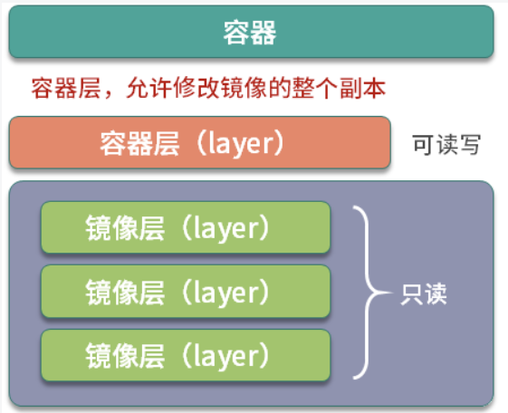
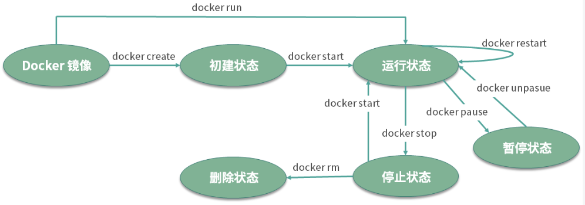
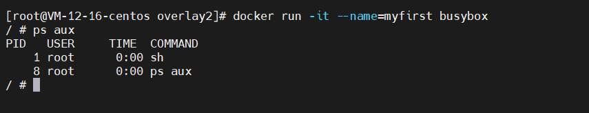
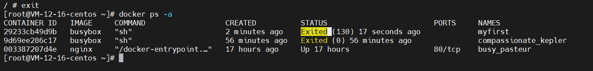
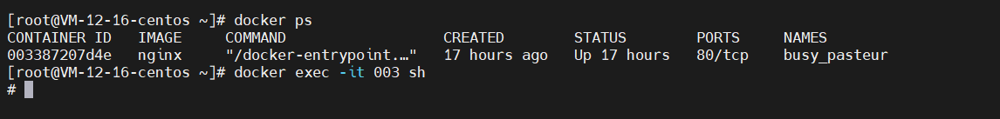
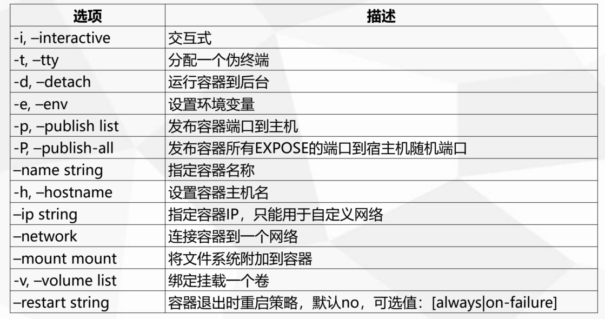
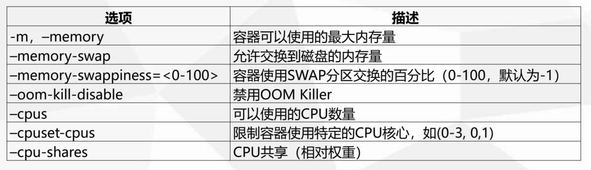

# 第五章：容器的使用

## 5-1 容器（container）是什么？

​	容器是基于镜像创建的可运行实例，并且单独存在，一个镜像可以创建出多个容器。运行容器化环境时，实际上是在容器内部创建该文件系统的读写副本。 这将添加一个容器层，该层允许修改镜像的整个副本。




## 5-2 容器的生命周期

​	容器的生命周期是容器可能处于的状态，容器的生命周期分为 5 种。

1.  created：初建状态

2.  running：运行状态
3.  stopped：停止状态
4.  paused： 暂停状态
5.  deleted：删除状态




## 5-3 容器的操作

​	容器的操作可以分为五个步骤：创建并启动容器、终止容器、进入容器、删除容器、导入和导出容器。下面我们逐一来看。

### 创建并启动容器

```sh
docker run -it --name=myfirst busybox
```

​	这个命令会基于busybox镜像创建出一个容器，并且我们使用`--name`参数给这个容器命了个名。

**Docker 后台执行的流程为：**

-   Docker 会检查本地是否存在 busybox 镜像，如果镜像不存在则从 Docker Hub 拉取 busybox 镜像；

-   使用 busybox 镜像创建并启动一个容器；

-   分配文件系统，并且在镜像只读层外创建一个读写层；

-   从 Docker IP 池中分配一个 IP 给容器；

-   **执行用户的启动命令**运行镜像。

上述命令中， -t 参数的作用是分配一个伪终端，-i 参数则可以终端的 STDIN 打开，同时使用 -it 参数可以让我们进入交互模式。 在交互模式下，用户可以通过所创建的终端来输入命令，例如：



​	我们可以看到容器的 1 号进程为 sh 命令，在容器内部并不能看到主机上的进程信息，因为容器内部和主机是完全隔离的。同时由于 sh 是 1 号进程，意味着如果通过 exit 退出 sh，那么容器也会退出。所以对于容器来说，杀死容器中的主进程，则容器也会被杀死（**容器是一个“单进程”模型**）。


### 终止容器

​	容器启动后，如果我们想停止运行中的容器，可以使用`docker stop`命令。命令格式为 `docker stop [-t|--time[=10]]`。该命令首先会向运行中的容器发送 SIGTERM 信号，如果容器内 1 号进程接受并能够处理 SIGTERM，则等待 1 号进程处理完毕后退出，如果等待一段时间后，容器仍然没有退出，则会发送 SIGKILL 强制终止容器。

```sh
docker stop <id or name>
```

​	需要注意的是：**容器是一个“单进程”模型**，如果容器的1号进程死掉了，容器也会立即停止，所以这上面我们运行的`busybox`容器，在`exit`退出后，容器也会立即变为`Exited `状态。




### 进入容器

​	处于运行状态的容器可以通过`docker attach`、`docker exec`、`nsenter`等多种方式进入容器。

​	最常用的是`docker exec`。所以这里只写`docker exec`方式进入容器。我们可以通过docker exec -it CONTAINER的方式进入到一个已经运行中的容器，如下所示。

```
docker exec -it busybox sh
```




### 删除容器

删除容器命令的使用方式如下：`docker rm [OPTIONS] CONTAINER [CONTAINER...]`。

**示例：**删除一个停止状态的容器

```sh
docker rm busybox
docker rm <id>
```

**示例**：删除正在运行中的容器

```sh
docker rm -f <id or name>
```


### 查看容器状态

`docker ps -a`：显示所有容器的状态，包括停止的。


### 导出容器

```sh
docker export busybox > busybox.tar
```

执行以上命令后会在当前文件夹下生成busybox.tar，我们可以将该文件拷贝到其他机器上，通过导入命令实现容器的迁移


### 导入容器

通过`docker export`命令导出的文件，可以通过`docker import`命令导入，执行完该命令后会变为本地镜像，最后再用`docker run`命令启动该镜像，这样就实现容器的迁移

```sh
docker import busybox.tar busybox:test
```

busybox.tar是上一步命令导出的文件，busybox:test是生成的镜像名称


## 5-4 创建容器常用选项




## 5-5 容器资源限制



```powershell
内存限额：
允许容器最多使用500M内存和100M的Swap，并禁用 OOM Killer：
docker run -d --name nginx03 --memory="500m" --memory-swap=“600m" --oom-kill-disable nginx

CPU限额：
允许容器最多使用一个半的CPU：
docker run -d --name nginx04 --cpus="1.5" nginx 
允许容器最多使用50%的CPU：
docker run -d --name nginx05 --cpus=".5" nginx
```


## 5-6 总结管理容器常用命令

```powershell
列出容器
docker container ls
docker ps 

列出最近创建的容器
docker ps -l
列出所有容器
docker ps -a

显示一个容器运行的进程
docker container top <container id or name>
docker top <container id or name>

获取一个容器日志. -f参数表示持续获取
docker logs <container id or name> -f
docker container logs <container id or name> -f

将宿主机上的script文件夹拷贝到centos7容器的/root目录下
docker cp script/ centos7:/root

将centos7容器中的1.txt拷贝到当前目录下
docker cp centos7:/root/1.txt ./
```

