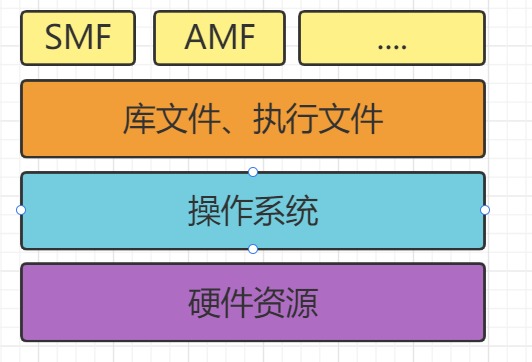

# 第七章：后记

​	从几十年前的1G，到4G，再到现在的5G，移动通信发生了翻天覆地的变化，核心网亦是如此。但是，如果你仔细洞察这些变化，会发现，所谓的核心网，其实本质上并没有发生改变，无非就是很多的服务器而已。不同的核心网网元，就是不同的服务器，不同的计算节点。

​	变化的，是这些“服务器”的形态和接口：形态，从机柜单板，变成机柜刀片，从机柜刀片，变成X86通用刀片服务器；接口，从中继线缆，变成网线，从网线，变成光纤。就算变来变去，还是服务器，是计算节点，是CPU。既然是服务器，那么就势必会和IT云计算一样，走上虚拟化的道路。毕竟，虚拟化有太多的优势，例如前文所说的低成本、高利用率、充分灵活、动态调度，等等。

 	我翻阅前面的资料（18年之前），在之前大家都以为虚拟机是核心网的终极形态。目前看来，是**容器化**。所以之前经常说的NFV（网元功能虚拟化），应该改为NFC（网元功能容器化）。 

​	特别是5GC采用现在的SBA架构，脱离了原有的专用机器，改为底层使用X86架构，核心网完全转变为软件服务，与硬件完成解耦。减少了部署时采购专有机器的大量成本。

 	而采用容器之后，会进一步降低成本，只需要一台服务器，创建十几个容器，用不同的容器，来分别运行不同网元的服务程序。 

​	这些容器，随时可以创建，也可以随时销毁。还能够在不停机的情况下，随意变大，随意变小，随意变强，随意变弱，在性能和功耗之间动态平衡。 

​	按照这样的发展趋势，在移动通信系统中，除了天线，剩下的部分都有可能虚拟化。核心网是第一个，但不是最后一个。虚拟化之后的核心网，与其说属于通信，实际上更应该归为IT。核心网的功能，只是容器中普通一个软件功能而已。 

