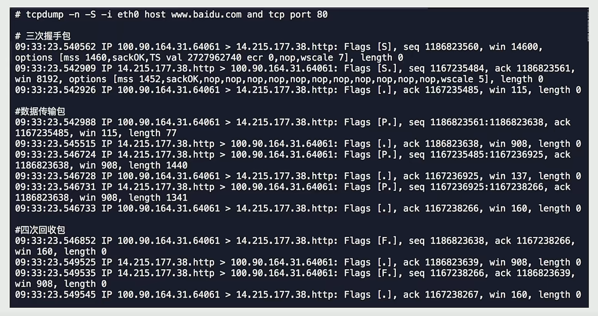
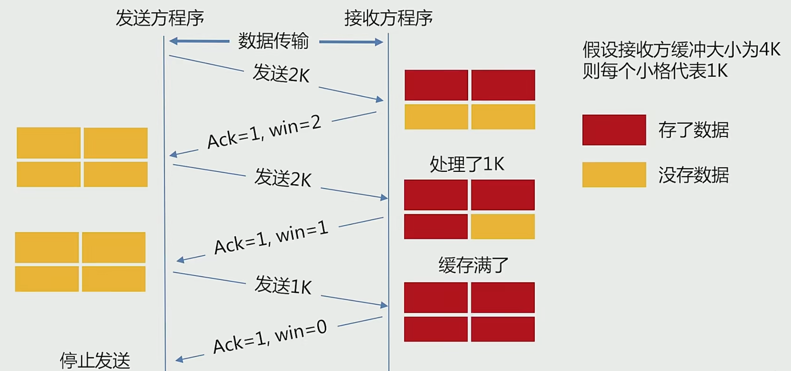
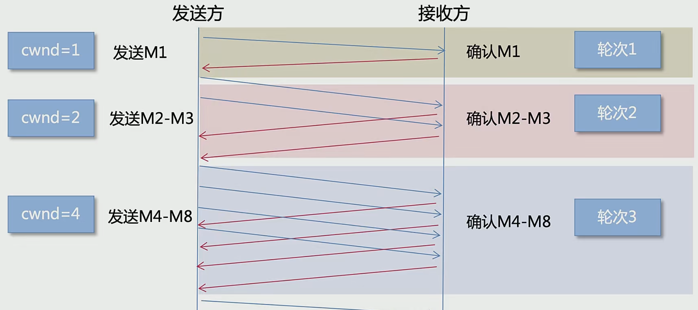
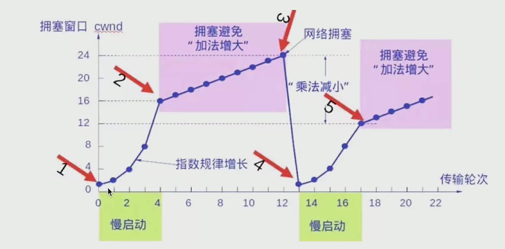
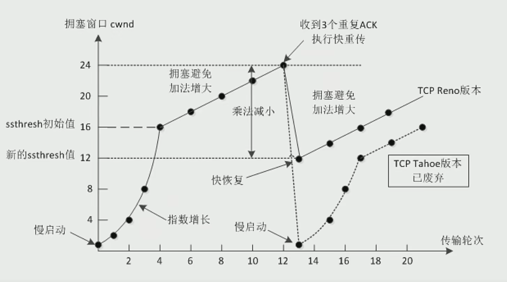
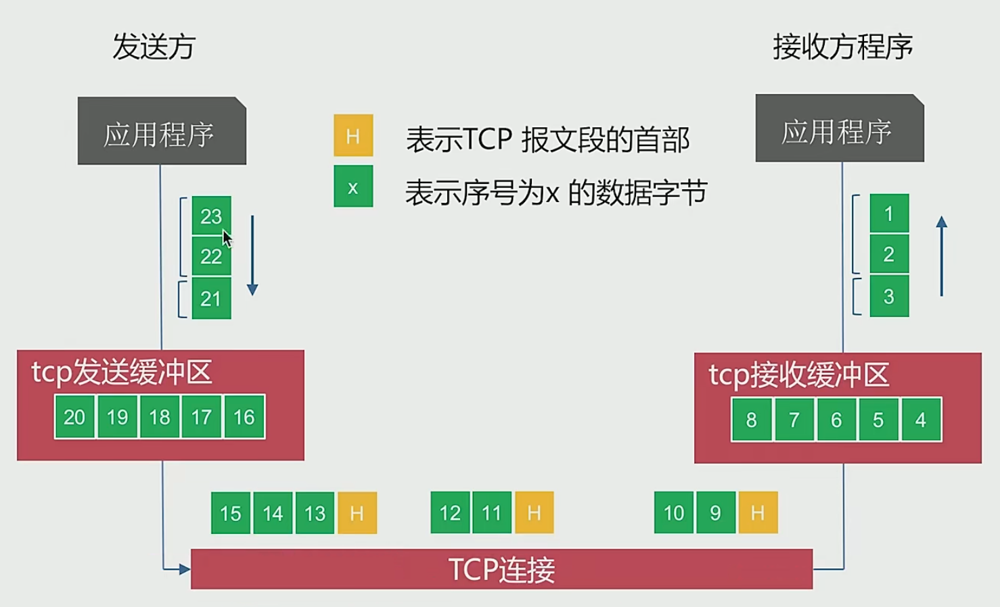

# 网络编程基础大纲

## 一、OSI七层网络协议

> Tips:
>
> ​	图中的TCP、IP参考模型的名称严格来说是：
>
> - 应用层
> - 传输层
> -  网际层 
> - 网络接口层

## 二、经典协议与数据包

## 三、三次握手与四次挥手

> 保证在不可靠的信道中可靠传输

### 1. TCP为啥要三次握手，两次行不行

- 三次握手的最主要目的是保证连接是双工的**（连接双方都能同时发送和接收）**，可靠性则靠重穿机制来保证

- **两次握手**：服务端回的响应因为网络延迟，没能及时传输到客户端，客户端在等待的时间内没有收到响应，则会认为包丢失，重传请求，第二次请求被正常响应，但是这时第一次请求的响应也因为网络恢复，也被传输到客户端，客户端能知道自己只传了一次请求，但是服务端不知道，所以服务端会维护两条连接。
- **三次握手**：依旧是上面的场景，第一次请求的响应和第二次的请求响应都同时到达客户端，客户端知道自己只需要一条连接，所以第三次握手只会发送一个请求给服务端，服务端这时建立一条连接。

### 2. TCP为啥要四次挥手，两次行不行

- TCP连接是全双工的，双方必须收到对方的FIN包，确认才可关闭

> SYN：[s]
>
> ACK：[.]
>
> 数据包：[P.]
>
> FIN：[F.]

### 3. 为什么time_wait需要等待2MSL？

- MSL：Maximum Segment Lifetime，30秒~1分钟
- 保证TCP协议的全双工连接能可靠关闭
- 假设：最后主动关闭方发送ACK包后立刻关闭，这个ACK包在网络环境中丢失了，被动关闭方没有接收到，这时触发重传机制，被动关闭方会重传一个FIN包给主动关闭方，但是主动关闭方已经关闭了，所以被动关闭方就会一直保持 LAST-ACK 的状态，资源无法释放

### 4. 为什么会出现大量 close_wait？

- close_wait一般会出现在被动关闭方
- 大部分原因是并发请求太多导致的：发送大量的请求，服务端对应间歇处理时间没有跟上并发
- 被动关闭方为及时释放端口资源导致

## 四、TCP流量控制、拥塞控制

### 1. TCP为什么需要流量控制

- UDP不需要流量控制，UDP是一种非连接、不可靠的通信协议，只管发送就可以了
- 由于通讯双方，网速不同。通讯方任一方发送过快都会导致对方消息处理不过来，所以就需要把数据放到缓冲区中
- 如果缓存区满了，发送方还在发送，那接收方自能把数据包丢弃。因此，**我们需要控制发送速率**。
- 我们缓冲区剩余大小称为接收窗口，用变量win表示。如果win=0，则发送方停止发送。

- 发送方会有周期探测包，探测到接收方缓存区有空闲后继续发送

### 2. TCP为啥需要拥塞控制

- 流量控制与拥塞控制是两个概念，拥塞控制是调解网络的负载
- 接收方网络资源繁忙，因未及时响应 ACK 导致发送方重传大量数据，这样将会导致网络更加拥堵
- 拥塞控制是动态调整win大小，不只是以来缓冲区大小确定窗口大小

### 3. TCP拥塞控制

- 慢开始和拥塞避免
- 快速重传和快速恢复

**慢开始和拥塞避免**

- 慢开始：TCP连接刚刚建立，一点点提速，试探网络承受能力，以免直接扰乱网络通道秩序

- 最开始 win 大小为1，每过一个RTT（往返时延），win都变成原来的两倍，直到慢启动阈值
- 超过慢启动阈值后，进入拥塞避免阶段，这这个阶段，每个RTT，win 加一

> 上面的算法在遇到网络拥塞的情况下，会将 win 大小立刻变为1，会对网络传输造成非常大的影响，所以就有了**快重传和快恢复**

**快重传和快恢复**

- 收到3次重复ACK时，执行快速重传，会把拥塞窗口降为原来的一半，拥塞阈值也降为原来的一半，进入快速恢复阶段
- 重传被丢的包，然后又进入拥塞避免阶段

## 五、为啥会出现粘包、拆包，如何处理？

### 1. TCP报文发送过程

- 发送程序发送数据，实际上是将数据丢进tcp发送缓冲区里，真正的发送过程是Linux内核走TCP连接发送

- TCP会根据缓冲区大小决定是否粘包，拆包。粘包：不同的请求合并到一个TCP报文中；拆包：一次请求拆到多个TCP报文中

    

### 2. 为啥会发送拆包、粘包

- 应用程序写入的数据大于套接字缓冲区大小，就会发生拆包
- 应用程序写入数据小于套接字缓冲区大小，网卡将应用多次写入的数据发送到网络中，就可能会发生粘包
- 进行MSS（最大报文长度 1460或1480）大小的TCP分段，当TCP报文长度-TCP头部长度 > MSS 的时候发生拆包
- 接收方法不及时读取套接字缓冲区数据，会发送粘包

### 3. 如何获取完整应用数据报文？

- 使用带消息头的协议，头部写入包长度，然后再读取包内容
- 设置定长消息，每次读取定长内容，长度不够时空位补固定字符
- 设置消息边界，服务端从网络流中按消息边界分离出消息内容，一般使用 '\n'
- 更复杂的协议，如：json、protobuf

## 六、基于Golang实现 TCP、UDP、HTTP服务器和客户端

