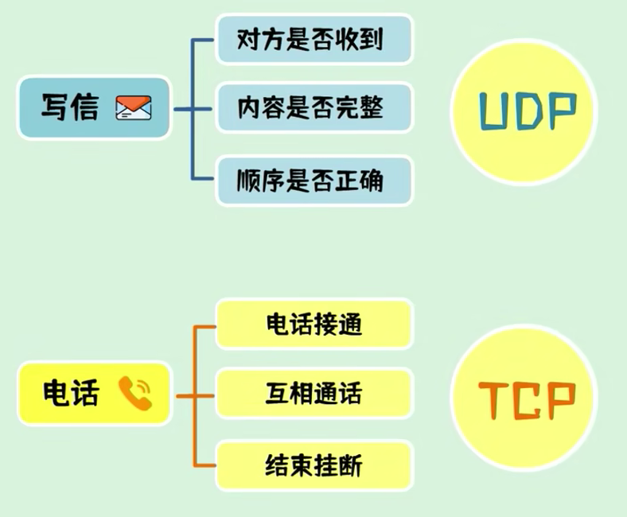
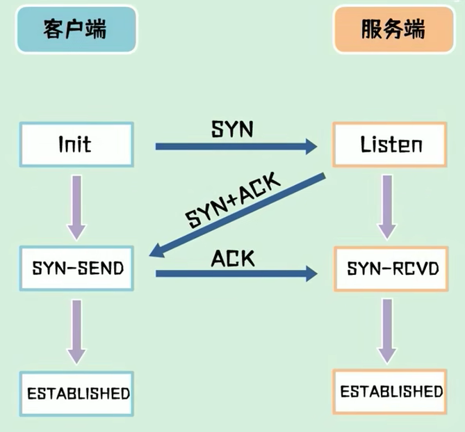
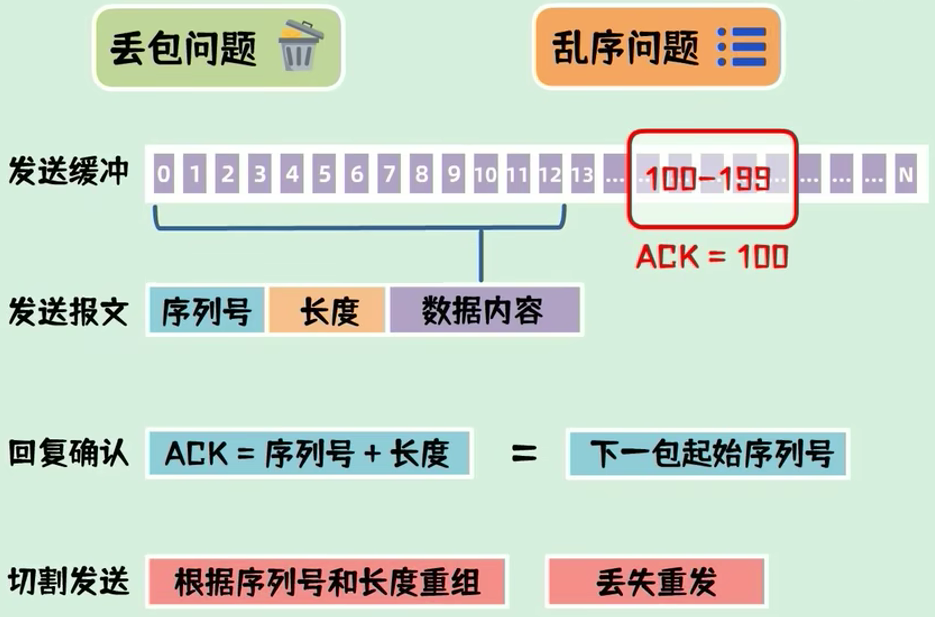
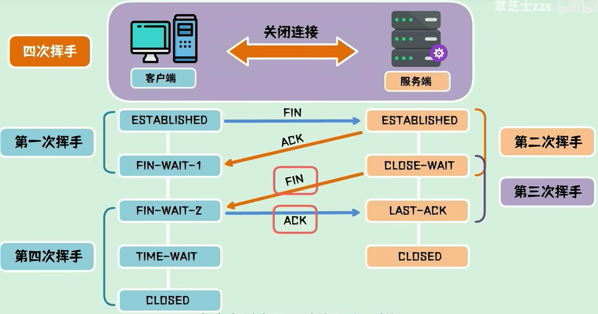

# TCP、UDP协议

​	我们常用的网络通讯，比如：浏览网页、软件聊天、播放的视频，都是通过这两种通信协议进行传输的。所以这篇文章我们聊一聊，它们是如何工作的，这两种协议有什么不同？

## 两种协议有什么不同

​	TCP和UDP协议都工作在传输层，它们的目标都是在程序之间传输数据，数据可以是文本文件，可以是视频，也可以是图片。对于TCP协议和UDP协议来说都是一堆二进制数，并没有多大区别。那TCP和UDP之间的区别是什么？

​	最大的区别是，TCP是基于连接的协议，UDP是基于非连接的协议。具体是什么意思，我们来举一个生活中的例子：打电话和写信。

### 举个栗子

​	如果把人与人之间的通信比作进程与进程的通信，我们基本有两种方式：写信和打电话。不考虑速度因素，这两种方式之间最大的区别是：**信寄出去后对方是否能收到**，**收到的信内容是否完整**，**先后寄两封信过去是否按照顺序接收？**这些都是不知道的，甚至你填写的收信地址和收信人是否存在都是未知数。

​	而打电话就不同，从电话接通、互相通话、结束挂断这一系列的流程都能得到及时的反馈，并且能够确认对方准确的接收到。

## 它们是如何工作的

​	TCP是如何保证以上过程的，有三个关键步骤：三次握手、传输确认、四次挥手。

​	三次握手是建立连接的过程，当客户端想服务端发起请求时，会先发一包连接请求数据过去询问一下：“我可以和你建立连接吗？”，我们一般称这包数据为SYN包。

​	如果对方同意连接，则会回复一包SYN + ACK数据。

​	客户端收到后，回复一包ACK数据，至此连接建立成功。

因为这个过程中互相发送了三包数据，所以称为**三次握手。**

## 为什么建立连接需要三次握手，而不是两次？

​	服务端回复SYN + ACK包后就建立连接不行吗？这是为了防止因为已失效的请求报文，突然又传到服务器引起错误。

​	假设一个客户端向服务器发起一包SYN包请求建立连接，因为一些未知的原因，SYN包并没有到达服务器，在中间某个网络节点产生了滞留，为了建立连接客户端会重发SYN包，这次的数据包正常到达，服务端回复SYN + ACK之后建立了连接，但是第一包数据阻塞的网络节点突然恢复，第一包SYN有送达服务端，这时服务端会误认为是客户端又发起了一个新的连接，从而在两次握手后进入等待数据状态。服务端认为是两个连接，而客户端认为是一个连接，造成了状态不一致。

​	如果是在三次握手的情况下，服务端收不到最后的ACK包，就不认为连接建立成功。

​	所以，三次握手本质上来说就是为了解决网络信道不可靠的问题，为了能在不可靠的信道上建立起可靠连接。

## TCP传输过程中的其他问题

​	经过三次握手后，客户端和服务端都进入数据传输状态，前面我们了解了TCP协议需要在不可靠的信道上建立起可靠的连接，所以就会有几个问题需要面对：

1.  一包数据有可能会被拆成多包发送，如何处理丢包问题？
2.  这些数据包到达的先后顺序不同，如何处理乱序问题？

​	为了解决以上问题，TCP为每一个连接建立了一个发送缓冲区，从建立连接后的第一个字节的序列号为0, 后面每个字节的序列号就自加1， 发送数据时，从发送缓冲区取一部分数据组成发送报文，在TCP的头中会附带序列号和长度，接收端在收到后需要回复确认报文，确认报文中的`ACK = 序列号 + 长度`， 也就是下一包起始序列号，这样一问一答的方式能够使发送端确认发送数据已经被对方收到。发送方也可以一次发送多包数据，接受端只需要回复一次ACK就可以了。这样接受端就可以通过序列号和长度重组成为完整的数据，假设丢失的某些数据包，接受端可以要求发送端重传数据。

## TCP 的四次挥手

​	处于连接状态的客户端和服务端都可以发起关闭连接请求，此时需要四次挥手来进行连接关闭。

​	假设客户端主动发起关闭连接请求，客户端向服务端主动发起FIN包，表示要关闭连接，自己进入终止等待1状态，这是第一次挥手。

​	服务端收到FIN包，向客户端回复ACK包，表示自己进入关闭等待状态，客户端进入终止等待2状态，这是第二次挥手。服务端此时还可以发送未发送的数据。客户端也还可以接受数据。

​	待服务端发送完数据后，向客户端发送一包FIN包，进入最后确认状态，这是第三次挥手。

​	客户端收到数据后，回复ACK包，进入超时等待状态，经过超时等待时间后关闭连接。服务端收到ACK后立即关闭连接。这是第四次挥手。

## 为什么客户端需要等待超时时间？

​	这是保证客户端已收到ACK包，假设完客户端发送最后的ACK包就立即释放连接，一旦ACK包在网络中丢失，服务端就会一直停留在最后确认状态。

​	如果客户端发送最后一包ACK包后，等待一段时间，这时服务端因为没收到ACK包，会重发FIN包，客户端会响应这个FIN包，重发ACK包并刷新超时时间。

​	这个机制和三次握手一样，也是为了保证在不可靠的网络链路中进行可靠的连接断开。

## UDP协议

​	UDP协议是基于非连接的，发送数据就是简单的把数据进行包装一下，就从网卡发送出去了，数据包之间并没有状态上的联系，UDP协程的传输过程是非常简单的，所以它的性能损耗是非常少的，对于CPU内存资源的占用也远小于TCP。

​	但是在传输过程中的丢包，UDP协议并不能保证，所以UDP在传输稳定性上要弱于TCP.

​	UDP常用于：域名查询、语音通话、视频直播等，UDP还有一个重要的应用：隧道网络（VPN）