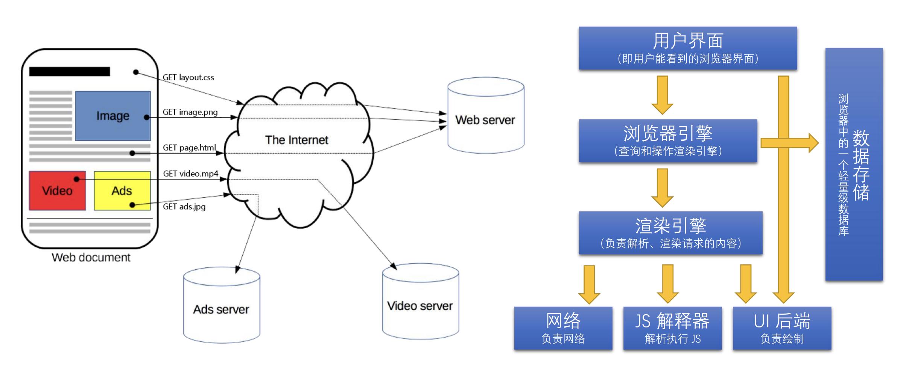
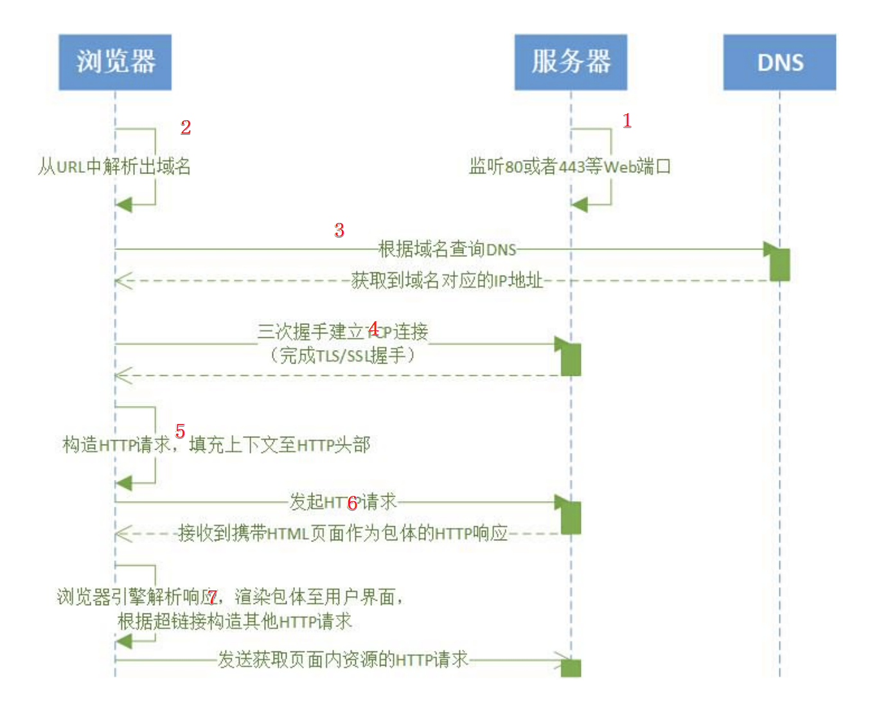
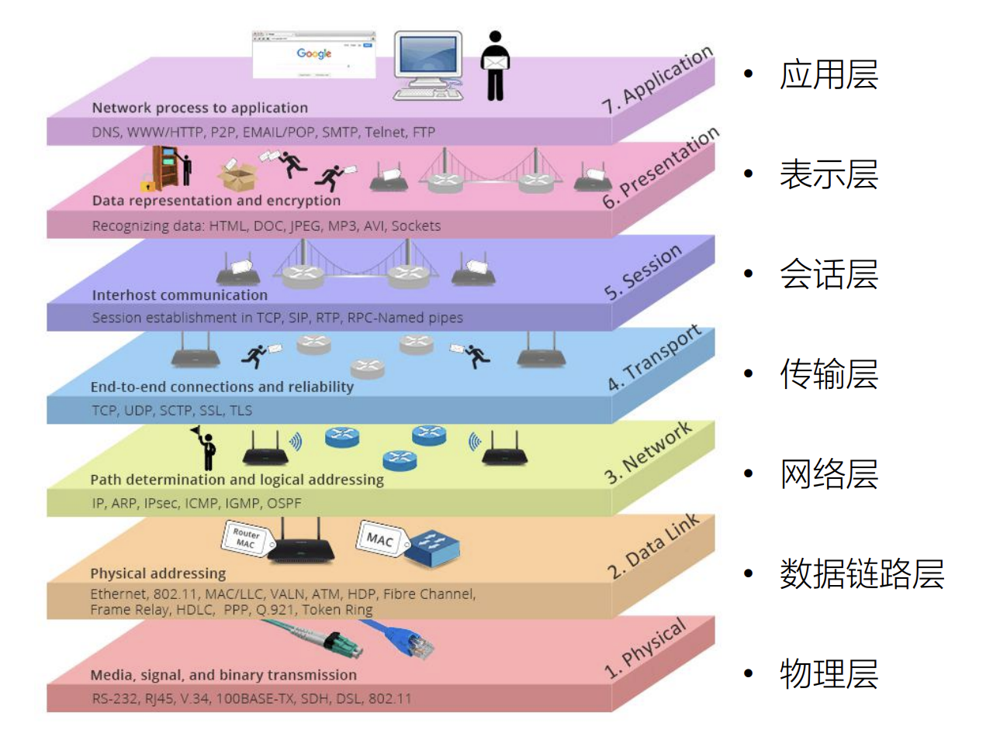
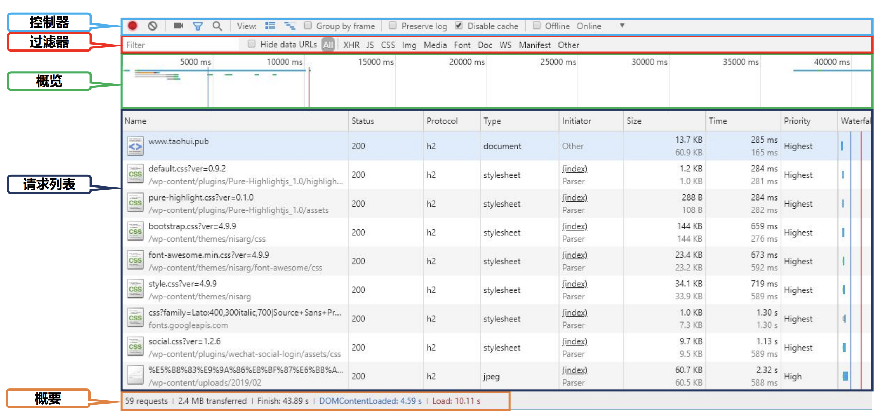
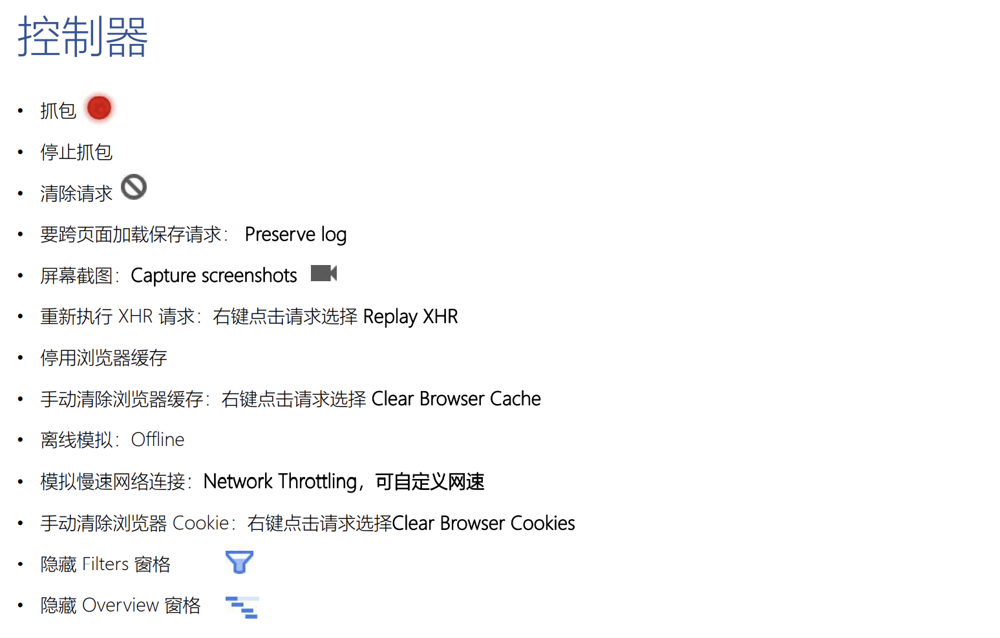
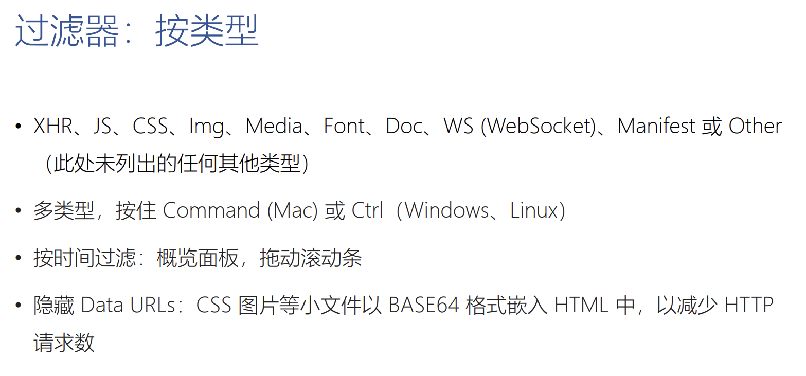

# HTTP协议

​	HTTP协议的重要性毋庸置疑，它是我们日常生活中直接打交道最多的一种网络协议，支撑起了万维网的基石，接下来我们从一个浏览器发起HTTP请求进行分析：

## 浏览器发起HTTP请求的典型场景

1.  服务器监听80或443端口
2.  浏览器从URL中解析出域名
3.  浏览器根据域名查询DNS，DNS返回域名对应的IP地址
4.  浏览器与服务器三次握手建立TCP连接，如果是HTTPS协议还应该完成TLS/SSL握手
5.  浏览器构造HTTP请求，填充上下文至HTTP头部
6.  浏览器发起HTTP请求，服务器返回携带HTML页面作为包体的HTTP响应
7.  浏览器引擎解析响应，渲染包体至用户界面，根据超链接构造其他HTTP请求
8.  浏览器发起获取页面内资源的HTTP请求

## HTTP协议的定义

​	HTTP 是一个在计算机世界里专门在**「两点」**之间**「传输」**文字、图片、音频、视频等**「超文本」**数据 的**「约定和规范」** 

​	HTTP是应用协议，工作在OSI的第七层，直接与应用打交道。

## 什么是OSI模型？

它是一个概念模型，从来没有被实现过，但是它对我们理解真正的网络分层有非常重要的意义，所以我们在学习网络协议的时候一般都会先学习它。

-   应用层：解决业务问题，例如：HTTP协议、P2P协议、SMTP协议都在这一层
-   表示层：负责将网络中的消息转换成应用层可以读取的消息，TLS/SSL就工作在这一层
-   会话层：完全概念化的一层，负责建立会话、握手、维持连接关闭，实际上传输层和表示层都有部分概念衍生到会话层
-   传输层：包括了我们熟悉的TCP和UDP，这一层主要解决的问题是进程与进程之间的通信
-   网络层：主要看IP协议，IP协议确保在广域网中，可以在一个主机上把报文发送到另一个主机上（可以是不直达，经过多次跳转的主机）
-   数据链路层：这一层在局域网中，我们使用MAC地址连接到交换机或者路由器，可以把报文转到另一个主机上（直达的主机）
-   物理层：物理介质，网线、光纤

## 网络为什么要分层？

### 分层的好处

​	每一层只与它的外层打交道，不需要关心其他层在做什么，相当于有了一个很好的封装。比如IPV4升级IPV6是非常困难的，但是在进展困难的情况下，应用层却在快速的迭代。

​	简单说，因为分层详细，所以在开发时只需要关系与之相邻的上下层。

### 分层的坏处

​	每一层都做处理，会有一个数据延迟，导致性能下降。为了解决这样的性能问题，就会有相应的组件，很比如inter的dbdk，它把下层都绕过去，所以有更好的性能，但是也因此丢失网络分层的好处，导致操作系统上的DUG工具在打开dbdk是无法使用的。

# 架构设计

​	目前对我来说理解起来有一些困难，等有业务需要了再来学习

## 评估web架构的七大关键属性

## 从五种架构分格推导HTTP的REST架构

# 使用Chrome的network面板抓包进行分析

快捷键：Ctrl + Shift + I

## Network面板

-   控制器：控制面板的外观与功能
-   过滤器：过滤请求列表中显示的资源
    -   按住Ctrl，然后点击过滤器可以同时选择多个过滤器
-   概览：显示HTTP请求、响应时间轴，可以用鼠标选择就可以显示对应时间的请求或响应
-   请求列表：默认时间排序，可以选择显示列
-   概要：请求总数、总数据量、总花费时间等

